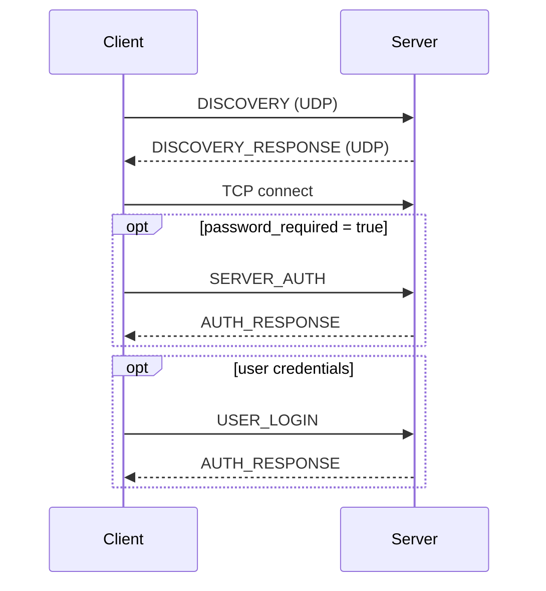
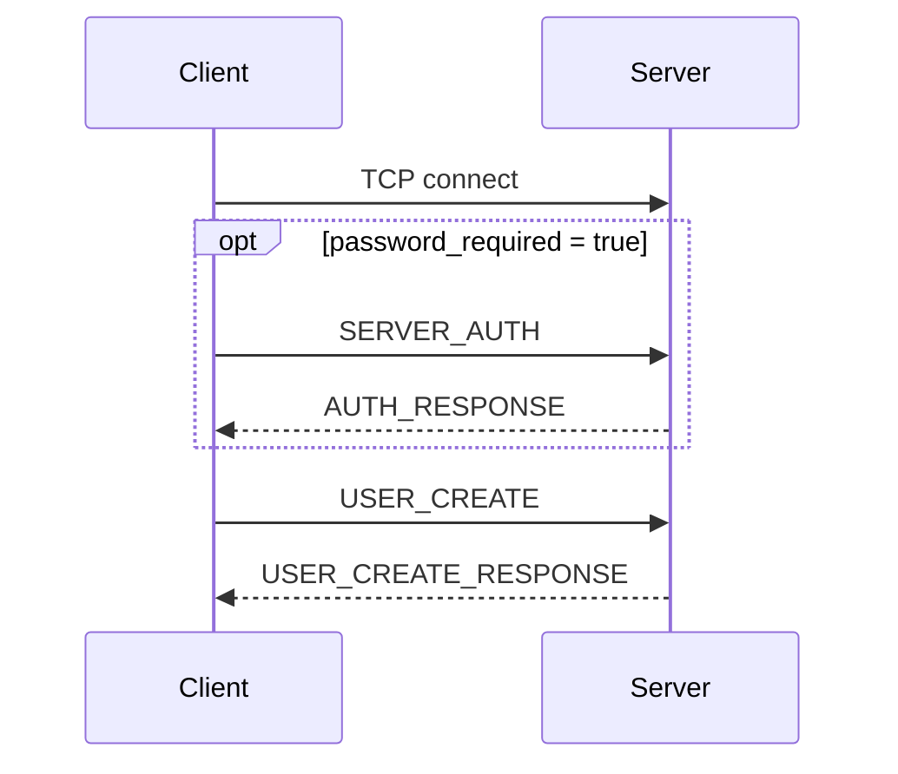
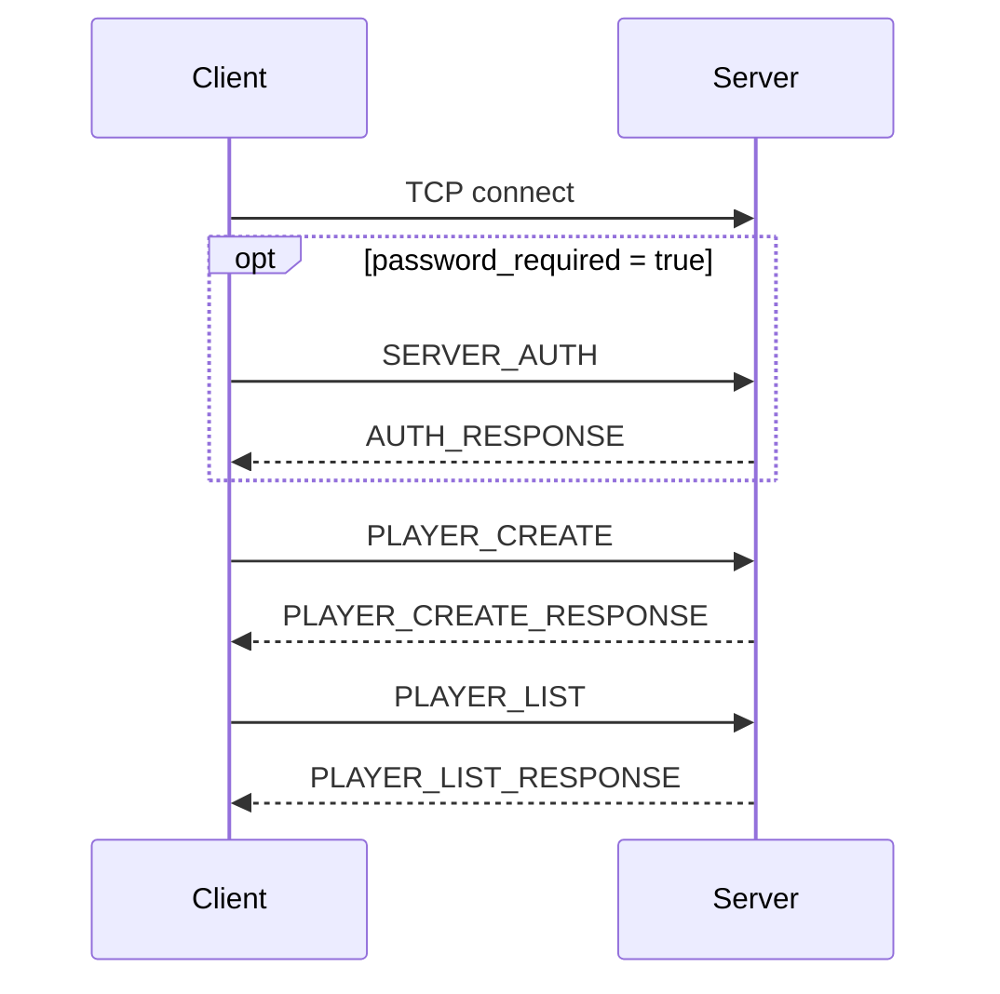
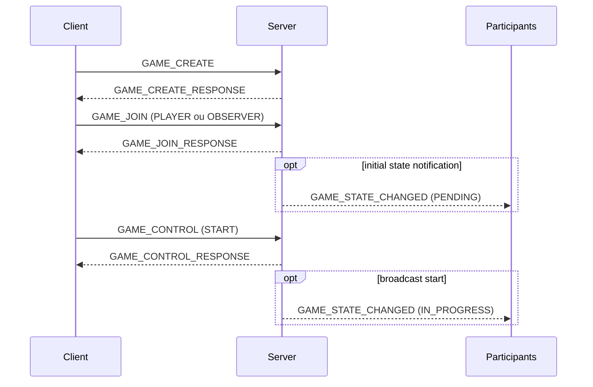
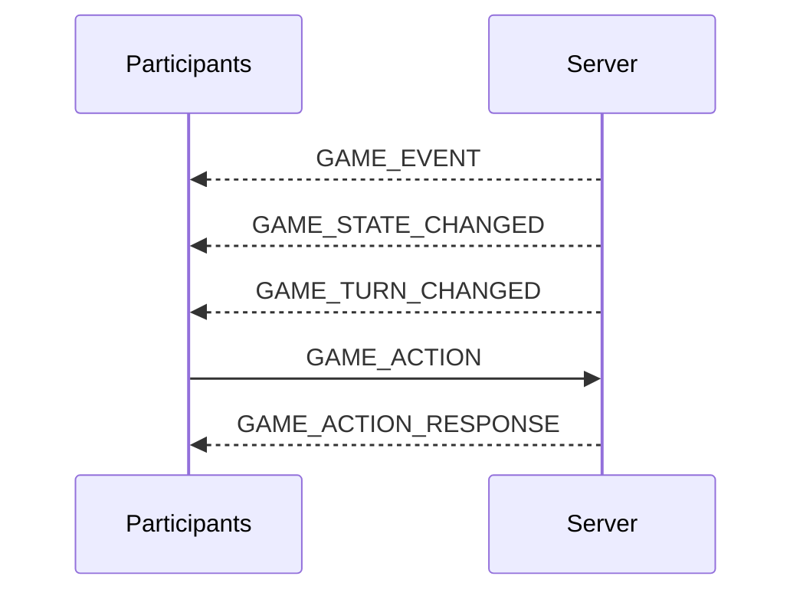
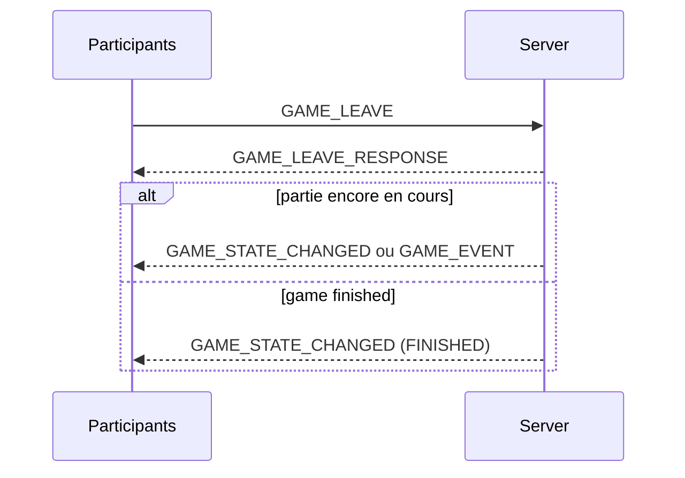
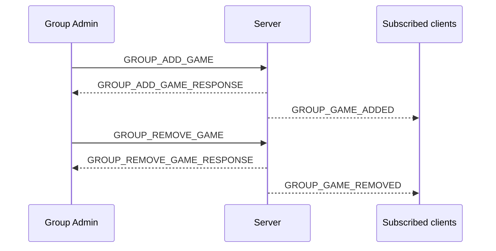
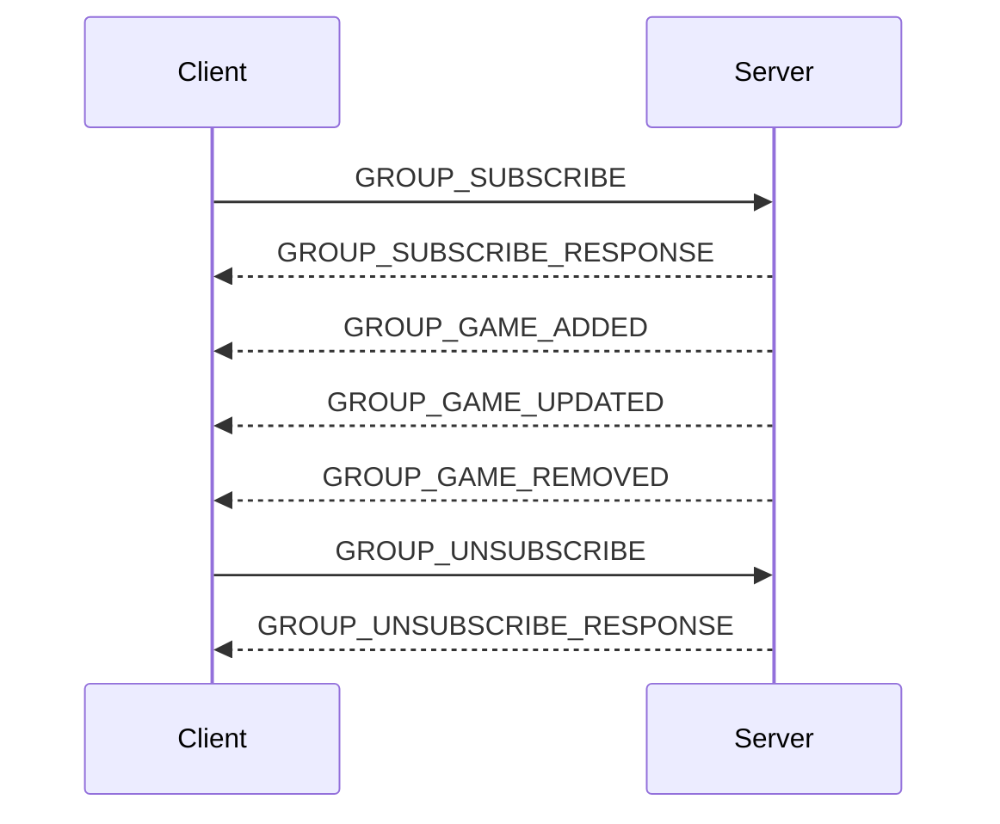

# Exchange protocol between the client and the server

This section describes the messages exchanged between clients and the server.

## Preamble to the exchange protocol

This section describes the protocol used for message exchanges between clients and the multiplayer server. It specifies the roles of the different actors, the network transports used, the general structure of messages, the validation principles, as well as the access levels applied to clients by the server.

The objective of this protocol is to provide a clear, extensible and predictable exchange framework for the following operations:

- automatic discovery of servers available on the local network;
- establishment of communication between a client and a server;
- authentication and progressive increase of access rights;
- management of users, groups and parties;
- transmission of game events;
- notification of changes in status to the customers concerned;
- server administration.

### Definitions

The following terms are used throughout this section.

#### User

A **user** (or user account) is a persistent entity on the server, defined by a unique identifier, a username and a password. The user allows, after authentication, access to the server with a certain level of rights (PLAYER, GROUP_ADMIN, ADMIN).

Every user has their own **Player** object which is automatically retrieved during authentication. When this player is attached to a session, he becomes the active default player of the session as long as the user remains authenticated.

#### Player

A **player** is the entity that actually participates in or observes a game. While the user manages access and permissions, the player carries game-related attributes (name, score, game status, etc.). 

A client can have several **Player** objects during the same session (for example to allow several participants to play on the same computer). However, only one player is considered the **active default player** of the session at any given time.

In this version of the protocol, a client must have a **Player** object in its session to join a game:
- For an authenticated user, the player associated with their account is automatically added to the session and becomes the active default player.
- For an unauthenticated client (`BASE` level), a player must be explicitly created via a dedicated request. The last player created with the "default" option becomes the reference player for subsequent actions.

Reference player resolution rule:
- if a request accepts a `player_id` but no identifier is provided, the server uses the active default player of the session;
- if no active default player is available, the request fails with `PLAYER_NOT_FOUND`;
- user authentication gives priority to the player associated with the account, without removing other players from the session;
- user disconnection removes this priority; if a session player had already been designated as the active default player, he becomes the reference player again, otherwise the session remains without an active default player.

#### Customer

A **client** is an application that connects to a multiplayer server in order to consult the available information, join or observe a game, play, administer a group of games or administer the server.

A client can represent different types of users depending on its current access level: unauthenticated visitor, logged in user, player, group administrator or server administrator.

From a protocol perspective, a client is identified by its active network connection and the access level that the server has assigned to it. This level of access may change during the session.

#### Server

The **server** is the application that receives messages from clients, validates their content, controls access rights, executes the requested actions and returns the appropriate responses.

He is responsible in particular for:

- listening for incoming connections;
- responding to network discovery requests;
- syntactic and semantic validation of messages received;
- customer authentication;
- the allocation and temporary retention of access levels;
- management of multiplayer objects: users, groups and games;
- sending responses to requests;
- the possible sending of spontaneous notifications to connected clients.

#### Protocol

The **protocol** designates the set of rules that define the way in which clients and the server exchange messages.

It specifies in particular:

- the network transport used;
- the accepted serialization formats;
- the common structure of messages;
- the types of messages available;
- mandatory and optional fields;
- validation rules;
- the access levels necessary to use each request;
- the expected behavior of the server in the event of success or error.

#### Transportation

**Transport** refers to the network mechanism used to transmit a message between a client and the server.

Two transports are used:

- **UDP**, only for network discovery exchanges;
- **TCP**, for main communications between clients and server.

UDP is used for discovery short messages because it allows multicast sending over the local network. UDP messages are autonomous: each datagram corresponds to a complete message.

TCP is used for game and control exchanges because it provides a reliable, orderly connection suitable for ongoing exchanges between a client and the server. Because TCP transports a stream of bytes and not separate messages, each TCP message is preceded by a header indicating the length of the transmitted content.

#### Message

A **message** is a logical unit of information exchanged between a client and the server.

Each message has a type which indicates its nature or the requested action. Depending on the transport and the type of exchange, a message can be:

- a request sent by a client;
- a response sent by the server following a request;
- a notification sent spontaneously by the server;
- a discovery message sent in UDP;
- a discovery response sent in UDP.

Messages are serialized either as UTF-8 encoded JSON or as [MessagePack](https://msgpack.org/index.html). The MessagePack format is preferred for game messages and required for game notifications for performance reasons.

When a message is serialized in MessagePack, it maintains exactly the same logical schema as its JSON version: same field names, same nesting levels and same semantic constraints. The difference only concerns the binary encoding of the data during transmission.

#### Query

A **request** is a message sent by a client to the server to request an action or information.

Example queries:

- search for available servers;
- authenticate with the server;
- create or list the players of the session;
- create a game;
- join or observe a game;
- transmit a game action;
- request the list of available parts;
- modify a configuration;
- administer a user, a group or the server.

Each request is associated with a minimum access level. The server must verify that the client has the required level before executing the requested action.

#### Reply

A **response** is a message sent by the server to a client in reaction to a request.

A response indicates whether the request succeeded or failed. It may contain:

- data requested by the customer;
- a confirmation of execution;
- an error message;
- an error code;
- additional information allowing the customer to understand or correct the request.

Unless otherwise specified, any valid TCP request must produce an explicit response from the server.

#### Notification

A **notification** is a message sent by the server to one or more clients without immediate request from them.

It is used to inform clients of a relevant event or state change, for example:

- a player has joined or left a game;
- a game has started, been paused, resumed or ended;
- the state of a part has changed;
- an administrator modified a configuration;
- the server will shut down;
- a gaming event must be broadcast to participants.

A notification does not necessarily require a response from the customer unless the notification type explicitly states so.

#### Customer session

A **client session** is the period of time a client is connected to the server.
During this session, the server maintains the information necessary for tracking the client, including:

- its current level of access;
- its possible authenticated user;
- the list of **Player** objects created or recovered during the session;
- the **Default Player** object (used automatically if no identifier is specified);
- the parties he joined;
- the groups to which he is subscribed;
- the groups or resources to which he has access;
- the specific rights linked to his role.

This information is temporary and is reset when the client logs out.

### General principles of exchanges

Exchanges follow the following principles.

#### Separation between discovery and main communication

Network discovery uses UDP to allow a client to automatically search for available servers on the local network.

Once a server is discovered, the main exchanges are done in TCP. The client then uses the information provided in the discovery response to establish a connection with the server.

#### Communication primarily initiated by the customer

Most exchanges are initiated by the client in the form of requests. The server validates the request, checks the client's rights, executes the action if it is authorized, then returns a response.

The general scheme is therefore:
```plain text
Client → Server: request
Server → Client: response
```
#### Server-initiated notifications

The server can also send messages without immediate request from the client when an event needs to be brought to its attention.

The diagram is then:
```plain text
Serveur → Client : notification
```
These notifications help keep clients in sync with the state of the server and the games they are participating in or observing.

#### Systematic validation of messages

Any message received must be validated before processing.

The validation concerns in particular:

- the format of the message;
- the presence of mandatory fields;
- the type of values received;
- the authorized values;
- the protocol version;
- consistency of content;
- the customer's access level;
- the existence of the referenced resources;
- the current state of the objects concerned.

An invalid message should not cause the server to stop. It must give rise to an error response when transport and context allow it.

#### Robustness and compatibility

Unknown fields can be ignored when doing so does not compromise security or consistency of processing. This rule facilitates the evolution of the protocol.

On the other hand, the absence of a required field, a value of incorrect type or an explicitly prohibited value renders the message invalid.

Each message contains version information making it possible to distinguish future developments of the protocol.

### Transports and serialization formats

The protocol uses two network transports and two main serialization formats.

#### UDP Messages

UDP messages are used only for network discovery.

They are serialized into UTF-8 encoded JSON. Each UDP datagram contains exactly one complete logical message.

UDP messages are not preceded by a length header, because UDP naturally preserves datagram boundaries.

UDP message families:

- discovery request;
- discovery response.

#### TCP Messages

TCP messages are used for all primary communications between clients and the server.

They can be serialized in two formats:

- JSON encoded in UTF-8, for control, configuration, administration and management messages;
- MessagePack, for game data or game states when binary format is preferred.

Each TCP message is preceded by a 4-byte header indicating the size of the content in bytes, encoded in **big-endian**.
```plain text
[4-byte header (content size)][JSON or MessagePack content]
```
This header is necessary because TCP carries a continuous stream of bytes and does not maintain boundaries between application messages.

The specified length is the size in bytes of the content after serialization, whether JSON or MessagePack.

### General message structure

Unless otherwise indicated, application messages use a common structure.

For JSON messages:
```json
{
  "type": "EVENT_TYPE",
  "version": 2,
  "request_id": "req_12345",
  "payload": {}
}
```
#### Field `type`

The `type` field identifies the nature of the message.

It allows the recipient to determine the treatment to be applied. Its value must belong to the list of types recognized by the protocol.

#### `version` field

The `version` field indicates the protocol version used for the message.

In this version of the protocol, the expected value is `2`.

#### `payload` field

The `payload` field contains message-specific data.

Its structure depends on the type of message. It can be empty when the message type does not require any additional data.

#### Field `request_id`

The `request_id` field is an optional correlation identifier used for TCP requests and associated responses.

When a client sends it in a TCP request, the server must copy it exactly in the corresponding response. This field allows you to match a response to its original request when multiple requests may be being processed or when notifications may be interspersed in the flow.

If a connection only executes one request at a time, `request_id` can be omitted. It is recommended whenever the client can send multiple requests without waiting for the previous response.

### Customer Access Levels

The server associates a current access level with each connected client. This level determines which queries the client is allowed to use.

Each client starts with the lowest access level. It can then obtain a higher level by successfully completing the authentication or authorization operations provided for by the protocol.

Access levels are hierarchical: a client with a given level can use requests from that level as well as those from lower levels.

The access levels are as follows.

#### `OPEN`

Open access, without authentication.

This level only allows public operations, for example:

- discover a server;
- consult certain public information;
- start an authentication procedure;
- access explicitly exposed information without restriction.

Every client has this level by default.

#### `BASE`

Basic server access.

This level is granted when a client has satisfied the general conditions of access to the server, for example the presentation of the server password if this is required.

If no server password is configured, this level can be considered equivalent to the `OPEN` level.

#### `PLAYER`

Access reserved for authenticated players.

This level allows the client to act as an identified player. It can in particular make it possible to:

- join a game as a player;
- leave a game;
- perform game actions;
- access information related to its own parties;
- receive notifications associated with its games.

#### `GROUP_ADMIN`

Access reserved for group administrators.

This level allows you to perform administration operations limited to groups for which the client has the necessary rights.

It can in particular make it possible to:

- create, modify or delete parts in an administered group;
- manage certain group settings;
- consult administration information limited to the authorized perimeter.

This level does not imply full access to server administration.

#### `ADMIN`

Server administrator access.

This level provides access to global server administration operations.

It can in particular make it possible to:

- manage users;
- manage all groups and all parties;
- modify the server configuration;
- trigger a persistent save or reload;
- consult global status information;
- properly shut down the server.

### Assigning and maintaining access levels

The access level is assigned by the server to each connected client.

At the start of a session, the client is at the `OPEN` level. Its level can then evolve following successful requests, for example:

- validation of the server password;
- authentication of a user;
- verification of a user’s role;
- validation of administrative rights on a group;
- authentication as server administrator.

The current access level is retained until one of the following events:

- disconnection of the client;
- expiration or invalidation of the session;
- explicit request for disconnection or change of identity;
- revocation of rights;
- server shutdown.

Server persistence does not remember the current access level of clients. When a client reconnects, it starts a new session at the `OPEN` level.

### Query access control

Each request defines a minimum access level.

Before executing a query, the server must check:

1. that the message is syntactically valid;
2. that the type of request is recognized;
3. that the client's level of access is sufficient;
4. that the requested resources exist;
5. that the current state of the server or game allows the requested action;
6. that the rights specific to the area concerned are respected.

If the access level is insufficient, the server must refuse the request and return an appropriate error.

A high level of access does not necessarily exempt perimeter checks. For example, a group administrator can have the `GROUP_ADMIN` level without being authorized to administer all groups.

### Message families

Protocol messages are grouped into functional families.

This classification makes the specification easier to read and the future evolution of the protocol.

#### Discovery Messages

These messages allow a client to search for available servers on the local network.

Transport used: UDP.

Possible format: JSON

Examples:

- discovery request;
- discovery response.

#### Connection and access messages

These messages make it possible to establish access to the server and to change the client's access level.

Transport used: TCP.

Possible format: JSON

Examples:

- presentation of the server password;
- user authentication;
- disconnection;
- session change or reset.

#### User management messages

These messages concern user accounts.

Transport used: TCP.

Possible format: JSON

Examples:

- creation of a user;
- authentication of a user;
- modification of a password;
- consultation or modification of a user profile;
- deletion or deactivation of a user.

#### Game management messages

These messages concern the creation, consultation and modification of parts.

Transport used: TCP.

Possible format: JSON

Examples:

- create a game;
- list the available parts;
- join a game as a player;
- join a game as an observer;
- leave a game;
- start, pause, resume or end a game;
- change the order of players in a turn-based game.

#### Group management messages

These messages concern party groups.

Transport used: TCP.

Possible format: JSON

Examples:

- create a group;
- subscribe or unsubscribe to a group;
- add a game to a group;
- remove part of a group;
- consult the parties of a group;
- modify the settings of a group.

#### Game Messages

These messages carry game actions, game events, and game states.

Transport used: TCP.

Possible format: JSON

Examples:

- action performed by a player;
- validation or refusal of an action;
- change of turn;
- update of a game state;
- synchronization of a complete or partial state.

#### Notification messages

These messages are sent by the server to notify clients of an event.

Transport used: TCP.

Format used: JSON or MessagePack (required for game notifications).

Examples:

- player joins or leaves a game;
- change of state of a part;
- addition, removal or update of a part in a group;
- game event broadcast to participants;
- warning before server shutdown.

#### Administrative messages

These messages are reserved for clients with elevated rights.

Transport used: TCP.

Possible format: JSON

Examples:

- consult the overall status of the server;
- consult the current server configuration;
- save or reload persistent data;
- modify the configuration;
- consult the audit logs;
- manage users;
- stop the server.

#### Error messages

These messages indicate that a request could not be processed.

Transport used: mainly TCP.

Possible format: JSON

An error may in particular result from:

- invalid message;
- unknown message type;
- incompatible protocol version;
- insufficient level of access;
- non-existent resource;
- incorrect password;
- action prohibited in the current state;
- Internal Server Error.

### General response rules

Unless otherwise specified, any TCP request must produce a response.

A response must allow the client to clearly determine:

- if the request was successful;
- what data is returned;
- what error occurred, if any;
- if the client can correct the request and resend it;
- if its access level has been modified.

If the TCP request contains a `request_id`, the associated response must take exactly this value in order to allow the correlation between request, response and interspersed notifications.

Notifications sent spontaneously by the server do not require a response, unless explicitly mentioned in the description of the message concerned.

UDP discovery messages follow specific logic: an invalid discovery request can simply be ignored by the server, to avoid responding to non-compliant or unsolicited messages.

### Error handling principles

When a request cannot be processed, the server must return a structured error when the transport allows it.

An error should contain at least:

- an error type or code;
- an explanatory message;
- possibly details useful for diagnosis;
- possibly the identifier of the request concerned if the protocol provides for a correlation.

The server should not expose sensitive information in error messages. For example, an authentication error should not unnecessarily distinguish a non-existent user from an incorrect password if this weakens security.

### Versioning and extensibility

The protocol version is indicated in the messages to facilitate future developments.

The following principles apply:

- unknown fields can be ignored when they do not compromise the processing;
- mandatory fields must always be present;
- unknown values for the message type make the message invalid;
- an incompatible version may result in the message being refused;
- new message types may be added in future versions;
- new optional fields can be added without breaking compatibility.

### General security

The protocol must be interpreted according to a principle of distrust of the data received.

The server must consider any client message as potentially invalid, incomplete, malicious, or unauthorized.

In particular, the server must:

- validate all fields received;
- systematically control access levels;
- never trust an identifier provided without verification;
- avoid disclosing sensitive information;
- limit the effects of invalid messages;
- refuse actions inconsistent with the current state;
- apply configured encryption mechanisms when TLS is enabled.


## Discovery messages

### Discovery request

**Direction:** Client → Server  
**Transport:** Multicast UDP  
**Encoding:** JSON UTF-8

**Access level:** OPEN

Message sent by a client to discover available servers on the local network.

#### Example
```json
{
  "type": "DISCOVERY",
  "service_name": "multiplayer_server",
  "version": 2
}
```
#### Fields

| Field | JSON type | Mandatory | Allowed values | Description |
|---|---|---:|---|---|
| `type` | `string` | Yes | `"DISCOVERY"` | Identifies the message as a discovery request. |
| `service_name` | `string` | Yes | `"multiplayer_server"` | Identifies the service sought. |
| `version` | `number` | Yes | `2` | Protocol version. |

#### Validation rules

- Unknown fields should be ignored.
- The absence of a mandatory field renders the message invalid.
- An invalid value for `type`, `service_name` or `version` makes the message invalid.

---

### Discovery Response

**Direction:** Server → Client  
**Transport:** Unicast UDP  
**Encoding:** JSON UTF-8

Message sent by a server in response to a valid discovery request.

#### Example
```json
{
  "type": "DISCOVERY_RESPONSE",
  "service_name": "multiplayer_server",
  "version": 2,
  "service_host": "192.168.1.20",
  "service_port": 65432,
  "unencrypted_port": null,
  "name": "Local game server",
  "use_tls": true,
  "password_required": false
}
```
#### Fields

| Field | JSON type | Mandatory | Constraints / allowed values | Description |
|---|---|---:|---|---|
| `type` | `string` | Yes | `"DISCOVERY_RESPONSE"` | Identifies the message as a discovery response. |
| `service_name` | `string` | Yes | `"multiplayer_server"` | Identifies the service. |
| `version` | `number` | Yes | `2` | Protocol version. |
| `service_host` | `string` | Yes | IPv4 address or DNS name | Address that clients should use to connect to the server. |
| `service_port` | `number` | Yes | Integer from `1` to `65535` | TCP port used by the service's primary or secure access point. |
| `unencrypted_port` | `number\| null` | Yes | Integer from `1` to `65535`, or `null` | TCP port for unencrypted connections. `null` means it is not available. |
| `name` | `string` | Yes | Any string | Readable server name. |
| `use_tls` | `boolean` | Yes | `true` or `false` | Indicates whether TLS is enabled on the service's primary port. |
| `password_required` | `boolean` | Yes | `true` or `false` | Indicates whether a password is required to log in. |

#### Validation rules

- `service_port` must not be `0`.
- `unencrypted_port` must be either `null` or an integer between `1` and `65535`.
- `service_host` must be reachable by the client.
- If `use_tls` is `true`, `service_port` is the server's primary TLS access point. If `unencrypted_port` is not `null`, it designates an optional unencrypted TCP port.
- If `use_tls` is `false`, `service_port` is the server's primary unencrypted TCP port and `unencrypted_port` must be `null`.
- When `unencrypted_port` is not `null`, clients that do not want or cannot use TLS should use `unencrypted_port` rather than `service_port`.
- If `password_required` is `true`, the client must authenticate using the intended connection protocol.

---

## Connection and access messages

These messages allow the client to establish a session with the server and change its access level.

### Server password overview

**Direction:** Client → Server  
**Transport:** TCP  
**Encoding:** JSON UTF-8  
**Minimum access level:** `OPEN`

This request is used when a server requires a password to authorize basic access (moving to the `BASE` level). It must be sent immediately after establishing the TCP connection if `password_required` was `true` in the discovery response.

When `password_required` is `true`, no other application request should be sent before `SERVER_AUTH` succeeds. After successful server authentication, the client moves to the `BASE` level and can then send requests authorized by this level.

If `password_required` is `false`, the client can directly send requests authorized at the `OPEN` or `BASE` level depending on the context of the server and the configured password.

#### Example
```json
{
  "type": "SERVER_AUTH",
  "version": 2,
  "payload": {
    "password": "server_password_123"
  }
}
```
#### Fields

| Field | JSON type | Mandatory | Description |
|---|---|---:|---|
| `type` | `string` | Yes | `"SERVER_AUTH"` |
| `version` | `number` | Yes | `2` |
| `payload.password` | `string` | Yes | The server password in clear text. |

---

### Creation of a player (Unauthenticated session)

**Direction:** Client → Server  
**Transport:** TCP  
**Encoding:** JSON UTF-8  
**Minimum access level:** `BASE`

This request allows a connected client (`BASE` level) to create a **Player** object for the duration of its session, without needing to authenticate with a user account. This is essential to be able to join or observe a game as a simple visitor.

A client can create several players during the session (for example to manage several participants on the same machine). One of them can be designated as the "default" player for the session. If a default player already exists, the new player created with the `is_default` option set to `true` takes that role, but the previous player continues to exist. If the session is authenticated, the player associated with the account remains priority over the players created via `PLAYER_CREATE` until disconnection.

#### Example
```json
{
  "type": "PLAYER_CREATE",
  "version": 2,
  "payload": {
    "name": "GuestPlayer",
    "is_default": true,
    "attributes": {
      "color": "blue"
    }
  }
}
```
#### Response (`PLAYER_CREATE_RESPONSE`)
```json
{
  "type": "PLAYER_CREATE_RESPONSE",
  "version": 2,
  "payload": {
    "success": true,
    "player_id": "uuid_du_joueur_cree",
    "message": "Player created successfully"
  }
}
```
#### Fields (`PLAYER_CREATE`)

| Field | JSON type | Mandatory | Description |
|---|---|---:|---|
| `type` | `string` | Yes | `"PLAYER_CREATE"` |
| `version` | `number` | Yes | `2` |
| `payload.name` | `string` | Yes | Desired name for the player. |
| `payload.is_default` | `boolean` | No | If `true`, this player becomes the default player of the session (`true` by default if it is the first player). |
| `payload.attributes` | `object` | No | Custom attributes for the session. |

#### Fields (`PLAYER_CREATE_RESPONSE`)

| Field | JSON type | Mandatory | Description |
|---|---|---:|---|
| `payload.success` | `boolean` | Yes | `true` if the creation was successful. |
| `payload.player_id` | `string` | No | UUID of the created player (if successful). |
| `payload.error_code` | `string` | No | Error code on failure. |
| `payload.message` | `string` | Yes | Information or error message. |

#### Error codes (`PLAYER_CREATE_RESPONSE`)

| Code | Description |
|---|---|
| `INVALID_NAME` | The name provided is invalid or already in use. |

---

### List of players of the session

**Direction:** Client → Server  
**Transport:** TCP  
**Encoding:** JSON UTF-8  
**Minimum access level:** `BASE`

This query allows the client to retrieve the list of all **Player** objects associated with its current session. This includes players created via the `PLAYER_CREATE` request as well as the player associated with the user account if the client is authenticated.

The response specifies for each player their unique identifier, their name and whether they are the default player for the session.

#### Example
```json
{
  "type": "PLAYER_LIST",
  "version": 2,
  "payload": {}
}
```
#### Response (`PLAYER_LIST_RESPONSE`)
```json
{
  "type": "PLAYER_LIST_RESPONSE",
  "version": 2,
  "payload": {
    "success": true,
    "players": [
      {
        "player_id": "uuid_joueur_1",
        "name": "GuestPlayer",
        "is_default": false
      },
      {
        "player_id": "uuid_joueur_2",
        "name": "AuthenticatedUser",
        "is_default": true
      }
    ]
  }
}
```
#### Fields (`PLAYER_LIST`)

| Field | JSON type | Mandatory | Description |
|---|---|---:|---|
| `type` | `string` | Yes | `"PLAYER_LIST"` |
| `version` | `number` | Yes | `2` |

#### Fields (`PLAYER_LIST_RESPONSE`)

| Field | JSON type | Mandatory | Description |
|---|---|---:|---|
| `payload.success` | `boolean` | Yes | `true` if the request was successful. |
| `payload.players` | `array` | No | List of player objects associated with the session (if successful). |
| `payload.players[].player_id` | `string` | - | Player UUID. |
| `payload.players[].name` | `string` | - | Player name. |
| `payload.players[].is_default` | `boolean` | - | `true` if this is the session's default player. |
| `payload.error_code` | `string` | No | Error code on failure. |
| `payload.message` | `string` | No | Information or error message. |

---

### Editing a player in the session

**Direction:** Client → Server  
**Transport:** TCP  
**Encoding:** JSON UTF-8  
**Minimum access level:** `BASE`

This request allows the client to modify the name of a **Player** object associated with its session (player created via `PLAYER_CREATE` or player associated with the user account).

#### Example
```json
{
  "type": "PLAYER_UPDATE",
  "version": 2,
  "payload": {
    "player_id": "uuid_du_joueur",
    "name": "NouveauNom"
  }
}
```
#### Response (`PLAYER_UPDATE_RESPONSE`)
```json
{
  "type": "PLAYER_UPDATE_RESPONSE",
  "version": 2,
  "payload": {
    "success": true,
    "player_id": "uuid_du_joueur",
    "message": "Player updated successfully"
  }
}
```
#### Fields (`PLAYER_UPDATE`)

| Field | JSON type | Mandatory | Description |
|---|---|---:|---|
| `type` | `string` | Yes | `"PLAYER_UPDATE"` |
| `version` | `number` | Yes | `2` |
| `payload.player_id` | `string` | Yes | UUID of the player to modify. |
| `payload.name` | `string` | Yes | New name for the player. |

#### Fields (`PLAYER_UPDATE_RESPONSE`)

| Field | JSON type | Mandatory | Description |
|---|---|---:|---|
| `payload.success` | `boolean` | Yes | `true` if the modification was successful. |
| `payload.player_id` | `string` | No | Player UUID changed. |
| `payload.error_code` | `string` | No | Error code on failure. |
| `payload.message` | `string` | Yes | Information or error message. |

#### Error codes (`PLAYER_UPDATE_RESPONSE`)

| Code | Description |
|---|---|
| `PLAYER_NOT_FOUND` | The specified player does not exist in this session. |
| `INVALID_NAME` | The new name is invalid or already in use. |
| `INSUFFICIENT_PERMISSIONS` | The client does not have the rights to modify this player. |

---

### User authentication

**Direction:** Client → Server  
**Transport:** TCP  
**Encoding:** JSON UTF-8  
**Minimum access level:** `BASE`

This request allows a client to authenticate with a user account to obtain the `PLAYER`, `GROUP_ADMIN` or `ADMIN` access level depending on the role associated with the account. 

If successful, the **Player** object associated with the user account is retrieved and becomes the active default player of the session. Any players previously created during the session are not deleted, but they cease to have priority as long as the session remains authenticated.

#### Example
```json
{
  "type": "USER_LOGIN",
  "version": 2,
  "payload": {
    "username": "player_one",
    "password": "user_password_456"
  }
}
```
#### Fields

| Field | JSON type | Mandatory | Description |
|---|---|---:|---|
| `type` | `string` | Yes | `"USER_LOGIN"` |
| `version` | `number` | Yes | `2` |
| `payload.username` | `string` | Yes | User name. |
| `payload.password` | `string` | Yes | User password. |

---

### Authentication response

**Direction:** Server → Client  
**Transport:** TCP  
**Encoding:** JSON UTF-8

Message sent by the server in response to a `SERVER_AUTH` or `USER_LOGIN` request.

#### Example (Success)
```json
{
  "type": "AUTH_RESPONSE",
  "version": 2,
  "payload": {
    "success": true,
    "access_level": "PLAYER",
    "username": "player_one",
    "role": "PLAYER",
    "player_id": "uuid_du_joueur_associe",
    "player_name": "player_one",
    "message": "Authentication successful"
  }
}
```
#### Example (Failed)
```json
{
  "type": "AUTH_RESPONSE",
  "version": 2,
  "payload": {
    "success": false,
    "access_level": "OPEN",
    "error_code": "INVALID_CREDENTIALS",
    "message": "Invalid username or password"
  }
}
```
#### Fields

| Field | JSON type | Mandatory | Description |
|---|---|---:|---|
| `type` | `string` | Yes | `"AUTH_RESPONSE"` |
| `version` | `number` | Yes | `2` |
| `payload.success` | `boolean` | Yes | `true` if authentication was successful. |
| `payload.access_level` | `string` | Yes | New level of access granted to the customer. |
| `payload.username` | `string` | No | Name of the authenticated user (if successful `USER_LOGIN`). |
| `payload.role` | `string` | No | User role (if successful `USER_LOGIN`). |
| `payload.player_id` | `string` | No | UUID of the Player object associated with the account (if `USER_LOGIN` is successful). |
| `payload.player_name` | `string` | No | Name of the Player object associated with the account (if successful `USER_LOGIN`). |
| `payload.error_code` | `string` | No | Error code in case of failure (see table below). |
| `payload.message` | `string` | Yes | Information or error message. |

#### Error codes (`AUTH_RESPONSE`)

| Code | Description |
|---|---|
| `INVALID_PASSWORD` | The server password is incorrect (`SERVER_AUTH`). |
| `INVALID_CREDENTIALS` | The username or password is incorrect (`USER_LOGIN`). |
| `USER_NOT_FOUND` | The specified user does not exist. |
| `ACCOUNT_DISABLED` | The user account has been disabled by an administrator. |
| `ALREADY_AUTHENTICATED` | The client is already authenticated with a user account. |

---

### Disconnect

**Direction:** Client → Server  
**Transport:** TCP  
**Encoding:** JSON UTF-8  
**Minimum access level:** `BASE`

This request allows the client to properly close its authenticated session and return to the `BASE` access level (or `OPEN` if no server password is required), without necessarily closing the TCP connection.

Disconnecting does not delete players created during the session. If a session player had already been designated as the active default player before authentication, he reverts to the reference player after disconnection; otherwise, the session remains without an active default player until a new player is created or explicitly designated.

#### Example
```json
{
  "type": "USER_LOGOUT",
  "version": 2,
  "payload": {}
}
```
#### Fields

| Field | JSON type | Mandatory | Description |
|---|---|---:|---|
| `type` | `string` | Yes | `"USER_LOGOUT"` |
| `version` | `number` | Yes | `2` |
| `payload` | `object` | Yes | Empty object. |

---

## User management messages

These messages concern user accounts.

### Creating a user account

**Direction:** Client → Server  
**Transport:** TCP  
**Encoding:** JSON UTF-8  
**Minimum access level:** `BASE` or `ADMIN`

This request allows you to create a new user account on the server.

If successful, creating a user account automatically generates a `Player` object on the server, whose name corresponds to the `username` of the created account.

#### Creation rules

Creation permission depends on the client's access level:
- **`BASE` level**: Can only create an account with the `PLAYER` role, and only if account creation is explicitly authorized in the server configuration.
- **`ADMIN` level**: Can create accounts with any role (`PLAYER`, `GROUP_ADMIN` or `ADMIN`).

#### Example
```json
{
  "type": "USER_CREATE",
  "version": 2,
  "payload": {
    "username": "new_player",
    "password": "secret_password",
    "email": "player@example.com",
    "role": "PLAYER",
    "attributes": {
      "avatar": "warrior",
      "region": "FR"
    }
  }
}
```
#### Fields

| Field | JSON type | Mandatory | Description |
|---|---|---:|---|
| `type` | `string` | Yes | `"USER_CREATE"` |
| `version` | `number` | Yes | `2` |
| `payload.username` | `string` | Yes | Name of new user (must be unique). |
| `payload.password` | `string` | Yes | Account password. |
| `payload.email` | `string` | No | User email address. |
| `payload.role` | `string` | No | Desired role (`PLAYER`, `GROUP_ADMIN`, `ADMIN`). Defaults to `"PLAYER"`. Subject to the creation rules above. |
| `payload.attributes` | `object` | No | User custom attributes. |

---

### User creation response

**Direction:** Server → Client  
**Transport:** TCP  
**Encoding:** JSON UTF-8

Message sent by the server in response to a `USER_CREATE` request.

#### Example (Success)
```json
{
  "type": "USER_CREATE_RESPONSE",
  "version": 2,
  "payload": {
    "success": true,
    "username": "new_player",
    "message": "User account created successfully"
  }
}
```
#### Example (Failed)
```json
{
  "type": "USER_CREATE_RESPONSE",
  "version": 2,
  "payload": {
    "success": false,
    "error_code": "USER_ALREADY_EXISTS",
    "message": "Username already taken"
  }
}
```
#### Fields

| Field | JSON type | Mandatory | Description |
|---|---|---:|---|
| `type` | `string` | Yes | `"USER_CREATE_RESPONSE"` |
| `version` | `number` | Yes | `2` |
| `payload.success` | `boolean` | Yes | `true` if the creation was successful. |
| `payload.username` | `string` | No | Name of user created (if successful). |
| `payload.error_code` | `string` | No | Error code in case of failure (see table below). |
| `payload.message` | `string` | Yes | Information or error message. |

#### Error codes (`USER_CREATE_RESPONSE`)

| Code | Description |
|---|---|
| `USER_ALREADY_EXISTS` | A user with this name already exists. |
| `INSUFFICIENT_PERMISSIONS` | The customer does not have the necessary rights to create a user with this role. |
| `REGISTRATION_DISABLED` | Account creation for `BASE` level users is disabled. |
| `INVALID_DATA` | The data provided (username, password, role) is invalid or malformed. |

---

### Editing a user account

**Direction:** Client → Server  
**Transport:** TCP  
**Encoding:** JSON UTF-8  
**Minimum access level:** `PLAYER` (for own account) or `ADMIN`

This request allows you to modify the information of an existing user account.

#### Example
```json
{
  "type": "USER_UPDATE",
  "version": 2,
  "payload": {
    "username": "new_player",
    "password": "new_secret_password",
    "email": "new_email@example.com",
    "player_name": "New Player Name",
    "managed_groups": ["group_uuid_1"],
    "attributes": {
      "avatar": "mage"
    }
  }
}
```
#### Fields

| Field | JSON type | Mandatory | Description |
|---|---|---:|---|
| `type` | `string` | Yes | `"USER_UPDATE"` |
| `version` | `number` | Yes | `2` |
| `payload.username` | `string` | Yes | Name of the user to modify. |
| `payload.password` | `string` | No | New Password. |
| `payload.email` | `string` | No | New email address. |
| `payload.player_name` | `string` | No | New name for the player associated with the account. |
| `payload.role` | `string` | No | New role (requires `ADMIN`). |
| `payload.managed_groups` | `array` | No | List of managed group UUIDs (requires `ADMIN`). |
| `payload.attributes` | `object` | No | New attributes (overwrites or merges depending on implementation). |

---

### User edit response

**Direction:** Server → Client  
**Transport:** TCP  
**Encoding:** JSON UTF-8

Message sent by the server in response to a `USER_UPDATE` request.

#### Example (Success)
```json
{
  "type": "USER_UPDATE_RESPONSE",
  "version": 2,
  "payload": {
    "success": true,
    "username": "new_player",
    "message": "User account updated successfully"
  }
}
```
#### Example (Failed)
```json
{
  "type": "USER_UPDATE_RESPONSE",
  "version": 2,
  "payload": {
    "success": false,
    "error_code": "USER_NOT_FOUND",
    "message": "User not found"
  }
}
```
#### Fields

| Field | JSON type | Mandatory | Description |
|---|---|---:|---|
| `type` | `string` | Yes | `"USER_UPDATE_RESPONSE"` |
| `version` | `number` | Yes | `2` |
| `payload.success` | `boolean` | Yes | `true` if the modification was successful. |
| `payload.username` | `string` | No | User name changed (if successful). |
| `payload.error_code` | `string` | No | Error code in case of failure (see table below). |
| `payload.message` | `string` | Yes | Information or error message. |

#### Error codes (`USER_UPDATE_RESPONSE`)

| Code | Description |
|---|---|
| `USER_NOT_FOUND` | The user to modify was not found. |
| `INSUFFICIENT_PERMISSIONS` | The client does not have the rights to modify this user or some of its fields (eg: role). |
| `INVALID_DATA` | The new data is invalid. |

---

### Deleting a user account

**Direction:** Client → Server  
**Transport:** TCP  
**Encoding:** JSON UTF-8  
**Minimum access level:** `ADMIN`

This request allows you to delete (or deactivate) a user account.

#### Example
```json
{
  "type": "USER_DELETE",
  "version": 2,
  "payload": {
    "username": "old_player"
  }
}
```
#### Fields

| Field | JSON type | Mandatory | Description |
|---|---|---:|---|
| `type` | `string` | Yes | `"USER_DELETE"` |
| `version` | `number` | Yes | `2` |
| `payload.username` | `string` | Yes | Name of user to delete. |

---

### User deletion response

**Direction:** Server → Client  
**Transport:** TCP  
**Encoding:** JSON UTF-8

Message sent by the server in response to a `USER_DELETE` request.

#### Example (Success)
```json
{
  "type": "USER_DELETE_RESPONSE",
  "version": 2,
  "payload": {
    "success": true,
    "username": "old_player",
    "message": "User account deleted successfully"
  }
}
```
#### Example (Failed)
```json
{
  "type": "USER_DELETE_RESPONSE",
  "version": 2,
  "payload": {
    "success": false,
    "error_code": "USER_NOT_FOUND",
    "message": "User not found"
  }
}
```
#### Fields

| Field | JSON type | Mandatory | Description |
|---|---|---:|---|
| `type` | `string` | Yes | `"USER_DELETE_RESPONSE"` |
| `version` | `number` | Yes | `2` |
| `payload.success` | `boolean` | Yes | `true` if the deletion was successful. |
| `payload.username` | `string` | No | User name removed (if successful). |
| `payload.error_code` | `string` | No | Error code in case of failure (see table below). |
| `payload.message` | `string` | Yes | Information or error message. |

#### Error codes (`USER_DELETE_RESPONSE`)

| Code | Description |
|---|---|
| `USER_NOT_FOUND` | The user to delete does not exist. |
| `INSUFFICIENT_PERMISSIONS` | Only an administrator can delete an account. |
| `CANNOT_DELETE_SELF` | An administrator cannot delete their own account via this request. |

---

### List of connected users

**Direction:** Client → Server  
**Transport:** TCP  
**Encoding:** JSON UTF-8  
**Minimum access level:** `PLAYER` (if allowed by configuration) or `ADMIN`

This query allows you to obtain the list of users currently connected to the server.

#### Example
```json
{
  "type": "USER_LIST",
  "version": 2,
  "payload": {}
}
```
#### Response (`USER_LIST_RESPONSE`)
```json
{
  "type": "USER_LIST_RESPONSE",
  "version": 2,
  "payload": {
    "success": true,
    "users": [
      { "username": "player_one", "role": "PLAYER" },
      { "username": "admin_user", "role": "ADMIN" }
    ]
  }
}
```
#### Fields (`USER_LIST`)

| Field | JSON type | Mandatory | Description |
|---|---|---:|---|
| `type` | `string` | Yes | `USER_LIST` |
| `version` | `number` | Yes | `2` |
| `payload` | `object` | Yes | Empty object. |

#### Fields (`USER_LIST_RESPONSE`)

| Field | JSON type | Mandatory | Description |
|---|---|---:|---|
| `type` | `string` | Yes | `USER_LIST_RESPONSE` |
| `version` | `number` | Yes | `2` |
| `payload.success` | `boolean` | Yes | `true` if the request was successful. |
| `payload.users` | `array` | No | List of connected user objects (if successful). |
| `payload.users[].username` | `string` | - | User name. |
| `payload.users[].role` | `string` | - | User role. |
| `payload.error_code` | `string` | No | Error code in case of failure (see table below). |
| `payload.message` | `string` | Yes | Information or error message. |

#### Error codes (`USER_LIST_RESPONSE`)

| Code | Description |
|---|---|
| `INSUFFICIENT_PERMISSIONS` | The client access level does not allow users to be listed (query disabled for the `PLAYER` level). |

---

## Game management messages

This section describes messages for creating, listing, and joining game parties.

### Creating a game

**Direction:** Client → Server  
**Transport:** TCP  
**Encoding:** JSON UTF-8  
**Minimum access level:** `BASE`

Allows you to create a new game instance on the server.

#### Example
```json
{
  "type": "GAME_CREATE",
  "version": 2,
  "payload": {
    "name": "Ma Super Partie",
    "group_id": "optional_group_uuid",
    "group_password": "group_secret",
    "max_players": 4,
    "max_observers": 10,
    "turn_based": true,
    "password": "private_game",
    "attributes": {
      "map": "island_01",
      "difficulty": "medium"
    }
  }
}
```
#### Response (`GAME_CREATE_RESPONSE`)
```json
{
  "type": "GAME_CREATE_RESPONSE",
  "version": 2,
  "payload": {
    "success": true,
    "game_id": "game_uuid",
    "message": "Game created successfully"
  }
}
```
#### Fields (`GAME_CREATE`)

| Field | JSON type | Mandatory | Description |
|---|---|---:|---|
| `payload.name` | `string` | Yes | Name of the game. |
| `payload.max_players` | `number` | No | Maximum number of players. Can be `null` (unlimited). |
| `payload.max_observers` | `number` | No | Maximum number of observers. Can be `null` (unlimited). |
| `payload.turn_based` | `boolean` | No | `true` if the game is turn-based. |
| `payload.password` | `string` | No | Password to join the game. |
| `payload.group_id` | `string` | No | Group UUID in which to create the game. |
| `payload.group_password` | `string` | No | Group password, required when the session has not already been authorized. |
| `payload.attributes` | `object` | No | Custom game attributes. |

#### Fields (`GAME_CREATE_RESPONSE`)

| Field | JSON type | Mandatory | Description |
|---|---|---:|---|
| `payload.success` | `boolean` | Yes | `true` if the creation was successful. |
| `payload.game_id` | `string` | No | UUID of the created game (if successful). |
| `payload.error_code` | `string` | No | Error code in case of failure (see table below). |
| `payload.message` | `string` | Yes | Information or error message. |

#### Error codes (`GAME_CREATE_RESPONSE`)

| Code | Description |
|---|---|
| `INSUFFICIENT_PERMISSIONS` | The user role does not allow creating a game. |
| `INVALID_DATA` | Invalid creation parameters. |
| `LIMIT_REACHED` | The maximum number of games on the server has been reached. |

---

### List of games

**Direction:** Client → Server  
**Transport:** TCP  
**Encoding:** JSON UTF-8  
**Minimum access level:** `BASE`

Retrieves the list of games available on the server.

#### Example
```json
{
  "type": "GAME_LIST",
  "version": 2,
  "payload": {
    "group_id": "optional_group_uuid"
  }
}
```
#### Response (`GAME_LIST_RESPONSE`)
```json
{
  "type": "GAME_LIST_RESPONSE",
  "version": 2,
  "payload": {
    "success": true,
    "games": [
      {
        "game_id": "uuid_1",
        "name": "Game A",
        "state": "PENDING",
        "players_count": 2,
        "max_players": 4,
        "observers_count": 3,
        "max_observers": 10,
        "requires_password": true
      }
    ]
  }
}
```
#### Fields (`GAME_LIST`)

| Field | JSON type | Mandatory | Description |
|---|---|---:|---|
| `type` | `string` | Yes | `GAME_LIST` |
| `version` | `number` | Yes | `2` |
| `payload.group_id` | `string` | No | Group UUID to restrict the list to parts of this group only. |
| `payload.group_password` | `string` | No | Group password, required when listing a protected group before authorization. |

#### Fields (`GAME_LIST_RESPONSE`)

| Field | JSON type | Mandatory | Description |
|---|---|---:|---|
| `type` | `string` | Yes | `GAME_LIST_RESPONSE` |
| `version` | `number` | Yes | `2` |
| `payload.success` | `boolean` | Yes | `true` if the request was successful. |
| `payload.games` | `array` | No | List of available part objects (if successful). |
| `payload.games[].game_id` | `string` | - | UUID of the game. |
| `payload.games[].name` | `string` | - | Name of the game. |
| `payload.games[].state` | `string` | - | Current state of the game (`PENDING`, `PAUSING`, `IN_PROGRESS`, `FINISHED`). |
| `payload.games[].players_count` | `number` | - | Current number of players. |
| `payload.games[].max_players` | `number` | - | Maximum number of players (or `null` for unlimited). |
| `payload.games[].observers_count` | `number` | - | Current number of observers. |
| `payload.games[].max_observers` | `number` | - | Maximum number of observers (or `null` for unlimited). |
| `payload.games[].requires_password` | `boolean` | - | `true` if a password is required to join. |
| `payload.error_code` | `string` | No | Error code in case of failure (see table below). |
| `payload.message` | `string` | Yes | Information or error message. |

#### Error codes (`GAME_LIST_RESPONSE`)

| Code | Description |
|---|---|
| `GROUP_NOT_FOUND` | The specified group ID does not exist. |
| `INVALID_GROUP_PASSWORD` | The group password is missing or incorrect. |
| `INSUFFICIENT_PERMISSIONS` | The client's access level does not allow listing the parties. |

---

### Join or watch a game

**Direction:** Client → Server  
**Transport:** TCP  
**Encoding:** JSON UTF-8  
**Minimum access level:** `BASE`

Allows the user to join a game, either to play it or to observe it.

If the player identifier (`player_id`) is not specified in the request, the server automatically uses the **default player** associated with the session. If no default player is defined, a `PLAYER_NOT_FOUND` error is returned.

#### Example
```json
{
  "type": "GAME_JOIN",
  "version": 2,
  "payload": {
    "game_id": "game_uuid",
    "player_id": "player_uuid",
    "role": "PLAYER",
    "password": "private_game"
  }
}
```
#### Response (`GAME_JOIN_RESPONSE`)
```json
{
  "type": "GAME_JOIN_RESPONSE",
  "version": 2,
  "payload": {
    "success": true,
    "message": "Joined game successfully"
  }
}
```
#### Fields (`GAME_JOIN`)

| Field | JSON type | Mandatory | Description |
|---|---|---:|---|
| `payload.game_id` | `string` | Yes | UUID of the party to join. |
| `payload.player_id` | `string` | No | UUID of the player who joins the game (default: the default player of the session). |
| `payload.role` | `string` | Yes | Desired role: `PLAYER` (Player) or `OBSERVER` (Observer). |
| `payload.password` | `string` | No | Password to join the game (if required). |
| `payload.group_password` | `string` | No | Password of a protected group containing the game (if required). |

#### Fields (`GAME_JOIN_RESPONSE`)

| Field | JSON type | Mandatory | Description |
|---|---|---:|---|
| `payload.success` | `boolean` | Yes | `true` if the operation was successful. |
| `payload.error_code` | `string` | No | Error code in case of failure (see table below). |
| `payload.message` | `string` | Yes | Information or error message. |

#### Error codes (`GAME_JOIN_RESPONSE`)

| Code | Description |
|---|---|
| `GAME_NOT_FOUND` | The specified part does not exist. |
| `INVALID_PASSWORD` | The game password is incorrect. |
| `INVALID_GROUP_PASSWORD` | The group password is missing or incorrect. |
| `GAME_FULL` | The maximum number of players (for `PLAYER`) or observers (for `OBSERVER`) is reached. |
| `ALREADY_IN_GAME` | The user is already participating in this game or another incompatible game. |
| `GAME_ALREADY_STARTED` | The game has already started and is no longer accepting new players (does not affect observers). |
| `INSUFFICIENT_PERMISSIONS` | The user's access level is insufficient for the requested role (eg: `BASE` requesting `PLAYER`). |
| `PLAYER_NOT_FOUND` | The player ID is missing and no default player is set for the session, or the specified ID was not found on the server. |

---

### Leave a game

**Direction:** Client → Server  
**Transport:** TCP  
**Encoding:** JSON UTF-8  
**Minimum access level:** `BASE`

Allows a player or observer to leave a game in progress. This request is only allowed if the specified `player_id` matches a player associated with the client session.

#### Example
```json
{
  "type": "GAME_LEAVE",
  "version": 2,
  "payload": {
    "game_id": "game_uuid",
    "player_id": "player_uuid"
  }
}
```
#### Response (`GAME_LEAVE_RESPONSE`)
```json
{
  "type": "GAME_LEAVE_RESPONSE",
  "version": 2,
  "payload": {
    "success": true,
    "message": "Left game successfully"
  }
}
```
#### Fields (`GAME_LEAVE`)

| Field | JSON type | Mandatory | Description |
|---|---|---:|---|
| `type` | `string` | Yes | `"GAME_LEAVE"` |
| `version` | `number` | Yes | `2` |
| `payload.game_id` | `string` | Yes | UUID of the game to leave. |
| `payload.player_id` | `string` | Yes | UUID of the player who leaves the game. |

#### Fields (`GAME_LEAVE_RESPONSE`)

| Field | JSON type | Mandatory | Description |
|---|---|---:|---|
| `payload.success` | `boolean` | Yes | `true` if the operation was successful. |
| `payload.error_code` | `string` | No | Error code in case of failure (see table below). |
| `payload.message` | `string` | Yes | Information or error message. |

#### Error codes (`GAME_LEAVE_RESPONSE`)

| Code | Description |
|---|---|
| `GAME_NOT_FOUND` | The specified part does not exist. |
| `PLAYER_NOT_FOUND` | The specified player does not exist or does not belong to the client session. |
| `NOT_IN_GAME` | The player is not present in this part. |
| `INSUFFICIENT_PERMISSIONS` | The client does not have the rights to quit this player (if he is not associated with the session). |

---

### Game control

**Direction:** Client → Server  
**Transport:** TCP  
**Encoding:** JSON UTF-8  
**Minimum access level:** `BASE` (client session creating the game) or `GROUP_ADMIN`

Allows you to modify the progress of the game (start, pause, etc.).

#### Example
```json
{
  "type": "GAME_CONTROL",
  "version": 2,
  "payload": {
    "game_id": "game_uuid",
    "player_id": "player_uuid",
    "action": "START"
  }
}
```
#### Possible actions

- `START`: Starts the game.
- `PAUSE`: Pauses the game.
- `RESUME`: Resumes a paused game.
- `STOP`: Permanently stops the game.

#### Response (`GAME_CONTROL_RESPONSE`)
```json
{
  "type": "GAME_CONTROL_RESPONSE",
  "version": 2,
  "payload": {
    "success": true,
    "message": "Action START executed successfully"
  }
}
```
#### Fields (`GAME_CONTROL`)

| Field | JSON type | Mandatory | Description |
|---|---|---:|---|
| `type` | `string` | Yes | `"GAME_CONTROL"` |
| `version` | `number` | Yes | `2` |
| `payload.game_id` | `string` | Yes | UUID of the part to control. |
| `payload.player_id` | `string` | Yes | UUID of the player performing the action (must have permissions). |
| `payload.action` | `string` | Yes | Action to perform (`START`, `PAUSE`, `RESUME`, `STOP`). |

#### Fields (`GAME_CONTROL_RESPONSE`)

| Field | JSON type | Mandatory | Description |
|---|---|---:|---|
| `payload.success` | `boolean` | Yes | `true` if the action was executed successfully. |
| `payload.error_code` | `string` | No | Error code in case of failure (see table below). |
| `payload.message` | `string` | Yes | Information or error message. |

#### Error codes (`GAME_CONTROL_RESPONSE`)

| Code | Description |
|---|---|
| `GAME_NOT_FOUND` | The specified part does not exist. |
| `PLAYER_NOT_FOUND` | The specified player does not exist. |
| `INVALID_ACTION` | The requested action is not recognized. |
| `INSUFFICIENT_PERMISSIONS` | The customer does not have the rights to control this part. |
| `GAME_ALREADY_STARTED` | `START` failed because the game is already in progress or paused. |
| `GAME_NOT_STARTED` | `PAUSE`, `RESUME` or `STOP` failed because the part is not in the required state. |

---

### Player Order (Turn-Based Game)

**Direction:** Client → Server  
**Transport:** TCP  
**Encoding:** JSON UTF-8  
**Minimum access level:** `BASE` (client session creating the game) or `GROUP_ADMIN`

Allows you to modify the order in which players play in a game configured as turn-based.

#### Example (Reversal of order)
```json
{
  "type": "GAME_PLAYER_ORDER",
  "version": 2,
  "payload": {
    "game_id": "game_uuid",
    "action": "REVERSE"
  }
}
```
#### Example (Defining a player's rank)
```json
{
  "type": "GAME_PLAYER_ORDER",
  "version": 2,
  "payload": {
    "game_id": "game_uuid",
    "action": "SET_RANK",
    "target_player_id": "player_to_move_uuid",
    "rank": 0
  }
}
```
#### Response (`GAME_PLAYER_ORDER_RESPONSE`)
```json
{
  "type": "GAME_PLAYER_ORDER_RESPONSE",
  "version": 2,
  "payload": {
    "success": true,
    "message": "Player order updated successfully"
  }
}
```
#### Fields (`GAME_PLAYER_ORDER`)

| Field | JSON type | Mandatory | Description |
|---|---|---:|---|
| `type` | `string` | Yes | `"GAME_PLAYER_ORDER"` |
| `version` | `number` | Yes | `2` |
| `payload.game_id` | `string` | Yes | UUID of the relevant party. |
| `payload.action` | `string` | Yes | Action: `REVERSE` (reverses the current order) or `SET_RANK` (moves a player). |
| `payload.target_player_id` | `string` | No | UUID of the player to move (required for `SET_RANK`). |
| `payload.rank` | `number` | No | New player index (0-based) (required for `SET_RANK`). |

#### Fields (`GAME_PLAYER_ORDER_RESPONSE`)

| Field | JSON type | Mandatory | Description |
|---|---|---:|---|
| `payload.success` | `boolean` | Yes | `true` if the order was successfully modified. |
| `payload.error_code` | `string` | No | Error code on failure. |
| `payload.message` | `string` | Yes | Information or error message. |

#### Error codes (`GAME_PLAYER_ORDER_RESPONSE`)

| Code | Description |
|---|---|
| `GAME_NOT_FOUND` | The specified part does not exist. |
| `GAME_NOT_TURN_BASED` | The game is not configured for turn-based play. |
| `GAME_FINISHED` | The game is already over. |
| `PLAYER_NOT_FOUND` | The specified target player does not exist in this game. |
| `INVALID_RANK` | The specified rank is out of bounds (e.g. negative or greater than the number of players). |
| `INVALID_ACTION` | The specified action is not recognized. |
| `INSUFFICIENT_PERMISSIONS` | The customer does not have the rights to modify the order. |

---

## Game Messages

This section describes messages carrying game actions, events, and game state synchronization.

### Game action

**Direction:** Client → Server  
**Transport:** TCP  
**Encoding:** JSON UTF-8 or MessagePack  
**Minimum access level:** `BASE` (must be an authorized participant or observer)

When a game message is transported in MessagePack, its logical structure remains that of the JSON examples in the same section. Tables marked `MessagePack Type` describe the logical types of fields, not a separate schema.

Sends a game action to the server so that it can be validated and possibly broadcast to other participants. The content of the action is free and depends on the logic specific to each game.

#### Example
```json
{
  "type": "GAME_ACTION",
  "version": 2,
  "payload": {
    "game_id": "game_uuid",
    "player_id": "player_uuid",
    "action_type": "MOVE",
    "data": {
      "from": "e2",
      "to": "e4"
    }
  }
}
```
#### Response (`GAME_ACTION_RESPONSE`)
```json
{
  "type": "GAME_ACTION_RESPONSE",
  "version": 2,
  "payload": {
    "success": true,
    "message": "Action accepted"
  }
}
```
#### Fields (`GAME_ACTION`)

| Field | MessagePack Type | Mandatory | Description |
|---|---|---:|---|
| `type` | `string` | Yes | `"GAME_ACTION"` |
| `version` | `number` | Yes | `2` |
| `payload.game_id` | `string` | Yes | UUID of the relevant party. |
| `payload.player_id` | `string` | Yes | UUID of the sending player or observer. |
| `payload.action_type` | `string` | Yes | Game-specific action type. |
| `payload.data` | `any` | No | Additional data associated with the action. |

#### Fields (`GAME_ACTION_RESPONSE`)

| Field | MessagePack Type | Mandatory | Description |
|---|---|---:|---|
| `payload.success` | `boolean` | Yes | `true` if the action was accepted by the server. |
| `payload.error_code` | `string` | No | Error code if the action is refused. |
| `payload.message` | `string` | Yes | Information or error message. |

#### Error codes (`GAME_ACTION_RESPONSE`)

| Code | Description |
|---|---|
| `GAME_NOT_FOUND` | The specified part does not exist. |
| `PLAYER_NOT_FOUND` | The player is not recognized or is not in this game. |
| `NOT_YOUR_TURN` | The action is refused because it is not this player's turn. |
| `GAME_PAUSED` | The action is refused because the game is paused. |
| `INVALID_ACTION` | The action is syntactically correct but refused by the logic of the game. |

---

### Game state update

**Direction:** Client → Server  
**Transport:** TCP  
**Encoding:** JSON UTF-8 or MessagePack  
**Minimum access level:** `BASE` (must be an authorized participant or observer)

Allows you to update all or part of the custom state (`custom_state`) of the game on the server.

#### Example
```json
{
  "type": "GAME_STATE_SET",
  "version": 2,
  "payload": {
    "game_id": "game_uuid",
    "state": {
      "board": "...",
      "scores": {"player1": 10, "player2": 15}
    }
  }
}
```
#### Response (`GAME_STATE_SET_RESPONSE`)
```json
{
  "type": "GAME_STATE_SET_RESPONSE",
  "version": 2,
  "payload": {
    "success": true,
    "message": "State updated"
  }
}
```
#### Fields (`GAME_STATE_SET`)

| Field | MessagePack Type | Mandatory | Description |
|---|---|---:|---|
| `type` | `string` | Yes | `"GAME_STATE_SET"` |
| `version` | `number` | Yes | `2` |
| `payload.game_id` | `string` | Yes | UUID of the game. |
| `payload.state` | `object` | Yes | New custom game state. |

---

### Game state recovery

**Direction:** Client → Server  
**Transport:** TCP  
**Encoding:** JSON UTF-8 or MessagePack  
**Minimum access level:** `BASE`

Requests the complete current state of a game.

#### Example
```json
{
  "type": "GAME_STATE_GET",
  "version": 2,
  "payload": {
    "game_id": "game_uuid"
  }
}
```
#### Response (`GAME_STATE_GET_RESPONSE`)
```json
{
  "type": "GAME_STATE_GET_RESPONSE",
  "version": 2,
  "payload": {
    "success": true,
    "state": {
      "status": "IN_PROGRESS",
      "custom": { "board": "...", "scores": { "player1": 10, "player2": 15 } },
      "current_player_id": "active_player_uuid"
    }
  }
}
```
#### Fields (`GAME_STATE_GET`)

| Field | MessagePack Type | Mandatory | Description |
|---|---|---:|---|
| `type` | `string` | Yes | `"GAME_STATE_GET"` |
| `version` | `number` | Yes | `2` |
| `payload.game_id` | `string` | Yes | UUID of the relevant game. |

#### Fields (`GAME_STATE_GET_RESPONSE`)

| Field | MessagePack Type | Mandatory | Description |
|---|---|---:|---|
| `payload.success` | `boolean` | Yes | `true` if the recovery was successful. |
| `payload.state` | `object` | No | Object containing the state of the game (if successful). |
| `payload.state.status` | `string` | - | Global status (`PENDING`, `IN_PROGRESS`, etc.). |
| `payload.state.custom` | `object` | - | Custom game state. |
| `payload.state.current_player_id` | `string` | - | UUID of the player whose turn it is (if applicable). |
| `payload.error_code` | `string` | No | Error code on failure. |
| `payload.message` | `string` | Yes | Information or error message. |

---

### Change of turn

**Direction:** Client → Server  
**Transport:** TCP  
**Encoding:** JSON UTF-8  
**Minimum access level:** `BASE`

Indicates to the server that the current player has finished their turn and that we must move on to the next player in the defined order.

#### Example
```json
{
  "type": "GAME_NEXT_TURN",
  "version": 2,
  "payload": {
    "game_id": "game_uuid",
    "player_id": "player_uuid"
  }
}
```
#### Response (`GAME_NEXT_TURN_RESPONSE`)
```json
{
  "type": "GAME_NEXT_TURN_RESPONSE",
  "version": 2,
  "payload": {
    "success": true,
    "current_player_id": "new_player_uuid",
    "message": "Turn advanced to next player"
  }
}
```
#### Fields (`GAME_NEXT_TURN`)

| Field | JSON type | Mandatory | Description |
|---|---|---:|---|
| `type` | `string` | Yes | `"GAME_NEXT_TURN"` |
| `version` | `number` | Yes | `2` |
| `payload.game_id` | `string` | Yes | UUID of the game. |
| `payload.player_id` | `string` | Yes | UUID of the player who ends their turn. |

#### Fields (`GAME_NEXT_TURN_RESPONSE`)

| Field | JSON type | Mandatory | Description |
|---|---|---:|---|
| `payload.success` | `boolean` | Yes | `true` if the round could be passed. |
| `payload.current_player_id` | `string` | No | UUID of the new active player (if successful). |
| `payload.error_code` | `string` | No | Error code on failure. |
| `payload.message` | `string` | Yes | Information or error message. |

#### Error codes (`GAME_NEXT_TURN_RESPONSE`)

| Code | Description |
|---|---|
| `GAME_NOT_FOUND` | The specified part does not exist. |
| `GAME_NOT_TURN_BASED` | The game is not turn-based. |
| `NOT_YOUR_TURN` | The specified player is not the active player. |

---

## System notification messages

These messages are sent spontaneously by the server to all connected clients to inform them of events related to the life of the server.

### Server shutdown notification

**Direction:** Server → Client  
**Broadcast:** All connected clients  
**Transport:** TCP  
**Encoding:** MessagePack  

Warns clients that the server will shut down soon. This notification allows clients to save their local state or notify users of impending disconnection.

#### Example
```json
{
  "type": "SERVER_SHUTDOWN",
  "version": 2,
  "payload": {
    "delay": 60,
    "message": "The server will shut down for maintenance in 60 seconds."
  }
}
```
#### Fields (`SERVER_SHUTDOWN`)

| Field | MessagePack Type | Mandatory | Description |
|---|---|---:|---|
| `type` | `string` | Yes | `"SERVER_SHUTDOWN"` |
| `version` | `number` | Yes | `2` |
| `payload.delay` | `number` | No | Delay before effective shutdown (in seconds). |
| `payload.message` | `string` | No | Explanatory message for users. |

---

## Group notification messages

These messages are sent spontaneously by the server to clients subscribed to a given group. They use the MessagePack format.

### Party added to a group

**Direction:** Server → Client  
**Diffusion:** Customers subscribed to the group concerned  
**Transport:** TCP  
**Encoding:** MessagePack  

Informs clients that a game has just been added to a group.

#### Example
```json
{
  "type": "GROUP_GAME_ADDED",
  "version": 2,
  "payload": {
    "group_id": "group_uuid",
    "game": {
      "game_id": "game_1_uuid",
      "name": "Alice's game",
      "state": "PENDING",
      "players_count": 2,
      "max_players": 4,
      "observers_count": 0,
      "max_observers": 10,
      "requires_password": false
    }
  }
}
```
#### Fields (`GROUP_GAME_ADDED`)

| Field | MessagePack Type | Mandatory | Description |
|---|---|---:|---|
| `type` | `string` | Yes | `"GROUP_GAME_ADDED"` |
| `version` | `number` | Yes | `2` |
| `payload.group_id` | `string` | Yes | UUID of the group concerned. |
| `payload.game` | `object` | Yes | Summary of the part added. |
| `payload.game.game_id` | `string` | Yes | UUID of the game. |
| `payload.game.name` | `string` | Yes | Name of the game. |
| `payload.game.state` | `string` | Yes | Current state of the game (`PENDING`, `PAUSING`, `IN_PROGRESS`, `FINISHED`). |
| `payload.game.players_count` | `number` | Yes | Current number of players. |
| `payload.game.max_players` | `number` | Yes | Maximum number of players (or `null` for unlimited). |
| `payload.game.observers_count` | `number` | Yes | Current number of observers. |
| `payload.game.max_observers` | `number` | Yes | Maximum number of observers (or `null` for unlimited). |
| `payload.game.requires_password` | `boolean` | Yes | `true` if a password is required to join. |

---

### Part removed from a group

**Direction:** Server → Client  
**Diffusion:** Customers subscribed to the group concerned  
**Transport:** TCP  
**Encoding:** MessagePack  

Informs clients that a game has just been removed from a group.

#### Example
```json
{
  "type": "GROUP_GAME_REMOVED",
  "version": 2,
  "payload": {
    "group_id": "group_uuid",
    "game_id": "game_1_uuid",
    "game_name": "Alice's game"
  }
}
```
#### Fields (`GROUP_GAME_REMOVED`)

| Field | MessagePack Type | Mandatory | Description |
|---|---|---:|---|
| `type` | `string` | Yes | `"GROUP_GAME_REMOVED"` |
| `version` | `number` | Yes | `2` |
| `payload.group_id` | `string` | Yes | UUID of the group concerned. |
| `payload.game_id` | `string` | Yes | UUID of the removed part. |
| `payload.game_name` | `string` | No | Name of the removed part. |

---

### Part of a group modified

**Direction:** Server → Client  
**Diffusion:** Customers subscribed to the group concerned  
**Transport:** TCP  
**Encoding:** MessagePack  

Informs clients that part of a group has changed state or visible properties.

#### Example
```json
{
  "type": "GROUP_GAME_UPDATED",
  "version": 2,
  "payload": {
    "group_id": "group_uuid",
    "game_id": "game_1_uuid",
    "changed_fields": ["state", "players_count", "name"],
    "game": {
      "game_id": "game_1_uuid",
      "name": "Bob's game",
      "state": "IN_PROGRESS",
      "players_count": 3,
      "max_players": 4,
      "observers_count": 1,
      "max_observers": 10,
      "requires_password": false
    }
  }
}
```
#### Fields (`GROUP_GAME_UPDATED`)

| Field | MessagePack Type | Mandatory | Description |
|---|---|---:|---|
| `type` | `string` | Yes | `"GROUP_GAME_UPDATED"` |
| `version` | `number` | Yes | `2` |
| `payload.group_id` | `string` | Yes | UUID of the group concerned. |
| `payload.game_id` | `string` | Yes | UUID of the modified part. |
| `payload.changed_fields` | `array` | Yes | List of fields that have changed. |
| `payload.changed_fields[]` | `string` | Yes | Value among `state`, `name`, `players_count`, `max_players`, `observers_count`, `max_observers`. |
| `payload.game` | `object` | Yes | Current summary of the game after modification. |
| `payload.game.game_id` | `string` | Yes | UUID of the game. |
| `payload.game.name` | `string` | Yes | Common name of the game. |
| `payload.game.state` | `string` | Yes | Current state of the game (`PENDING`, `PAUSING`, `IN_PROGRESS`, `FINISHED`). |
| `payload.game.players_count` | `number` | Yes | Current number of players. |
| `payload.game.max_players` | `number` | Yes | Maximum number of players (or `null` for unlimited). |
| `payload.game.observers_count` | `number` | Yes | Current number of observers. |
| `payload.game.max_observers` | `number` | Yes | Maximum number of observers (or `null` for unlimited). |
| `payload.game.requires_password` | `boolean` | Yes | `true` if a password is required to join. |

---

## Game notification messages

These messages are sent spontaneously by the server to clients connected to a game. For performance reasons, they use the MessagePack format.

### Game Event (Broadcast)

**Direction:** Server → Client  
**Broadcast:** Clients connected to the game  
**Transport:** TCP  
**Encoding:** MessagePack  

Notifies participants of an action performed by one of them or by the server.

#### Example
```json
{
  "type": "GAME_EVENT",
  "version": 2,
  "payload": {
    "game_id": "game_uuid",
    "player_id": "emitter_uuid",
    "action_type": "MOVE",
    "data": { "from": "e2", "to": "e4" }
  }
}
```
#### Fields (`GAME_EVENT`)

| Field | MessagePack Type | Mandatory | Description |
|---|---|---:|---|
| `type` | `string` | Yes | `"GAME_EVENT"` |
| `version` | `number` | Yes | `2` |
| `payload.game_id` | `string` | Yes | UUID of the relevant party. |
| `payload.player_id` | `string` | Yes | UUID of the issuer of the original action. |
| `payload.action_type` | `string` | Yes | Type of action broadcast. |
| `payload.data` | `any` | No | Data associated with the action. |

---

### Status change notification

**Direction:** Server → Client  
**Broadcast:** Clients connected to the game  
**Transport:** TCP  
**Encoding:** MessagePack  

Informs clients that the global or custom state of the game has been changed.

#### Example
```json
{
  "type": "GAME_STATE_CHANGED",
  "version": 2,
  "payload": {
    "game_id": "game_uuid",
    "new_status": "IN_PROGRESS",
    "custom_state": { "board": "...", "scores": { "player1": 12, "player2": 15 } }
  }
}
```
#### Fields (`GAME_STATE_CHANGED`)

| Field | MessagePack Type | Mandatory | Description |
|---|---|---:|---|
| `type` | `string` | Yes | `"GAME_STATE_CHANGED"` |
| `version` | `number` | Yes | `2` |
| `payload.game_id` | `string` | Yes | UUID of the relevant party. |
| `payload.new_status` | `string` | No | New overall state of the game (if modified). |
| `payload.custom_state` | `object` | No | New custom game state (if modified). |

---

### Turn change notification

**Direction:** Server → Client  
**Broadcast:** Clients connected to the game  
**Transport:** TCP  
**Encoding:** MessagePack  

Notifies all connected clients that a new turn is starting and identifies the player whose turn it is.

#### Example
```json
{
  "type": "GAME_TURN_CHANGED",
  "version": 2,
  "payload": {
    "game_id": "game_uuid",
    "current_player_id": "new_player_uuid"
  }
}
```
#### Fields (`GAME_TURN_CHANGED`)

| Field | MessagePack Type | Mandatory | Description |
|---|---|---:|---|
| `type` | `string` | Yes | `"GAME_TURN_CHANGED"` |
| `version` | `number` | Yes | `2` |
| `payload.game_id` | `string` | Yes | UUID of the relevant party. |
| `payload.current_player_id` | `string` | Yes | UUID of the player who should now play. |

---

## Group management messages

This section describes messages for creating, listing, and managing party groups.

### Creating a group

**Direction:** Client → Server  
**Transport:** TCP  
**Encoding:** JSON UTF-8  
**Minimum access level:** `ADMIN`

Allows you to create a new game group on the server.

#### Example
```json
{
  "type": "GROUP_CREATE",
  "version": 2,
  "payload": {
    "name": "Summer tournament",
    "password": "group_secret",
    "attributes": {
      "type": "ranked",
      "season": "2026"
    }
  }
}
```
#### Response (`GROUP_CREATE_RESPONSE`)
```json
{
  "type": "GROUP_CREATE_RESPONSE",
  "version": 2,
  "payload": {
    "success": true,
    "group_id": "group_uuid",
    "message": "Group created successfully"
  }
}
```
#### Fields (`GROUP_CREATE`)

| Field | JSON type | Mandatory | Description |
|---|---|---:|---|
| `type` | `string` | Yes | `"GROUP_CREATE"` |
| `version` | `number` | Yes | `2` |
| `payload.name` | `string` | Yes | Group name. |
| `payload.password` | `string` | No | Password protecting access to the group. |
| `payload.attributes` | `object` | No | Custom group attributes. |

#### Fields (`GROUP_CREATE_RESPONSE`)

| Field | JSON type | Mandatory | Description |
|---|---|---:|---|
| `payload.success` | `boolean` | Yes | `true` if the creation was successful. |
| `payload.group_id` | `string` | No | UUID of the created group (if successful). |
| `payload.error_code` | `string` | No | Error code on failure. |
| `payload.message` | `string` | Yes | Information or error message. |

#### Error codes (`GROUP_CREATE_RESPONSE`)

| Code | Description |
|---|---|
| `INSUFFICIENT_PERMISSIONS` | The client's access level does not allow creating a group. |
| `INVALID_DATA` | The data provided for group creation is invalid. |

---

### List of groups

**Direction:** Client → Server  
**Transport:** TCP  
**Encoding:** JSON UTF-8  
**Minimum access level:** `BASE`

Retrieves the list of groups available on the server.

#### Example
```json
{
  "type": "GROUP_LIST",
  "version": 2,
  "payload": {}
}
```
#### Response (`GROUP_LIST_RESPONSE`)
```json
{
  "type": "GROUP_LIST_RESPONSE",
  "version": 2,
  "payload": {
    "success": true,
    "groups": [
      {
        "group_id": "uuid_1",
        "name": "Summer tournament",
        "games_count": 5,
        "requires_password": true
      }
    ]
  }
}
```
#### Fields (`GROUP_LIST`)

| Field | JSON type | Mandatory | Description |
|---|---|---:|---|
| `type` | `string` | Yes | `"GROUP_LIST"` |
| `version` | `number` | Yes | `2` |
| `payload` | `object` | Yes | Empty object. |

#### Fields (`GROUP_LIST_RESPONSE`)

| Field | JSON type | Mandatory | Description |
|---|---|---:|---|
| `payload.success` | `boolean` | Yes | `true` if the request was successful. |
| `payload.groups` | `array` | No | List of group objects (if successful). |
| `payload.groups[].group_id` | `string` | - | Group UUID. |
| `payload.groups[].name` | `string` | - | Group name. |
| `payload.groups[].games_count` | `number` | - | Number of games in this group. |
| `payload.groups[].requires_password` | `boolean` | - | `true` if a password is required to access the group. |

---

### Group subscription

**Direction:** Client → Server  
**Transport:** TCP  
**Encoding:** JSON UTF-8  
**Minimum access level:** `BASE`

Allows a client to subscribe to notifications from a group of parties.

When a customer is subscribed to a group, they receive notifications regarding:
- the addition of a part in this group;
- the withdrawal of part of this group;
- for each part of the group, changes in status, name, number of players, number of observers, maximum players and maximum observers.

The subscription is attached to the current session and is automatically deleted when disconnected.

#### Example
```json
{
  "type": "GROUP_SUBSCRIBE",
  "version": 2,
  "payload": {
    "group_id": "group_uuid",
    "password": "group_secret"
  }
}
```
#### Response (`GROUP_SUBSCRIBE_RESPONSE`)
```json
{
  "type": "GROUP_SUBSCRIBE_RESPONSE",
  "version": 2,
  "payload": {
    "success": true,
    "group_id": "group_uuid",
    "message": "Subscribed to group successfully"
  }
}
```
#### Fields (`GROUP_SUBSCRIBE`)

| Field | JSON type | Mandatory | Description |
|---|---|---:|---|
| `type` | `string` | Yes | `"GROUP_SUBSCRIBE"` |
| `version` | `number` | Yes | `2` |
| `payload.group_id` | `string` | Yes | UUID of the group to follow. |
| `payload.password` | `string` | No | Group password, required for a protected group. |

#### Fields (`GROUP_SUBSCRIBE_RESPONSE`)

| Field | JSON type | Mandatory | Description |
|---|---|---:|---|
| `payload.success` | `boolean` | Yes | `true` if the subscription was successful. |
| `payload.group_id` | `string` | No | UUID of the tracked group (if successful). |
| `payload.error_code` | `string` | No | Error code on failure. |
| `payload.message` | `string` | Yes | Information or error message. |

#### Error codes (`GROUP_SUBSCRIBE_RESPONSE`)

| Code | Description |
|---|---|
| `GROUP_NOT_FOUND` | The specified group does not exist. |
| `INVALID_GROUP_PASSWORD` | The group password is missing or incorrect. |
| `ALREADY_SUBSCRIBED` | The customer is already subscribed to this group. |
| `INSUFFICIENT_PERMISSIONS` | The client does not have the necessary rights to follow this group. |

---

### Unsubscribe from a group

**Direction:** Client → Server  
**Transport:** TCP  
**Encoding:** JSON UTF-8  
**Minimum access level:** `BASE`

Allows a customer to unsubscribe from notifications from a group of parties.

#### Example
```json
{
  "type": "GROUP_UNSUBSCRIBE",
  "version": 2,
  "payload": {
    "group_id": "group_uuid"
  }
}
```
#### Response (`GROUP_UNSUBSCRIBE_RESPONSE`)
```json
{
  "type": "GROUP_UNSUBSCRIBE_RESPONSE",
  "version": 2,
  "payload": {
    "success": true,
    "group_id": "group_uuid",
    "message": "Unsubscribed from group successfully"
  }
}
```
#### Fields (`GROUP_UNSUBSCRIBE`)

| Field | JSON type | Mandatory | Description |
|---|---|---:|---|
| `type` | `string` | Yes | `"GROUP_UNSUBSCRIBE"` |
| `version` | `number` | Yes | `2` |
| `payload.group_id` | `string` | Yes | UUID of the group to no longer follow. |

#### Fields (`GROUP_UNSUBSCRIBE_RESPONSE`)

| Field | JSON type | Mandatory | Description |
|---|---|---:|---|
| `payload.success` | `boolean` | Yes | `true` if the unsubscribe was successful. |
| `payload.group_id` | `string` | No | UUID of the group concerned (if successful). |
| `payload.error_code` | `string` | No | Error code on failure. |
| `payload.message` | `string` | Yes | Information or error message. |

#### Error codes (`GROUP_UNSUBSCRIBE_RESPONSE`)

| Code | Description |
|---|---|
| `GROUP_NOT_FOUND` | The specified group does not exist. |
| `NOT_SUBSCRIBED` | The customer is not subscribed to this group. |

---

### Changing group password protection

**Direction:** Client → Server
**Minimum access level:** `BASE`

Use `GROUP_PASSWORD_SET` to set or change a group password. Send `null` as
`payload.password` to remove password protection. Passwords are never returned
by the server; only `requires_password` is exposed.

```json
{
  "type": "GROUP_PASSWORD_SET",
  "version": 2,
  "payload": { "group_id": "group_uuid", "password": null }
}
```

The response is `GROUP_PASSWORD_SET_RESPONSE` and contains `success`,
`group_id`, and `requires_password`. It can return `GROUP_NOT_FOUND`,
`INVALID_DATA`, or `INSUFFICIENT_PERMISSIONS`.

---

### Adding a game to a group

**Direction:** Client → Server  
**Transport:** TCP  
**Encoding:** JSON UTF-8  
**Minimum access level:** `BASE`

Allows you to add an existing game to a group. The session that created the
game may perform this operation at `BASE` level; a group administrator may also
perform it. A protected group requires authorization with its password.

#### Example
```json
{
  "type": "GROUP_ADD_GAME",
  "version": 2,
  "payload": {
    "group_id": "group_uuid",
    "game_id": "game_uuid",
    "group_password": "group_secret"
  }
}
```
#### Response (`GROUP_ADD_GAME_RESPONSE`)
```json
{
  "type": "GROUP_ADD_GAME_RESPONSE",
  "version": 2,
  "payload": {
    "success": true,
    "message": "Game added to group successfully"
  }
}
```
#### Fields (`GROUP_ADD_GAME`)

| Field | JSON type | Mandatory | Description |
|---|---|---:|---|
| `type` | `string` | Yes | `"GROUP_ADD_GAME"` |
| `version` | `number` | Yes | `2` |
| `payload.group_id` | `string` | Yes | UUID of the target group. |
| `payload.game_id` | `string` | Yes | UUID of the part to add. |
| `payload.group_password` | `string` | No | Group password, required when the group is protected and the session is not already authorized. |

#### Error codes (`GROUP_ADD_GAME_RESPONSE`)

| Code | Description |
|---|---|
| `GROUP_NOT_FOUND` | The specified group does not exist. |
| `GAME_NOT_FOUND` | The specified part does not exist. |
| `INSUFFICIENT_PERMISSIONS` | The client does not have the rights to modify this group. |
| `INVALID_GROUP_PASSWORD` | The group password is missing or incorrect. |

---

### Removing part of a group

**Direction:** Client → Server  
**Transport:** TCP  
**Encoding:** JSON UTF-8  
**Minimum access level:** `BASE`

Remove part of a group. The part itself is not deleted.

#### Example
```json
{
  "type": "GROUP_REMOVE_GAME",
  "version": 2,
  "payload": {
    "group_id": "group_uuid",
    "game_id": "game_uuid"
  }
}
```
#### Response (`GROUP_REMOVE_GAME_RESPONSE`)
```json
{
  "type": "GROUP_REMOVE_GAME_RESPONSE",
  "version": 2,
  "payload": {
    "success": true,
    "message": "Game removed from group successfully"
  }
}
```
#### Fields (`GROUP_REMOVE_GAME`)

| Field | JSON type | Mandatory | Description |
|---|---|---:|---|
| `type` | `string` | Yes | `"GROUP_REMOVE_GAME"` |
| `version` | `number` | Yes | `2` |
| `payload.group_id` | `string` | Yes | UUID of the target group. |
| `payload.game_id` | `string` | Yes | UUID of the part to remove. |

#### Fields (`GROUP_REMOVE_GAME_RESPONSE`)

| Field | JSON type | Mandatory | Description |
|---|---|---:|---|
| `payload.success` | `boolean` | Yes | `true` if the removal was successful. |
| `payload.error_code` | `string` | No | Error code in case of failure (see table below). |
| `payload.message` | `string` | Yes | Information or error message. |

#### Error codes (`GROUP_REMOVE_GAME_RESPONSE`)

| Code | Description |
|---|---|
| `GROUP_NOT_FOUND` | The specified group does not exist. |
| `GAME_NOT_FOUND_IN_GROUP` | The specified part is not present in this group. |
| `INSUFFICIENT_PERMISSIONS` | The client does not have the rights to modify this group. |

---

### Deleting a group

**Direction:** Client → Server  
**Transport:** TCP  
**Encoding:** JSON UTF-8  
**Minimum access level:** `ADMIN`

Permanently delete a group. The games contained in the group are not deleted from the server.

#### Example
```json
{
  "type": "GROUP_DELETE",
  "version": 2,
  "payload": {
    "group_id": "group_uuid"
  }
}
```
#### Response (`GROUP_DELETE_RESPONSE`)
```json
{
  "type": "GROUP_DELETE_RESPONSE",
  "version": 2,
  "payload": {
    "success": true,
    "message": "Group deleted successfully"
  }
}
```
#### Fields (`GROUP_DELETE`)

| Field | JSON type | Mandatory | Description |
|---|---|---:|---|
| `type` | `string` | Yes | `"GROUP_DELETE"` |
| `version` | `number` | Yes | `2` |
| `payload.group_id` | `string` | Yes | UUID of the group to delete. |

#### Fields (`GROUP_DELETE_RESPONSE`)

| Field | JSON type | Mandatory | Description |
|---|---|---:|---|
| `payload.success` | `boolean` | Yes | `true` if the deletion was successful. |
| `payload.error_code` | `string` | No | Error code in case of failure (see table below). |
| `payload.message` | `string` | Yes | Information or error message. |

#### Error codes (`GROUP_DELETE_RESPONSE`)

| Code | Description |
|---|---|
| `GROUP_NOT_FOUND` | The specified group does not exist. |
| `INSUFFICIENT_PERMISSIONS` | The client does not have the rights to delete this group. |

---

## Group administration messages

These messages allow group administrators (or server administrators) to manage games within a restricted scope.

### List of all parts of the group

**Direction:** Client → Server  
**Transport:** TCP  
**Encoding:** JSON UTF-8  
**Minimum access level:** `GROUP_ADMIN` of the group concerned

Retrieves the exhaustive list of games (active and completed) belonging to a given group.

#### Example
```json
{
  "type": "GROUP_GAME_LIST_ALL",
  "version": 2,
  "payload": {
    "group_id": "group_uuid"
  }
}
```
#### Response (`GROUP_GAME_LIST_ALL_RESPONSE`)
```json
{
  "type": "GROUP_GAME_LIST_ALL_RESPONSE",
  "version": 2,
  "payload": {
    "success": true,
    "games": [
      {
        "game_id": "game_1_uuid",
        "name": "Alice's game",
        "state": "FINISHED",
        "players_count": 2,
        "max_players": 4,
        "observers_count": 0,
        "max_observers": 10,
        "requires_password": false
      }
    ]
  }
}
```
#### Fields (`GROUP_GAME_LIST_ALL_RESPONSE`)

| Field | JSON type | Mandatory | Description |
|---|---|---:|---|
| `payload.success` | `boolean` | Yes | `true` if the request was successful. |
| `payload.games` | `array` | No | List of part objects (if successful). |
| `payload.games[].game_id` | `string` | - | UUID of the game. |
| `payload.games[].name` | `string` | - | Name of the game. |
| `payload.games[].state` | `string` | - | Current state of the game (`PENDING`, `PAUSING`, `IN_PROGRESS`, `FINISHED`). |
| `payload.games[].players_count` | `number` | - | Current number of players. |
| `payload.games[].max_players` | `number` | - | Maximum number of players (or `null` for unlimited). |
| `payload.games[].observers_count` | `number` | - | Current number of observers. |
| `payload.games[].max_observers` | `number` | - | Maximum number of observers (or `null` for unlimited). |
| `payload.games[].requires_password` | `boolean` | - | `true` if a password is required to join. |
| `payload.error_code` | `string` | No | Error code on failure. |
| `payload.message` | `string` | Yes | Information or error message. |

#### Error codes (`GROUP_GAME_LIST_ALL_RESPONSE`)

| Code | Description |
|---|---|
| `GROUP_NOT_FOUND` | The specified group does not exist. |
| `INSUFFICIENT_PERMISSIONS` | The client does not have the necessary rights to view this group. |

---

## Server administration messages

This section describes messages reserved for administrators for overall server, user, and resource management.

#### Summary table

| Domain | Action | Message | Required level | Scope |
|---|---|---|---|---|
| Server | View server status | `SERVER_INFO_GET` | `ADMIN` | Global |
| Server | Consult the current configuration | `SERVER_CONFIG_GET` | `ADMIN` | Global |
| Server | Edit configuration | `SERVER_CONFIG_SET` | `ADMIN` | Global |
| Server | View the audit log | `SERVER_AUDIT_LOG_GET` | `ADMIN` | Global |
| Server | Back up persistent data | `SERVER_PERSISTENCE_SAVE` | `ADMIN` | Global |
| Server | Reload persistent data | `SERVER_PERSISTENCE_RELOAD` | `ADMIN` | Global |
| Server | Stop or restart the server | `SERVER_CONTROL` | `ADMIN` | Global |
| User accounts | Create an account | `USER_CREATE` | `ADMIN` or `BASE` depending on the target role | Global |
| User accounts | Edit an account | `USER_UPDATE` | `ADMIN` | Global |
| User accounts | Delete an account | `USER_DELETE` | `ADMIN` | Global |
| User accounts | List all accounts | `USER_LIST_ALL` | `ADMIN` | Global |
| Players | List all players | `PLAYER_LIST_ALL` | `ADMIN` | Global |
| Parts | Exclude a player or observer | `GAME_KICK` | `ADMIN` | Overall or by group |
| Groups | Create a group | `GROUP_CREATE` | `ADMIN` | Global |
| Groups | List groups | `GROUP_LIST` | `BASE` or higher | Global |
| Groups | Subscribe to a group | `GROUP_SUBSCRIBE` | `BASIC` | By session |
| Groups | Unsubscribe from a group | `GROUP_UNSUBSCRIBE` | `BASIC` | By session |
| Groups | Add a game to a group | `GROUP_ADD_GAME` | `BASE` (creator) or `GROUP_ADMIN` | By group |
| Groups | Remove part of a group | `GROUP_REMOVE_GAME` | `ADMIN` or `GROUP_ADMIN` of the group | By group |
| Groups | Delete a group | `GROUP_DELETE` | `ADMIN` | Global |
| Groups | List all parts of a group | `GROUP_GAME_LIST_ALL` | `ADMIN` or `GROUP_ADMIN` of the group | By group |

Actions of group scope remain subject to the group perimeter when they are exercised by a `GROUP_ADMIN`. An `ADMIN` can exercise them on a global scale according to the rules of this protocol.

### Server information

**Direction:** Client → Server  
**Transport:** TCP  
**Encoding:** JSON UTF-8  
**Minimum access level:** `ADMIN`

Requests detailed server status and configuration information.

#### Example
```json
{
  "type": "SERVER_INFO_GET",
  "version": 2,
  "payload": {}
}
```
#### Response (`SERVER_INFO_GET_RESPONSE`)
```json
{
  "type": "SERVER_INFO_GET_RESPONSE",
  "version": 2,
  "payload": {
    "success": true,
    "info": {
      "name": "Main Server",
      "uptime": 3600.5,
      "connected_clients": 12,
      "use_tls": true,
      "user_registration_enabled": true
    }
  }
}
```
#### Fields (`SERVER_INFO_GET_RESPONSE`)

| Field | JSON type | Mandatory | Description |
|---|---|---:|---|
| `payload.success` | `boolean` | Yes | `true` if the request was successful. |
| `payload.info` | `object` | No | Object containing server information. |
| `payload.info.name` | `string` | - | Server name. |
| `payload.info.uptime` | `number` | - | Time since startup (seconds). |
| `payload.info.connected_clients` | `number` | - | Number of connected clients. |
| `payload.info.use_tls` | `boolean` | - | Indicates whether TLS is enabled. |
| `payload.info.user_registration_enabled` | `boolean` | - | Indicates whether the creation of new user accounts by a non-administrator client is allowed (`USER_CREATE` at the `BASE` level). |

---

### Server audit log

**Direction:** Client → Server  
**Transport:** TCP  
**Encoding:** JSON UTF-8  
**Minimum access level:** `ADMIN`

Retrieves the latest server audit events. This query checks for sensitive administrative actions, configuration changes, and operations impacting accounts, groups, or parties.

#### Example
```json
{
  "type": "SERVER_AUDIT_LOG_GET",
  "version": 2,
  "payload": {
    "limit": 100
  }
}
```
#### Response (`SERVER_AUDIT_LOG_GET_RESPONSE`)
```json
{
  "type": "SERVER_AUDIT_LOG_GET_RESPONSE",
  "version": 2,
  "payload": {
    "success": true,
    "entries": [
      {
        "timestamp": 1760000000,
        "actor": "admin",
        "action": "SERVER_CONFIG_SET",
        "target": "server",
        "severity": "INFO",
        "summary": "Updated server registration policy"
      }
    ]
  }
}
```
#### Fields (`SERVER_AUDIT_LOG_GET`)

| Field | JSON type | Mandatory | Description |
|---|---|---:|---|
| `type` | `string` | Yes | `"SERVER_AUDIT_LOG_GET"` |
| `version` | `number` | Yes | `2` |
| `payload.limit` | `number` | No | Maximum number of entries to return. |

#### Fields (`SERVER_AUDIT_LOG_GET_RESPONSE`)

| Field | JSON type | Mandatory | Description |
|---|---|---:|---|
| `payload.success` | `boolean` | Yes | `true` if the recovery was successful. |
| `payload.entries` | `array` | No | List of audit entries (if successful). |
| `payload.entries[].timestamp` | `number` | - | UNIX timestamp of the event. |
| `payload.entries[].actor` | `string` | - | Identifier of the author of the action. |
| `payload.entries[].action` | `string` | - | Name of the audited action. |
| `payload.entries[].target` | `string` | - | Main target of the action. |
| `payload.entries[].severity` | `string` | - | Severity level (`INFO`, `WARN`, `ERROR`). |
| `payload.entries[].summary` | `string` | - | Readable summary of the event. |
| `payload.error_code` | `string` | No | Error code on failure. |
| `payload.message` | `string` | Yes | Information or error message. |

#### Error codes (`SERVER_AUDIT_LOG_GET_RESPONSE`)

| Code | Description |
|---|---|
| `INSUFFICIENT_PERMISSIONS` | The client does not have the necessary rights to view the audit log. |
| `INVALID_DATA` | The `limit` parameter is invalid. |

---

### Backup of persistent data

**Direction:** Client → Server  
**Transport:** TCP  
**Encoding:** JSON UTF-8  
**Minimum access level:** `ADMIN`

Triggers an explicit backup of persistent server data.

This request does not modify the current state of connected sessions. It only asks the server to write the current persistent state to the configured storage medium.

#### Example
```json
{
  "type": "SERVER_PERSISTENCE_SAVE",
  "version": 2,
  "payload": {}
}
```
#### Response (`SERVER_PERSISTENCE_SAVE_RESPONSE`)
```json
{
  "type": "SERVER_PERSISTENCE_SAVE_RESPONSE",
  "version": 2,
  "payload": {
    "success": true,
    "saved_at": 1760000000,
    "message": "Persistent data saved successfully"
  }
}
```
#### Fields (`SERVER_PERSISTENCE_SAVE`)

| Field | JSON type | Mandatory | Description |
|---|---|---:|---|
| `type` | `string` | Yes | `"SERVER_PERSISTENCE_SAVE"` |
| `version` | `number` | Yes | `2` |
| `payload` | `object` | Yes | Empty object. |

#### Fields (`SERVER_PERSISTENCE_SAVE_RESPONSE`)

| Field | JSON type | Mandatory | Description |
|---|---|---:|---|
| `payload.success` | `boolean` | Yes | `true` if the save was successful. |
| `payload.saved_at` | `number` | No | UNIX timestamp of the end of the backup (if successful). |
| `payload.error_code` | `string` | No | Error code on failure. |
| `payload.message` | `string` | Yes | Information or error message. |

#### Error codes (`SERVER_PERSISTENCE_SAVE_RESPONSE`)

| Code | Description |
|---|---|
| `PERSISTENCE_ERROR` | The backup could not be performed. |
| `INSUFFICIENT_PERMISSIONS` | The client does not have the necessary rights to trigger a backup. |

---

### Reloading persistent data

**Direction:** Client → Server  
**Transport:** TCP  
**Encoding:** JSON UTF-8  
**Minimum access level:** `ADMIN`

Triggers an explicit reload of the server's persistent data from the configured storage media.

This query replaces the currently loaded persistent state with the most recent content available on the storage media. The protocol does not force the server to disconnect clients, but the server must ensure consistency of reloaded state.

#### Example
```json
{
  "type": "SERVER_PERSISTENCE_RELOAD",
  "version": 2,
  "payload": {}
}
```
#### Response (`SERVER_PERSISTENCE_RELOAD_RESPONSE`)
```json
{
  "type": "SERVER_PERSISTENCE_RELOAD_RESPONSE",
  "version": 2,
  "payload": {
    "success": true,
    "reloaded_at": 1760000100,
    "message": "Persistent data reloaded successfully"
  }
}
```
#### Fields (`SERVER_PERSISTENCE_RELOAD`)

| Field | JSON type | Mandatory | Description |
|---|---|---:|---|
| `type` | `string` | Yes | `"SERVER_PERSISTENCE_RELOAD"` |
| `version` | `number` | Yes | `2` |
| `payload` | `object` | Yes | Empty object. |

#### Fields (`SERVER_PERSISTENCE_RELOAD_RESPONSE`)

| Field | JSON type | Mandatory | Description |
|---|---|---:|---|
| `payload.success` | `boolean` | Yes | `true` if the reload was successful. |
| `payload.reloaded_at` | `number` | No | UNIX timestamp of the end of reload (if successful). |
| `payload.error_code` | `string` | No | Error code on failure. |
| `payload.message` | `string` | Yes | Information or error message. |

#### Error codes (`SERVER_PERSISTENCE_RELOAD_RESPONSE`)

| Code | Description |
|---|---|
| `PERSISTENCE_ERROR` | Reloading could not be completed. |
| `INSUFFICIENT_PERMISSIONS` | The customer does not have the necessary rights to trigger a reload. |

---

### Server Shutdown or Restart

**Direction:** Client → Server  
**Transport:** TCP  
**Encoding:** JSON UTF-8  
**Minimum access level:** `ADMIN`

Requests immediate shutdown or restart of the server.

#### Example
```json
{
  "type": "SERVER_CONTROL",
  "version": 2,
  "payload": {
    "action": "STOP",
    "delay": 0
  }
}
```
#### Response (`SERVER_CONTROL_RESPONSE`)
```json
{
  "type": "SERVER_CONTROL_RESPONSE",
  "version": 2,
  "payload": {
    "success": true,
    "message": "Server is shutting down"
  }
}
```
#### Fields (`SERVER_CONTROL`)

| Field | JSON type | Mandatory | Description |
|---|---|---:|---|
| `type` | `string` | Yes | `"SERVER_CONTROL"` |
| `version` | `number` | Yes | `2` |
| `payload.action` | `string` | Yes | Action: `STOP` or `RESTART`. |
| `payload.delay` | `number` | No | Delay before execution (seconds). |

---

### Server configuration

**Direction:** Client → Server  
**Transport:** TCP  
**Encoding:** JSON UTF-8  
**Minimum access level:** `ADMIN`

Retrieves the current server configuration. Sensitive values are never returned in plain text; the response only indicates whether they are defined.

#### Example
```json
{
  "type": "SERVER_CONFIG_GET",
  "version": 2,
  "payload": {}
}
```
#### Response (`SERVER_CONFIG_GET_RESPONSE`)
```json
{
  "type": "SERVER_CONFIG_GET_RESPONSE",
  "version": 2,
  "payload": {
    "success": true,
    "config": {
      "user_registration_enabled": true,
      "orphan_games_allowed": true,
      "unauthenticated_game_creation_allowed": true,
      "hidden": false,
      "server_password_set": true
    }
  }
}
```
#### Fields (`SERVER_CONFIG_GET_RESPONSE`)

| Field | JSON type | Mandatory | Description |
|---|---|---:|---|
| `payload.success` | `boolean` | Yes | `true` if the recovery was successful. |
| `payload.config` | `object` | No | Object containing the current configuration. |
| `payload.config.user_registration_enabled` | `boolean` | - | Indicates whether the creation of new user accounts by a non-administrator client is allowed (`USER_CREATE` at the `BASE` level). |
| `payload.config.orphan_games_allowed` | `boolean` | - | Indicates whether clients may create games without assigning them to a group. |
| `payload.config.unauthenticated_game_creation_allowed` | `boolean` | - | Indicates whether clients at `BASE` level without an authenticated user may create games. |
| `payload.config.hidden` | `boolean` | - | Indicates whether the server is hidden on the network. |
| `payload.config.server_password_set` | `boolean` | - | Indicates whether a server password is set. |
| `payload.error_code` | `string` | No | Error code on failure. |
| `payload.message` | `string` | Yes | Information or error message. |

#### Error codes (`SERVER_CONFIG_GET_RESPONSE`)

| Code | Description |
|---|---|
| `INSUFFICIENT_PERMISSIONS` | The client does not have the necessary rights to view the server configuration. |

---

### List of all players

**Direction:** Client → Server  
**Transport:** TCP  
**Encoding:** JSON UTF-8  
**Minimum access level:** `ADMIN`

Retrieves the list of all players (`Player` objects) present on the server, whether they are persistent or not, connected or not.

#### Example
```json
{
  "type": "PLAYER_LIST_ALL",
  "version": 2,
  "payload": {}
}
```
#### Response (`PLAYER_LIST_ALL_RESPONSE`)
```json
{
  "type": "PLAYER_LIST_ALL_RESPONSE",
  "version": 2,
  "payload": {
    "success": true,
    "players": [
      {
        "player_id": "uuid_1",
        "name": "Alice",
        "connected": true,
        "is_persistent": true,
        "games": [
          {
            "game_id": "game_1_uuid",
            "name": "Chess game",
            "state": "IN_PROGRESS",
            "role": "PLAYER"
          }
        ]
      }
    ]
  }
}
```
#### Fields (`PLAYER_LIST_ALL_RESPONSE`)

| Field | JSON type | Mandatory | Description |
|---|---|---:|---|
| `payload.success` | `boolean` | Yes | `true` if the request was successful. |
| `payload.players` | `array` | No | List of detailed player items (if successful). |
| `payload.players[].player_id` | `string` | - | Player UUID. |
| `payload.players[].name` | `string` | - | Player name. |
| `payload.players[].connected` | `boolean` | - | `true` if the player is currently attached to an active session. |
| `payload.players[].is_persistent` | `boolean` | - | `true` if the player is linked to a persistent user account. |
| `payload.players[].games` | `array` | - | List of games this player is associated with, in summary form. |
| `payload.players[].games[].game_id` | `string` | - | UUID of the game. |
| `payload.players[].games[].name` | `string` | - | Name of the game. |
| `payload.players[].games[].state` | `string` | - | Current state of the game (`PENDING`, `PAUSING`, `IN_PROGRESS`, `FINISHED`). |
| `payload.players[].games[].players_count` | `number` | - | Current number of players. |
| `payload.players[].games[].max_players` | `number` | - | Maximum number of players (or `null` for unlimited). |
| `payload.players[].games[].observers_count` | `number` | - | Current number of observers. |
| `payload.players[].games[].max_observers` | `number` | - | Maximum number of observers (or `null` for unlimited). |
| `payload.players[].games[].requires_password` | `boolean` | - | `true` if a password is required to join. |
| `payload.players[].games[].role` | `string` | - | Role of the player in the game (`PLAYER` or `OBSERVER`). |
| `payload.error_code` | `string` | No | Error code on failure. |
| `payload.message` | `string` | Yes | Information or error message. |

#### Error codes (`PLAYER_LIST_ALL_RESPONSE`)

| Code | Description |
|---|---|
| `INSUFFICIENT_PERMISSIONS` | The client does not have the necessary rights to view the full list of players. |

---

### Exclusion of a player or observer

**Direction:** Client → Server  
**Transport:** TCP  
**Encoding:** JSON UTF-8  
**Minimum access level:** `GROUP_ADMIN` (for its groups) or `ADMIN`

Forces the removal of a player or observer from a game.

#### Example
```json
{
  "type": "GAME_KICK",
  "version": 2,
  "payload": {
    "game_id": "game_uuid",
    "target_id": "player_or_observer_uuid",
    "reason": "Inappropriate behavior"
  }
}
```
#### Fields (`GAME_KICK`)

| Field | JSON type | Mandatory | Description |
|---|---|---:|---|
| `type` | `string` | Yes | `"GAME_KICK"` |
| `version` | `number` | Yes | `2` |
| `payload.game_id` | `string` | Yes | UUID of the relevant party. |
| `payload.target_id` | `string` | Yes | UUID of the person to exclude. |
| `payload.reason` | `string` | No | Reason for exclusion. |

#### Response (`GAME_KICK_RESPONSE`)
```json
{
  "type": "GAME_KICK_RESPONSE",
  "version": 2,
  "payload": {
    "success": true,
    "game_id": "uuid_game",
    "target_id": "player_or_observer_uuid",
    "message": "Player kicked successfully"
  }
}
```
#### Fields (`GAME_KICK_RESPONSE`)

| Field | JSON type | Mandatory | Description |
|---|---|---:|---|
| `type` | `string` | Yes | `"GAME_KICK_RESPONSE"` |
| `version` | `number` | Yes | `2` |
| `payload.success` | `boolean` | Yes | `true` if the exclusion was successful. |
| `payload.game_id` | `string` | No | UUID of the affected party (if successful). |
| `payload.target_id` | `string` | No | UUID of the excluded player or observer (if successful). |
| `payload.error_code` | `string` | No | Error code on failure. |
| `payload.message` | `string` | Yes | Information or error message. |

#### Error codes (`GAME_KICK_RESPONSE`)

| Code | Description |
|---|---|
| `GAME_NOT_FOUND` | The specified part does not exist. |
| `PLAYER_NOT_FOUND` | The specified person does not exist or cannot be found. |
| `NOT_IN_GAME` | The specified person is not present in this part. |
| `INSUFFICIENT_PERMISSIONS` | The customer does not have the necessary rights to exclude this person. |

---

### User account management

**Direction:** Client → Server  
**Transport:** TCP  
**Encoding:** JSON UTF-8  
**Minimum access level:** `ADMIN`

Allows you to modify user accounts.

#### Updating an account (`USER_UPDATE`)
```json
{
  "type": "USER_UPDATE",
  "version": 2,
  "payload": {
    "username": "Username",
    "role": "GROUP_ADMIN",
    "managed_groups": ["group_id_1", "group_id_2"]
  }
}
```
#### Response (`USER_UPDATE_RESPONSE`)
```json
{
  "type": "USER_UPDATE_RESPONSE",
  "version": 2,
  "payload": {
    "success": true,
    "message": "User updated successfully"
  }
}
```
#### User response fields

| Field | JSON type | Mandatory | Description |
|---|---|---:|---|
| `payload.success` | `boolean` | Yes | `true` if the operation was successful. |
| `payload.error_code` | `string` | No | Error code (`USER_NOT_FOUND`, `INSUFFICIENT_PERMISSIONS`, etc.). |
| `payload.message` | `string` | Yes | Confirmation or error message. |

---

### List of all user accounts

**Direction:** Client → Server  
**Transport:** TCP  
**Encoding:** JSON UTF-8  
**Minimum access level:** `ADMIN`

Retrieves the list of all user accounts registered on the server.

#### Example
```json
{
  "type": "USER_LIST_ALL",
  "version": 2,
  "payload": {}
}
```
#### Response (`USER_LIST_ALL_RESPONSE`)
```json
{
  "type": "USER_LIST_ALL_RESPONSE",
  "version": 2,
  "payload": {
    "success": true,
    "users": [
      {
        "username": "alice",
        "role": "PLAYER",
        "managed_groups": []
      },
      {
        "username": "bob",
        "role": "GROUP_ADMIN",
        "managed_groups": ["group_1_uuid"]
      }
    ]
  }
}
```
#### Fields (`USER_LIST_ALL_RESPONSE`)

| Field | JSON type | Mandatory | Description |
|---|---|---:|---|
| `payload.success` | `boolean` | Yes | `true` if the request was successful. |
| `payload.users` | `array` | No | List of user objects. |
| `payload.users[].username` | `string` | - | User name. |
| `payload.users[].role` | `string` | - | User role. |
| `payload.users[].managed_groups` | `array` | - | List of UUIDs of administered groups. |

---

### Server configuration

**Direction:** Client → Server  
**Transport:** TCP  
**Encoding:** JSON UTF-8  
**Minimum access level:** `ADMIN`

Allows you to modify server configuration settings in real time.

> **Warning:** Defining or changing `payload.server_password` immediately
> disconnects all clients currently connected to the server, including the
> administrator issuing the request. All clients must reconnect and provide the
> new server password.

#### Example (Disabling persistent accounts)
```json
{
  "type": "SERVER_CONFIG_SET",
  "version": 2,
  "payload": {
    "user_registration_enabled": false,
    "orphan_games_allowed": false,
    "unauthenticated_game_creation_allowed": false
  }
}
```
#### Fields (`SERVER_CONFIG_SET`)

| Field | JSON type | Mandatory | Description |
|---|---|---:|---|
| `type` | `string` | Yes | `"SERVER_CONFIG_SET"` |
| `version` | `number` | Yes | `2` |
| `payload.user_registration_enabled` | `boolean` | No | Enables/Disables the registration of new user accounts via `USER_CREATE` at the `BASE` level. |
| `payload.orphan_games_allowed` | `boolean` | No | Allows or disallows creation of orphan games, without a `group_id`. |
| `payload.unauthenticated_game_creation_allowed` | `boolean` | No | Allows or disallows game creation by a `BASE` session without an authenticated user. |
| `payload.server_password` | `string` | No | Sets the new general server password. |
| `payload.hidden` | `boolean` | No | Defines whether the server is hidden on the network. |

#### Response (`SERVER_CONFIG_SET_RESPONSE`)
```json
{
  "type": "SERVER_CONFIG_SET_RESPONSE",
  "version": 2,
  "payload": {
    "success": true,
    "updated_fields": ["user_registration_enabled"],
    "message": "Configuration updated successfully"
  }
}
```
#### Fields (`SERVER_CONFIG_SET_RESPONSE`)

| Field | JSON type | Mandatory | Description |
|---|---|---:|---|
| `type` | `string` | Yes | `"SERVER_CONFIG_SET_RESPONSE"` |
| `version` | `number` | Yes | `2` |
| `payload.success` | `boolean` | Yes | `true` if the configuration has been updated. |
| `payload.updated_fields` | `array` | No | List of fields actually applied on success. |
| `payload.updated_fields[]` | `string` | - | Name of a modified field. |
| `payload.error_code` | `string` | No | Error code on failure. |
| `payload.message` | `string` | Yes | Information or error message. |

#### Error codes (`SERVER_CONFIG_SET_RESPONSE`)

| Code | Description |
|---|---|
| `INSUFFICIENT_PERMISSIONS` | The client does not have the necessary rights to modify the server configuration. |
| `INVALID_DATA` | At least one configuration parameter is invalid or inconsistent. |
| `ORPHAN_GAMES_DISABLED` | Game creation without a group is disabled by server configuration. |
| `AUTHENTICATION_REQUIRED` | An authenticated user is required to create a game. |
---

## Sequence diagrams

The following diagrams illustrate the sequence of messages for representative server activities. They are indicative and do not replace the rules detailed in the previous sections.

### Login

### Creating an account

### Creating a player

### Creating and launching a game

### Evolution of the game

### Leave the game

### Integration into a group

### Group subscription

---

## Appendix: Summary of notifications

This table groups together all the notifications sent by the server, classified by domain.

| Notification type | Description | Broadcast |
|---|---|---|
| `SERVER_SHUTDOWN` | Warns clients that the server will shut down soon. | All connected customers |
| `GROUP_GAME_ADDED` | Informs clients that a game has just been added to a group. | Customers subscribed to the group |
| `GROUP_GAME_REMOVED` | Informs clients that a game has just been removed from a group. | Customers subscribed to the group |
| `GROUP_GAME_UPDATED` | Informs clients that part of a group has changed state or visible properties. | Customers subscribed to the group |
| `GAME_EVENT` | Notifies participants of an action performed by one of them or by the server. | Customers connected to the game |
| `GAME_STATE_CHANGED` | Informs clients that the global or custom state of the game has been changed. | Customers connected to the game |
| `GAME_TURN_CHANGED` | Notifies connected clients that a new round has started and identifies the active player. | Customers connected to the game |

---

## Appendix: Summary of error codes

This table groups together all the error codes defined in the protocol, classified in alphabetical order.

| Code | Description | Used in |
|---|---|---|
| `ACCOUNT_DISABLED` | The user account has been disabled by an administrator. | `AUTH_RESPONSE` |
| `ALREADY_AUTHENTICATED` | The client is already authenticated with a user account. | `AUTH_RESPONSE` |
| `ALREADY_IN_GAME` | The user is already participating in this game or another incompatible game. | `GAME_JOIN_RESPONSE` |
| `ALREADY_SUBSCRIBED` | The customer is already subscribed to this group. | `GROUP_SUBSCRIBE_RESPONSE` |
| `CANNOT_DELETE_SELF` | An administrator cannot delete their own account via this request. | `USER_DELETE_RESPONSE` |
| `GAME_ALREADY_STARTED` | The game has already started (or no longer accepts players). | `GAME_JOIN_RESPONSE`, `GAME_CONTROL_RESPONSE` |
| `GAME_FINISHED` | The game is already over. | `GAME_PLAYER_ORDER_RESPONSE` |
| `GAME_FULL` | The maximum number of players or observers has been reached. | `GAME_JOIN_RESPONSE` |
| `GAME_NOT_FOUND` | The specified part does not exist. | `GAME_JOIN_RESPONSE`, `GAME_LEAVE_RESPONSE`, `GAME_CONTROL_RESPONSE`, `GAME_PLAYER_ORDER_RESPONSE`, `GAME_ACTION_RESPONSE`, `GAME_NEXT_TURN_RESPONSE`, `GROUP_ADD_GAME_RESPONSE`, `GAME_KICK_RESPONSE` |
| `GAME_NOT_STARTED` | The part is not in the state required for the action. | `GAME_CONTROL_RESPONSE` |
| `GAME_NOT_TURN_BASED` | The game is not configured for turn-based play. | `GAME_PLAYER_ORDER_RESPONSE`, `GAME_NEXT_TURN_RESPONSE` |
| `GAME_PAUSED` | The action is refused because the game is paused. | `GAME_ACTION_RESPONSE` |
| `GROUP_NOT_FOUND` | The specified group does not exist. | `GAME_LIST_RESPONSE`, `GROUP_ADD_GAME_RESPONSE`, `GROUP_REMOVE_GAME_RESPONSE`, `GROUP_DELETE_RESPONSE`, `GROUP_GAME_LIST_ALL_RESPONSE` |
| `GAME_NOT_FOUND_IN_GROUP` | The specified part is not present in this group. | `GROUP_REMOVE_GAME_RESPONSE` |
| `INSUFFICIENT_PERMISSIONS` | Insufficient rights to perform the action. | `GROUP_GAME_LIST_ALL_RESPONSE`, `PLAYER_LIST_ALL_RESPONSE`, `SERVER_CONFIG_GET_RESPONSE`, `SERVER_CONFIG_SET_RESPONSE`, `SERVER_AUDIT_LOG_GET_RESPONSE`, `GAME_KICK_RESPONSE`, *several other responses* |
| `PERSISTENCE_ERROR` | An error occurred during a persistence operation. | `SERVER_PERSISTENCE_SAVE_RESPONSE`, `SERVER_PERSISTENCE_RELOAD_RESPONSE` |
| `INVALID_ACTION` | The requested action is not recognized or refused by logic. | `GAME_CONTROL_RESPONSE`, `GAME_PLAYER_ORDER_RESPONSE`, `GAME_ACTION_RESPONSE` |
| `INVALID_CREDENTIALS` | Incorrect username or password. | `AUTH_RESPONSE` |
| `INVALID_DATA` | Invalid or malformed data provided. | `USER_CREATE_RESPONSE`, `USER_UPDATE_RESPONSE`, `GAME_CREATE_RESPONSE`, `GROUP_CREATE_RESPONSE`, `SERVER_CONFIG_SET_RESPONSE`, `SERVER_AUDIT_LOG_GET_RESPONSE` |
| `INVALID_NAME` | The name provided is invalid or already in use. | `PLAYER_CREATE_RESPONSE`, `PLAYER_UPDATE_RESPONSE` |
| `INVALID_PASSWORD` | The password (server or game) is incorrect. | `AUTH_RESPONSE`, `GAME_JOIN_RESPONSE` |
| `INVALID_RANK` | The specified rank is out of range. | `GAME_PLAYER_ORDER_RESPONSE` |
| `LIMIT_REACHED` | The maximum number of games on the server has been reached. | `GAME_CREATE_RESPONSE` |
| `NOT_IN_GAME` | The player is not present in this part. | `GAME_LEAVE_RESPONSE`, `GAME_KICK_RESPONSE` |
| `NOT_SUBSCRIBED` | The customer is not subscribed to this group. | `GROUP_UNSUBSCRIBE_RESPONSE` |
| `NOT_YOUR_TURN` | It is not this player's turn. | `GAME_ACTION_RESPONSE`, `GAME_NEXT_TURN_RESPONSE` |
| `PLAYER_NOT_FOUND` | The specified player does not exist or is not found. | `PLAYER_UPDATE_RESPONSE`, `GAME_JOIN_RESPONSE`, `GAME_LEAVE_RESPONSE`, `GAME_CONTROL_RESPONSE`, `GAME_PLAYER_ORDER_RESPONSE`, `GAME_ACTION_RESPONSE`, `GAME_KICK_RESPONSE` |
| `REGISTRATION_DISABLED` | Account creation is disabled for this access level. | `USER_CREATE_RESPONSE` |
| `USER_ALREADY_EXISTS` | A user with this name already exists. | `USER_CREATE_RESPONSE` |
| `USER_NOT_FOUND` | The specified user does not exist. | `AUTH_RESPONSE`, `USER_UPDATE_RESPONSE`, `USER_DELETE_RESPONSE` |
