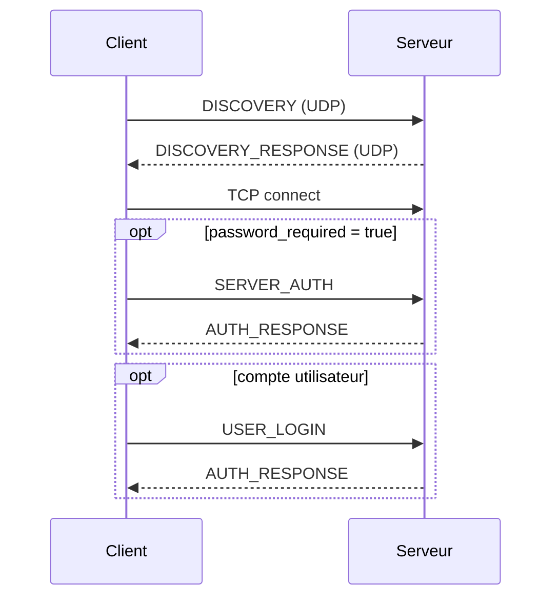
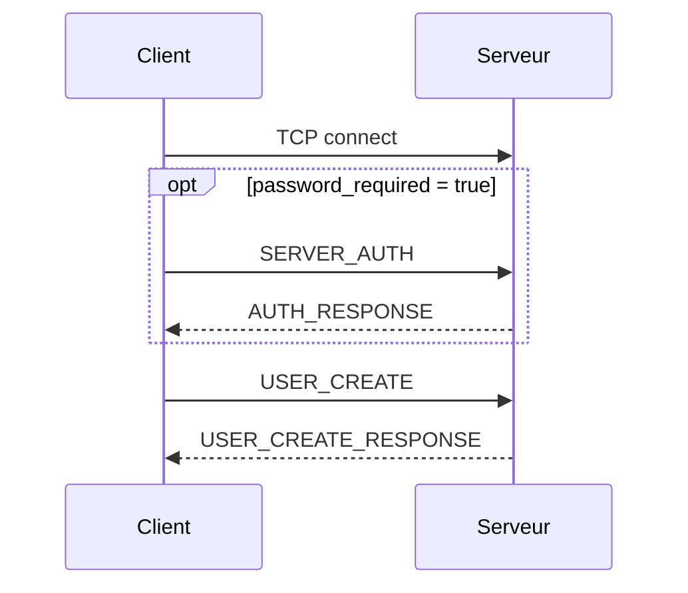
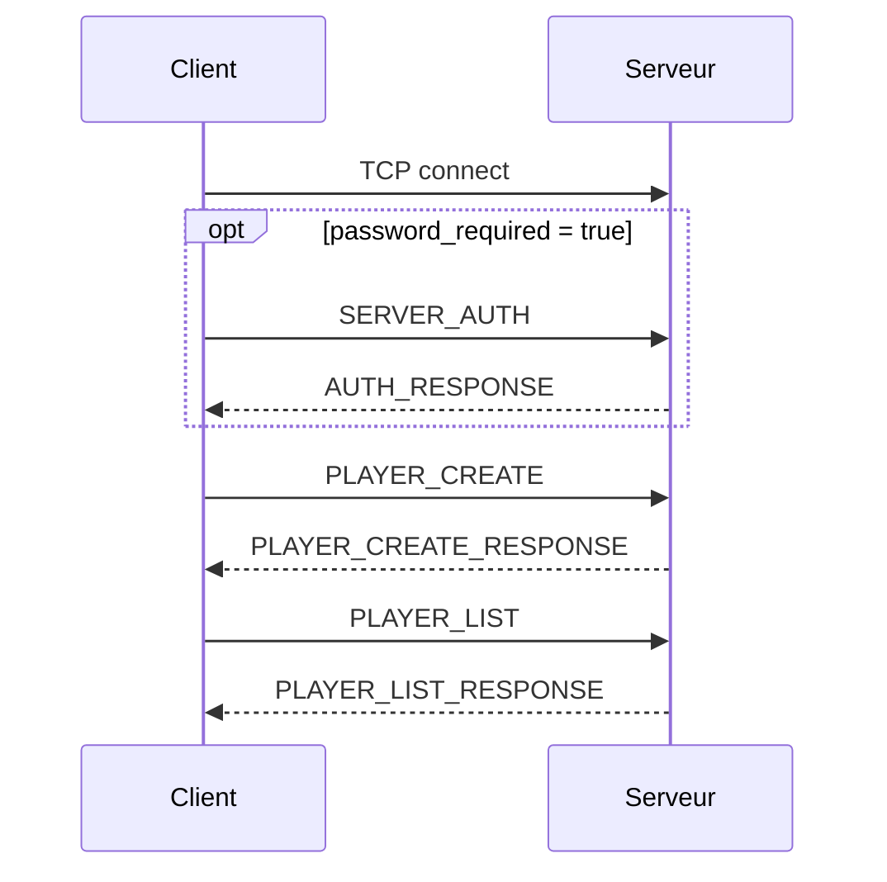
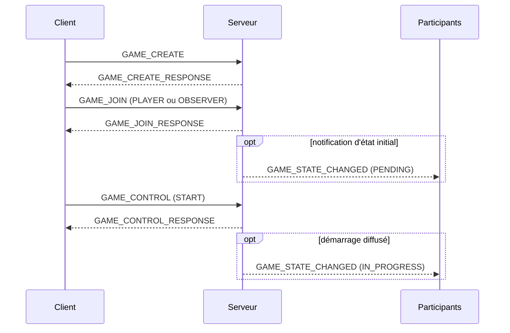
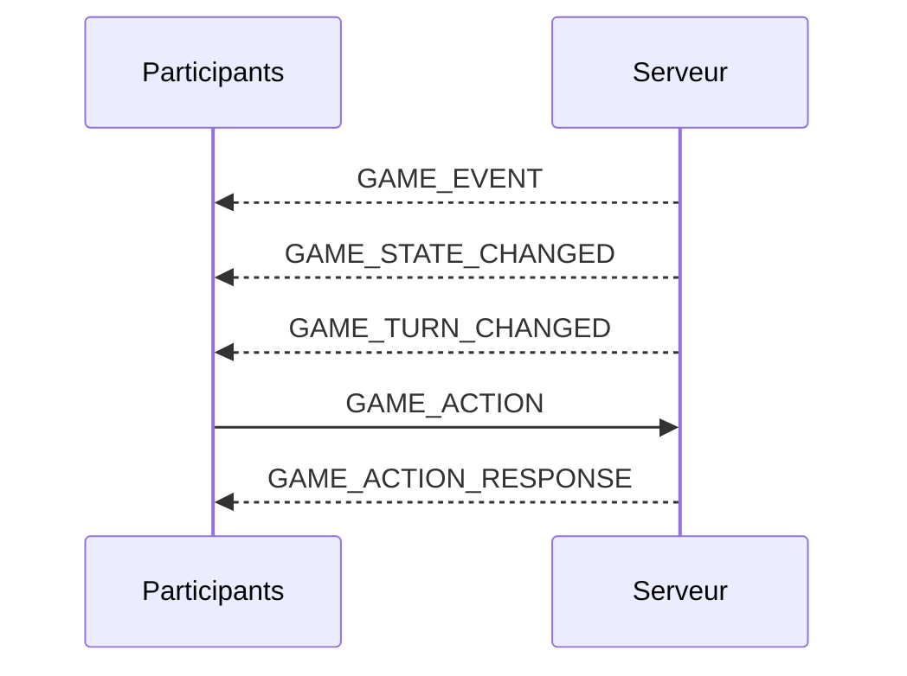
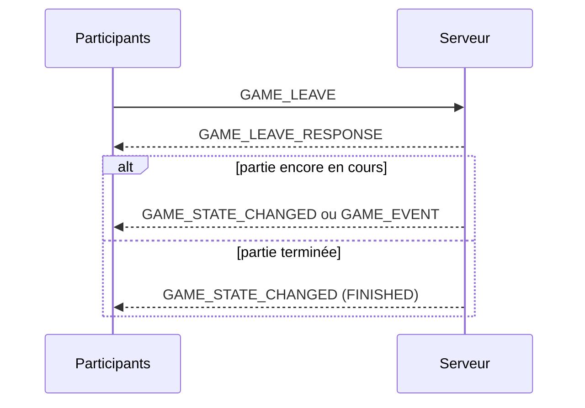
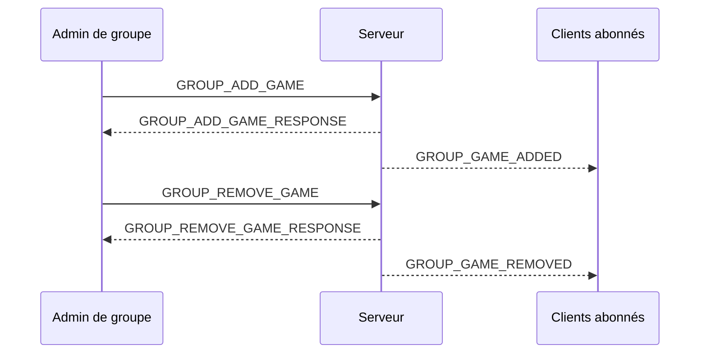
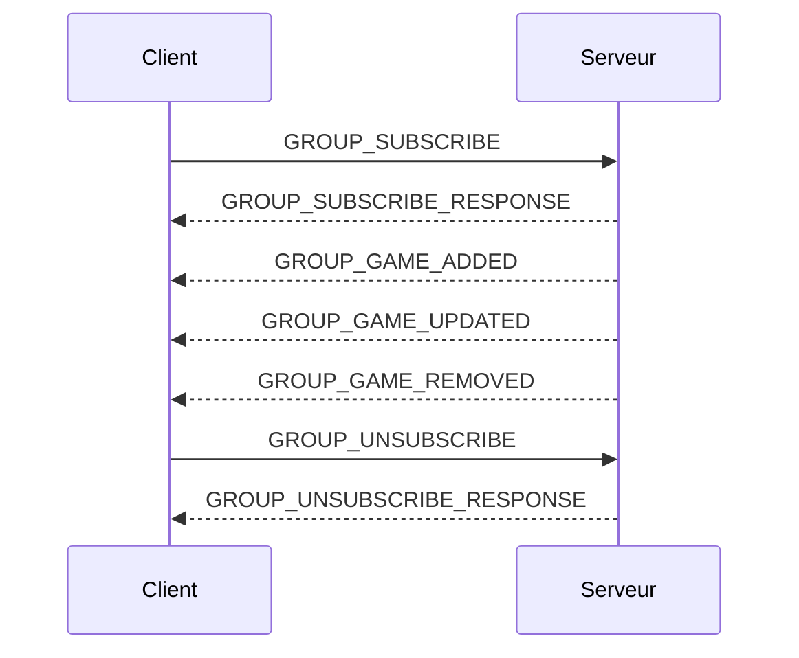

# Protocole d'échanges entre le client et le serveur

Dans cette section sont décrits les messages échangés entre les clients et le serveur.

## Préambule au protocole d’échanges

Cette section décrit le protocole utilisé pour les échanges de messages entre les clients et le serveur multijoueur. Elle précise les rôles des différents acteurs, les transports réseau utilisés, la structure générale des messages, les principes de validation, ainsi que les niveaux d’accès appliqués aux clients par le serveur.

L’objectif de ce protocole est de fournir un cadre d’échange clair, extensible et prévisible pour les opérations suivantes :

- découverte automatique des serveurs disponibles sur le réseau local ;
- établissement d’une communication entre un client et un serveur ;
- authentification et élévation progressive des droits d’accès ;
- gestion des utilisateurs, des groupes et des parties ;
- transmission des événements de jeu ;
- notification des changements d’état aux clients concernés ;
- administration du serveur.

### Définitions

Les termes suivants sont utilisés dans la suite de cette section.

#### Utilisateur

Un **utilisateur** (ou compte utilisateur) est une entité persistante sur le serveur, définie par un identifiant unique, un nom d'utilisateur et un mot de passe. L'utilisateur permet, après authentification, d'accéder au serveur avec un certain niveau de droits (PLAYER, GROUP_ADMIN, ADMIN).

Tout utilisateur possède un objet **Joueur** qui lui est propre et qui est récupéré automatiquement lors de l'authentification. Lorsque ce joueur est rattaché à une session, il devient le joueur par défaut actif de la session tant que l'utilisateur reste authentifié.

#### Joueur

Un **joueur** est l'entité qui participe effectivement à une partie de jeu ou qui l'observe. Alors que l'utilisateur gère l'accès et les permissions, le joueur porte les attributs liés au jeu (nom, score, état dans la partie, etc.). 

Un client peut posséder plusieurs objets **Joueur** au cours d'une même session (par exemple pour permettre à plusieurs participants de jouer sur le même ordinateur). Cependant, un seul joueur est considéré à un instant donné comme le **joueur par défaut actif** de la session.

Dans cette version du protocole, un client doit obligatoirement disposer d'un objet **Joueur** dans sa session pour rejoindre une partie :
- Pour un utilisateur authentifié, le joueur associé à son compte est automatiquement ajouté à la session et devient le joueur par défaut actif.
- Pour un client non authentifié (niveau `BASE`), un joueur doit être créé explicitement via une requête dédiée. Le dernier joueur créé avec l'option "par défaut" devient le joueur de référence pour les actions suivantes.

Règle de résolution du joueur de référence :
- si une requête accepte un `player_id` mais qu'aucun identifiant n'est fourni, le serveur utilise le joueur par défaut actif de la session ;
- si aucun joueur par défaut actif n'est disponible, la requête échoue avec `PLAYER_NOT_FOUND` ;
- l'authentification utilisateur rend prioritaire le joueur associé au compte, sans supprimer les autres joueurs de la session ;
- la déconnexion utilisateur retire cette priorité ; si un joueur de session avait déjà été désigné comme joueur par défaut actif, il redevient le joueur de référence, sinon la session reste sans joueur par défaut actif.

#### Client

Un **client** est une application qui se connecte à un serveur multijoueur afin de consulter les informations disponibles, rejoindre ou observer une partie, jouer, administrer un groupe de parties ou administrer le serveur.

Un client peut représenter différents types d’utilisateurs selon son niveau d’accès courant : visiteur non authentifié, utilisateur connecté, joueur, administrateur de groupe ou administrateur serveur.

Du point de vue du protocole, un client est identifié par sa connexion réseau active et par le niveau d’accès que le serveur lui a attribué. Ce niveau d’accès peut évoluer au cours de la session.

#### Serveur

Le **serveur** est l’application qui reçoit les messages des clients, valide leur contenu, contrôle les droits d’accès, exécute les actions demandées et retourne les réponses appropriées.

Il est responsable notamment de :

- l’écoute des connexions entrantes ;
- la réponse aux requêtes de découverte réseau ;
- la validation syntaxique et sémantique des messages reçus ;
- l’authentification des clients ;
- l’attribution et la conservation temporaire des niveaux d’accès ;
- la gestion des objets multijoueur : utilisateurs, groupes et parties ;
- l’envoi de réponses aux requêtes ;
- l’envoi éventuel de notifications spontanées aux clients connectés.

#### Protocole

Le **protocole** désigne l’ensemble des règles qui définissent la manière dont les clients et le serveur échangent des messages.

Il précise notamment :

- les transports réseau utilisés ;
- les formats de sérialisation acceptés ;
- la structure commune des messages ;
- les types de messages disponibles ;
- les champs obligatoires et optionnels ;
- les règles de validation ;
- les niveaux d’accès nécessaires pour utiliser chaque requête ;
- le comportement attendu du serveur en cas de succès ou d’erreur.

#### Transport

Le **transport** désigne le mécanisme réseau utilisé pour transmettre un message entre un client et le serveur.

Deux transports sont utilisés :

- **UDP**, uniquement pour les échanges de découverte réseau ;
- **TCP**, pour les communications principales entre les clients et le serveur.

UDP est utilisé pour les messages courts de découverte, car il permet l’envoi multicast sur le réseau local. Les messages UDP sont autonomes : chaque datagramme correspond à un message complet.

TCP est utilisé pour les échanges de jeu et de contrôle, car il fournit une connexion fiable, ordonnée et adaptée à des échanges suivis entre un client et le serveur. Comme TCP transporte un flux d’octets et non des messages distincts, chaque message TCP est précédé d’un en-tête indiquant la longueur du contenu transmis.

#### Message

Un **message** est une unité logique d’information échangée entre un client et le serveur.

Chaque message possède un type qui indique sa nature ou l’action demandée. Selon le transport et le type d’échange, un message peut être :

- une requête envoyée par un client ;
- une réponse envoyée par le serveur à la suite d’une requête ;
- une notification envoyée spontanément par le serveur ;
- un message de découverte envoyé en UDP ;
- une réponse de découverte envoyée en UDP.

Les messages sont sérialisés soit en JSON encodé en UTF-8, soit en [MessagePack](https://msgpack.org/index.html). Le format MessagePack est privilégié pour les messages de jeu et obligatoire pour les notifications de jeu pour des raisons de performance.

Quand un message est sérialisé en MessagePack, il conserve exactement le même schéma logique que sa version JSON : mêmes noms de champs, mêmes niveaux d'imbrication et mêmes contraintes sémantiques. La différence porte uniquement sur l'encodage binaire des données à la transmission.

#### Requête

Une **requête** est un message envoyé par un client au serveur pour demander une action ou une information.

Exemples de requêtes :

- rechercher les serveurs disponibles ;
- s’authentifier auprès du serveur ;
- créer ou lister les joueurs de la session ;
- créer une partie ;
- rejoindre ou observer une partie ;
- transmettre une action de jeu ;
- demander la liste des parties disponibles ;
- modifier une configuration ;
- administrer un utilisateur, un groupe ou le serveur.

Chaque requête est associée à un niveau d’accès minimal. Le serveur doit vérifier que le client dispose du niveau requis avant d’exécuter l’action demandée.

#### Réponse

Une **réponse** est un message envoyé par le serveur à un client en réaction à une requête.

Une réponse indique si la requête a réussi ou échoué. Elle peut contenir :

- des données demandées par le client ;
- une confirmation d’exécution ;
- un message d’erreur ;
- un code d’erreur ;
- des informations complémentaires permettant au client de comprendre ou corriger la requête.

Sauf indication contraire, toute requête TCP valide doit produire une réponse explicite du serveur.

#### Notification

Une **notification** est un message envoyé par le serveur à un ou plusieurs clients sans requête immédiate de leur part.

Elle sert à informer les clients d’un événement ou d’un changement d’état pertinent, par exemple :

- un joueur a rejoint ou quitté une partie ;
- une partie a démarré, été mise en pause, reprise ou terminée ;
- l’état d’une partie a changé ;
- un administrateur a modifié une configuration ;
- le serveur va s’arrêter ;
- un événement de jeu doit être diffusé aux participants.

Une notification ne nécessite pas nécessairement de réponse de la part du client, sauf si le type de notification le précise explicitement.

#### Session client

Une **session client** correspond à la période pendant laquelle un client est connecté au serveur.

Pendant cette session, le serveur conserve les informations nécessaires au suivi du client, notamment :

- son niveau d’accès courant ;
- son éventuel utilisateur authentifié ;
- la liste des objets **Joueur** créés ou récupérés durant la session ;
- l'objet **Joueur par défaut** (utilisé automatiquement si aucun identifiant n'est précisé) ;
- les parties qu’il a rejointes ;
- les groupes auxquels il est abonné ;
- les groupes ou ressources auxquels il a accès ;
- les droits particuliers liés à son rôle.

Ces informations sont temporaires et sont réinitialisées lors de la déconnexion du client.

### Principes généraux des échanges

Les échanges suivent les principes suivants.

#### Séparation entre découverte et communication principale

La découverte réseau utilise UDP afin de permettre à un client de rechercher automatiquement les serveurs disponibles sur le réseau local.

Une fois un serveur découvert, les échanges principaux se font en TCP. Le client utilise alors les informations fournies dans la réponse de découverte pour établir une connexion avec le serveur.

#### Communication principalement initiée par le client

La plupart des échanges sont initiés par le client sous forme de requêtes. Le serveur valide la requête, vérifie les droits du client, exécute l’action si elle est autorisée, puis retourne une réponse.

Le schéma général est donc :
```plain text
Client → Serveur : requête
Serveur → Client : réponse
```
#### Notifications initiées par le serveur

Le serveur peut également envoyer des messages sans requête immédiate du client lorsqu’un événement doit être porté à sa connaissance.

Le schéma est alors :
```plain text
Serveur → Client : notification
```
Ces notifications permettent de maintenir les clients synchronisés avec l’état du serveur et des parties auxquelles ils participent ou qu’ils observent.

#### Validation systématique des messages

Tout message reçu doit être validé avant traitement.

La validation porte notamment sur :

- le format du message ;
- la présence des champs obligatoires ;
- le type des valeurs reçues ;
- les valeurs autorisées ;
- la version du protocole ;
- la cohérence du contenu ;
- le niveau d’accès du client ;
- l’existence des ressources référencées ;
- l’état courant des objets concernés.

Un message invalide ne doit pas provoquer l’arrêt du serveur. Il doit donner lieu à une réponse d’erreur lorsque le transport et le contexte le permettent.

#### Robustesse et compatibilité

Les champs inconnus peuvent être ignorés lorsque cela ne compromet pas la sécurité ni la cohérence du traitement. Cette règle permet de faciliter l’évolution du protocole.

En revanche, l’absence d’un champ obligatoire, une valeur de type incorrect ou une valeur explicitement interdite rendent le message invalide.

Chaque message contient une information de version permettant de distinguer les évolutions futures du protocole.

### Transports et formats de sérialisation

Le protocole utilise deux transports réseau et deux formats principaux de sérialisation.

#### Messages UDP

Les messages UDP sont utilisés uniquement pour la découverte réseau.

Ils sont sérialisés en JSON encodé en UTF-8. Chaque datagramme UDP contient exactement un message logique complet.

Les messages UDP ne sont pas précédés d’un en-tête de longueur, car UDP conserve naturellement les frontières des datagrammes.

Familles de messages UDP :

- requête de découverte ;
- réponse de découverte.

#### Messages TCP

Les messages TCP sont utilisés pour toutes les communications principales entre les clients et le serveur.

Ils peuvent être sérialisés selon deux formats :

- JSON encodé en UTF-8, pour les messages de contrôle, de configuration, d’administration et de gestion ;
- MessagePack, pour les données de jeu ou les états de jeu lorsque le format binaire est préférable.

Chaque message TCP est précédé d’un en-tête de 4 octets indiquant la taille du contenu en octets, encodée en **big-endian**.
```plain text
[longueur sur 4 octets][contenu JSON ou MessagePack]
```
Cet en-tête est nécessaire car TCP transporte un flux continu d’octets et ne conserve pas les frontières entre les messages applicatifs.

La longueur indiquée correspond à la taille en octets du contenu après sérialisation, qu'il s'agisse de JSON ou de MessagePack.

### Structure générale des messages

Sauf indication contraire, les messages applicatifs utilisent une structure commune.

Pour les messages JSON :
```json
{
  "type": "EVENT_TYPE",
  "version": 2,
  "request_id": "req_12345",
  "payload": {}
}
```
#### Champ `type`

Le champ `type` identifie la nature du message.

Il permet au destinataire de déterminer le traitement à appliquer. Sa valeur doit appartenir à la liste des types reconnus par le protocole.

#### Champ `version`

Le champ `version` indique la version du protocole utilisée pour le message.

Dans cette version du protocole, la valeur attendue est `2`.

#### Champ `payload`

Le champ `payload` contient les données spécifiques au message.

Sa structure dépend du type de message. Il peut être vide lorsque le type de message ne nécessite aucune donnée complémentaire.

#### Champ `request_id`

Le champ `request_id` est un identifiant de corrélation optionnel utilisé pour les requêtes TCP et les réponses associées.

Lorsqu'un client l'envoie dans une requête TCP, le serveur doit le recopier à l'identique dans la réponse correspondante. Ce champ permet de faire correspondre une réponse à sa requête d'origine lorsque plusieurs requêtes peuvent être en cours de traitement ou lorsque des notifications peuvent s'intercaler dans le flux.

Si une connexion n'exécute qu'une seule requête à la fois, `request_id` peut être omis. Il est recommandé dès que le client peut envoyer plusieurs requêtes sans attendre la réponse précédente.

### Niveaux d’accès des clients

Le serveur associe à chaque client connecté un niveau d’accès courant. Ce niveau détermine les requêtes que le client est autorisé à utiliser.

Chaque client commence avec le niveau d’accès le plus faible. Il peut ensuite obtenir un niveau supérieur en réussissant les opérations d’authentification ou d’autorisation prévues par le protocole.

Les niveaux d’accès sont hiérarchiques : un client disposant d’un niveau donné peut utiliser les requêtes de ce niveau ainsi que celles des niveaux inférieurs.

Les niveaux d’accès sont les suivants.

#### `OPEN`

Accès ouvert, sans authentification.

Ce niveau permet uniquement les opérations publiques, par exemple :

- découvrir un serveur ;
- consulter certaines informations publiques ;
- commencer une procédure d’authentification ;
- accéder aux informations explicitement exposées sans restriction.

Tout client dispose de ce niveau par défaut.

#### `BASE`

Accès de base au serveur.

Ce niveau est accordé lorsqu’un client a satisfait aux conditions générales d’accès au serveur, par exemple la présentation du mot de passe du serveur si celui-ci est requis.

Si aucun mot de passe serveur n’est configuré, ce niveau peut être considéré comme équivalent au niveau `OPEN`.

#### `PLAYER`

Accès réservé aux joueurs authentifiés.

Ce niveau permet au client d’agir en tant que joueur identifié. Il peut notamment permettre de :

- rejoindre une partie en tant que joueur ;
- quitter une partie ;
- effectuer des actions de jeu ;
- accéder aux informations liées à ses propres parties ;
- recevoir les notifications associées à ses parties.

#### `GROUP_ADMIN`

Accès réservé aux administrateurs de groupes.

Ce niveau permet d’effectuer des opérations d’administration limitées aux groupes pour lesquels le client dispose des droits nécessaires.

Il peut notamment permettre de :

- créer, modifier ou supprimer des parties dans un groupe administré ;
- gérer certains paramètres de groupe ;
- consulter des informations d’administration limitées au périmètre autorisé.

Ce niveau n’implique pas un accès complet à l’administration du serveur.

#### `ADMIN`

Accès administrateur serveur.

Ce niveau donne accès aux opérations d’administration globale du serveur.

Il peut notamment permettre de :

- gérer les utilisateurs ;
- gérer tous les groupes et toutes les parties ;
- modifier la configuration serveur ;
- déclencher une sauvegarde ou un rechargement persistant ;
- consulter des informations globales d’état ;
- arrêter proprement le serveur.

### Attribution et conservation des niveaux d’accès

Le niveau d’accès est attribué par le serveur à chaque client connecté.

Au début d’une session, le client est au niveau `OPEN`. Son niveau peut ensuite évoluer à la suite de requêtes réussies, par exemple :

- validation du mot de passe serveur ;
- authentification d’un utilisateur ;
- vérification du rôle d’un utilisateur ;
- validation de droits d’administration sur un groupe ;
- authentification comme administrateur serveur.

Le niveau d’accès courant est conservé jusqu’à l’un des événements suivants :

- déconnexion du client ;
- expiration ou invalidation de la session ;
- requête explicite de déconnexion ou de changement d’identité ;
- révocation des droits ;
- arrêt du serveur.

La persistance du serveur ne mémorise pas le niveau d’accès courant des clients. Lorsqu’un client se reconnecte, il commence une nouvelle session au niveau `OPEN`.

### Contrôle d’accès aux requêtes

Chaque requête définit un niveau d’accès minimal.

Avant d’exécuter une requête, le serveur doit vérifier :

1. que le message est syntaxiquement valide ;
2. que le type de requête est reconnu ;
3. que le niveau d’accès du client est suffisant ;
4. que les ressources demandées existent ;
5. que l’état courant du serveur ou de la partie permet l’action demandée ;
6. que les droits spécifiques au périmètre concerné sont respectés.

Si le niveau d’accès est insuffisant, le serveur doit refuser la requête et retourner une erreur adaptée.

Un niveau d’accès élevé ne dispense pas nécessairement des vérifications de périmètre. Par exemple, un administrateur de groupe peut disposer du niveau `GROUP_ADMIN` sans être autorisé à administrer tous les groupes.

### Familles de messages

Les messages du protocole sont regroupés en familles fonctionnelles.

Cette classification facilite la lecture de la spécification et l’évolution future du protocole.

#### Messages de découverte

Ces messages permettent à un client de rechercher les serveurs disponibles sur le réseau local.

Transport utilisé : UDP.

Format possible : JSON

Exemples :

- requête de découverte ;
- réponse de découverte.

#### Messages de connexion et d’accès

Ces messages permettent d’établir l’accès au serveur et de faire évoluer le niveau d’accès du client.

Transport utilisé : TCP.

Format possible : JSON

Exemples :

- présentation du mot de passe serveur ;
- authentification utilisateur ;
- déconnexion ;
- changement ou réinitialisation de session.

#### Messages de gestion des utilisateurs

Ces messages concernent les comptes utilisateurs.

Transport utilisé : TCP.

Format possible : JSON

Exemples :

- création d’un utilisateur ;
- authentification d’un utilisateur ;
- modification d’un mot de passe ;
- consultation ou modification d’un profil utilisateur ;
- suppression ou désactivation d’un utilisateur.

#### Messages de gestion des parties

Ces messages concernent la création, la consultation et la modification des parties.

Transport utilisé : TCP.

Format possible : JSON

Exemples :

- créer une partie ;
- lister les parties disponibles ;
- rejoindre une partie comme joueur ;
- rejoindre une partie comme observateur ;
- quitter une partie ;
- démarrer, mettre en pause, reprendre ou terminer une partie ;
- modifier l’ordre des joueurs dans une partie au tour par tour.

#### Messages de gestion des groupes

Ces messages concernent les groupes de parties.

Transport utilisé : TCP.

Format possible : JSON

Exemples :

- créer un groupe ;
- s'abonner ou se désabonner à un groupe ;
- ajouter une partie à un groupe ;
- retirer une partie d'un groupe ;
- consulter les parties d'un groupe ;
- modifier les paramètres d'un groupe.

#### Messages de jeu

Ces messages transportent les actions de jeu, les événements de jeu et les états de jeu.

Transport utilisé : TCP.

Format possible : JSON

Exemples :

- action effectuée par un joueur ;
- validation ou refus d’une action ;
- changement de tour ;
- mise à jour d’un état de jeu ;
- synchronisation d’un état complet ou partiel.

#### Messages de notification

Ces messages sont envoyés par le serveur pour informer les clients d’un événement.

Transport utilisé : TCP.

Format utilisé : JSON ou MessagePack (obligatoire pour les notifications de jeu).

Exemples :

- joueur rejoint ou quitte une partie ;
- changement d’état d’une partie ;
- ajout, retrait ou mise à jour d’une partie dans un groupe ;
- événement de jeu diffusé aux participants ;
- avertissement avant arrêt du serveur.

#### Messages d’administration

Ces messages sont réservés aux clients disposant de droits élevés.

Transport utilisé : TCP.

Format possible : JSON

Exemples :

- consulter l’état global du serveur ;
- consulter la configuration courante du serveur ;
- sauvegarder ou rechargement les données persistantes ;
- modifier la configuration ;
- consulter les journaux d'audit ;
- gérer les utilisateurs ;
- arrêter le serveur.

#### Messages d’erreur

Ces messages indiquent qu’une requête n’a pas pu être traitée.

Transport utilisé : principalement TCP.

Format possible : JSON

Une erreur peut notamment résulter de :

- message invalide ;
- type de message inconnu ;
- version de protocole incompatible ;
- niveau d’accès insuffisant ;
- ressource inexistante ;
- mot de passe incorrect ;
- action interdite dans l’état courant ;
- erreur interne du serveur.

### Règles générales de réponse

Sauf indication contraire, toute requête TCP doit produire une réponse.

Une réponse doit permettre au client de déterminer clairement :

- si la requête a réussi ;
- quelles données sont retournées ;
- quelle erreur s'est produite le cas échéant ;
- si le client peut corriger la requête et la renvoyer ;
- si son niveau d'accès a été modifié.

Si la requête TCP contient un `request_id`, la réponse associée doit reprendre exactement cette valeur afin de permettre la corrélation entre requête, réponse et notifications intercalées.

Les notifications envoyées spontanément par le serveur ne nécessitent pas de réponse, sauf mention explicite dans la description du message concerné.

Les messages UDP de découverte suivent une logique spécifique : une requête de découverte invalide peut simplement être ignorée par le serveur, afin d’éviter de répondre à des messages non conformes ou non sollicités.

### Principes de gestion des erreurs

Lorsqu’une requête ne peut pas être traitée, le serveur doit retourner une erreur structurée lorsque le transport le permet.

Une erreur devrait contenir au minimum :

- un type ou code d’erreur ;
- un message explicatif ;
- éventuellement des détails utiles au diagnostic ;
- éventuellement l’identifiant de la requête concernée si le protocole prévoit une corrélation.

Le serveur ne doit pas exposer d’informations sensibles dans les messages d’erreur. Par exemple, une erreur d’authentification ne doit pas permettre de distinguer inutilement un utilisateur inexistant d’un mot de passe incorrect si cela affaiblit la sécurité.

### Versionnement et extensibilité

La version du protocole est indiquée dans les messages afin de faciliter les évolutions futures.

Les principes suivants s’appliquent :

- les champs inconnus peuvent être ignorés lorsqu’ils ne compromettent pas le traitement ;
- les champs obligatoires doivent toujours être présents ;
- les valeurs inconnues pour le type de message rendent le message invalide ;
- une version incompatible peut entraîner le refus du message ;
- de nouveaux types de messages peuvent être ajoutés dans les versions futures ;
- de nouveaux champs optionnels peuvent être ajoutés sans casser la compatibilité.

### Sécurité générale

Le protocole doit être interprété selon un principe de méfiance vis-à-vis des données reçues.

Le serveur doit considérer tout message client comme potentiellement invalide, incomplet, malveillant ou non autorisé.

En particulier, le serveur doit :

- valider tous les champs reçus ;
- contrôler systématiquement les niveaux d’accès ;
- ne jamais faire confiance à un identifiant fourni sans vérification ;
- éviter de divulguer des informations sensibles ;
- limiter les effets des messages invalides ;
- refuser les actions incohérentes avec l’état courant ;
- appliquer les mécanismes de chiffrement configurés lorsque TLS est activé.


## Messages de découverte

### Requête de découverte

**Direction :** Client → Serveur  
**Transport :** Multicast UDP  
**Encodage :** JSON UTF-8

**Niveau d'accès :** OPEN

Message envoyé par un client pour découvrir les serveurs disponibles sur le réseau local.

#### Exemple

```json
{
  "type": "DISCOVERY",
  "service_name": "multiplayer_server",
  "version": 2
}
```


#### Champs

| Champ | Type JSON | Obligatoire | Valeurs autorisées | Description |
|---|---|---:|---|---|
| `type` | `string` | Oui | `"DISCOVERY"` | Identifie le message comme une requête de découverte. |
| `service_name` | `string` | Oui | `"multiplayer_server"` | Identifie le service recherché. |
| `version` | `number` | Oui | `2` | Version du protocole. |

#### Règles de validation

- Les champs inconnus doivent être ignorés.
- L’absence d’un champ obligatoire rend le message invalide.
- Une valeur invalide pour `type`, `service_name` ou `version` rend le message invalide.

---

### Réponse de découverte

**Direction :** Serveur → Client  
**Transport :** Unicast UDP  
**Encodage :** JSON UTF-8

Message envoyé par un serveur en réponse à une requête de découverte valide.

#### Exemple

```json
{
  "type": "DISCOVERY_RESPONSE",
  "service_name": "multiplayer_server",
  "version": 2,
  "service_host": "192.168.1.20",
  "service_port": 65432,
  "unencrypted_port": null,
  "name": "Local game server",
  "use_tls": true,
  "password_required": false
}
```

#### Champs

| Champ | Type JSON | Obligatoire | Contraintes / valeurs autorisées | Description |
|---|---|---:|---|---|
| `type` | `string` | Oui | `"DISCOVERY_RESPONSE"` | Identifie le message comme une réponse de découverte. |
| `service_name` | `string` | Oui | `"multiplayer_server"` | Identifie le service. |
| `version` | `number` | Oui | `2` | Version du protocole. |
| `service_host` | `string` | Oui | Adresse IPv4 ou nom DNS | Adresse que les clients doivent utiliser pour se connecter au serveur. |
| `service_port` | `number` | Oui | Entier de `1` à `65535` | Port TCP utilisé par le point d’accès principal ou sécurisé du service. |
| `unencrypted_port` | `number \| null` | Oui | Entier de `1` à `65535`, ou `null` | Port TCP pour les connexions non chiffrées. `null` signifie qu’il n’est pas disponible. |
| `name` | `string` | Oui | Toute chaîne de caractères | Nom lisible du serveur. |
| `use_tls` | `boolean` | Oui | `true` ou `false` | Indique si TLS est activé sur le port principal du service. |
| `password_required` | `boolean` | Oui | `true` ou `false` | Indique si un mot de passe est nécessaire pour se connecter. |

#### Règles de validation

- `service_port` ne doit pas être `0`.
- `unencrypted_port` doit être soit `null`, soit un entier compris entre `1` et `65535`.
- `service_host` doit être joignable par le client.
- Si `use_tls` vaut `true`, `service_port` est le point d'accès TLS principal du serveur. Si `unencrypted_port` n'est pas `null`, il désigne un point d'accès TCP non chiffré optionnel.
- Si `use_tls` vaut `false`, `service_port` est le point d'accès TCP non chiffré principal du serveur et `unencrypted_port` doit être `null`.
- Quand `unencrypted_port` n'est pas `null`, les clients qui ne souhaitent pas ou ne peuvent pas utiliser TLS doivent utiliser `unencrypted_port` plutôt que `service_port`.
- Si `password_required` vaut `true`, le client doit s’authentifier selon le protocole de connexion prévu.

---

## Messages de connexion et d’accès

Ces messages permettent au client d'établir une session avec le serveur et de faire évoluer son niveau d'accès.

### Présentation du mot de passe serveur

**Direction :** Client → Serveur  
**Transport :** TCP  
**Encodage :** JSON UTF-8  
**Niveau d'accès minimal :** `OPEN`

Cette requête est utilisée lorsqu'un serveur nécessite un mot de passe pour autoriser l'accès de base (passage au niveau `BASE`). Elle doit être envoyée immédiatement après l'établissement de la connexion TCP si `password_required` était à `true` dans la réponse de découverte.

Lorsque `password_required` vaut `true`, aucune autre requête applicative ne doit être envoyée avant la réussite de `SERVER_AUTH`. Après une authentification serveur réussie, le client passe au niveau `BASE` et peut ensuite envoyer les requêtes autorisées par ce niveau.

Si `password_required` vaut `false`, le client peut directement envoyer des requêtes autorisées au niveau `OPEN` ou `BASE` selon le contexte du serveur et du mot de passe configuré.

#### Exemple

```json
{
  "type": "SERVER_AUTH",
  "version": 2,
  "payload": {
    "password": "server_password_123"
  }
}
```

#### Champs

| Champ | Type JSON | Obligatoire | Description |
|---|---|---:|---|
| `type` | `string` | Oui | `"SERVER_AUTH"` |
| `version` | `number` | Oui | `2` |
| `payload.password` | `string` | Oui | Le mot de passe du serveur en clair. |

---

### Création d'un joueur (Session non-authentifiée)

**Direction :** Client → Serveur  
**Transport :** TCP  
**Encodage :** JSON UTF-8  
**Niveau d'accès minimal :** `BASE`

Cette requête permet à un client connecté (niveau `BASE`) de se créer un objet **Joueur** pour la durée de sa session, sans avoir besoin de s'authentifier avec un compte utilisateur. Cela est indispensable pour pouvoir rejoindre ou observer une partie en tant que simple visiteur.

Un client peut créer plusieurs joueurs au cours de la session (par exemple pour gérer plusieurs participants sur la même machine). L'un d'entre eux peut être désigné comme joueur "par défaut" de la session. Si un joueur par défaut existe déjà, le nouveau joueur créé avec l'option `is_default` à `true` prend ce rôle, mais le joueur précédent continue d'exister. Si la session est authentifiée, le joueur associé au compte reste prioritaire sur les joueurs créés via `PLAYER_CREATE` jusqu'à la déconnexion.

#### Exemple

```json
{
  "type": "PLAYER_CREATE",
  "version": 2,
  "payload": {
    "name": "GuestPlayer",
    "is_default": true,
    "attributes": {
      "color": "blue"
    }
  }
}
```

#### Réponse (`PLAYER_CREATE_RESPONSE`)

```json
{
  "type": "PLAYER_CREATE_RESPONSE",
  "version": 2,
  "payload": {
    "success": true,
    "player_id": "uuid_du_joueur_cree",
    "message": "Player created successfully"
  }
}
```

#### Champs (`PLAYER_CREATE`)

| Champ | Type JSON | Obligatoire | Description |
|---|---|---:|---|
| `type` | `string` | Oui | `"PLAYER_CREATE"` |
| `version` | `number` | Oui | `2` |
| `payload.name` | `string` | Oui | Nom souhaité pour le joueur. |
| `payload.is_default` | `boolean` | Non | Si `true`, ce joueur devient le joueur par défaut de la session (`true` par défaut s'il s'agit du premier joueur). |
| `payload.attributes` | `object` | Non | Attributs personnalisés pour la session. |

#### Champs (`PLAYER_CREATE_RESPONSE`)

| Champ | Type JSON | Obligatoire | Description |
|---|---|---:|---|
| `payload.success` | `boolean` | Oui | `true` si la création a réussi. |
| `payload.player_id` | `string` | Non | UUID du joueur créé (en cas de succès). |
| `payload.error_code` | `string` | Non | Code d'erreur en cas d'échec. |
| `payload.message` | `string` | Oui | Message d'information ou d'erreur. |

#### Codes d'erreur (`PLAYER_CREATE_RESPONSE`)

| Code | Description |
|---|---|
| `INVALID_NAME` | Le nom fourni est invalide ou déjà utilisé. |

---

### Liste des joueurs de la session

**Direction :** Client → Serveur  
**Transport :** TCP  
**Encodage :** JSON UTF-8  
**Niveau d'accès minimal :** `BASE`

Cette requête permet au client de récupérer la liste de tous les objets **Joueur** associés à sa session actuelle. Cela inclut les joueurs créés via la requête `PLAYER_CREATE` ainsi que le joueur associé au compte utilisateur si le client est authentifié.

La réponse précise pour chaque joueur son identifiant unique, son nom et s'il s'agit du joueur par défaut de la session.

#### Exemple

```json
{
  "type": "PLAYER_LIST",
  "version": 2,
  "payload": {}
}
```

#### Réponse (`PLAYER_LIST_RESPONSE`)

```json
{
  "type": "PLAYER_LIST_RESPONSE",
  "version": 2,
  "payload": {
    "success": true,
    "players": [
      {
        "player_id": "uuid_joueur_1",
        "name": "GuestPlayer",
        "is_default": false
      },
      {
        "player_id": "uuid_joueur_2",
        "name": "AuthenticatedUser",
        "is_default": true
      }
    ]
  }
}
```

#### Champs (`PLAYER_LIST`)

| Champ | Type JSON | Obligatoire | Description |
|---|---|---:|---|
| `type` | `string` | Oui | `"PLAYER_LIST"` |
| `version` | `number` | Oui | `2` |

#### Champs (`PLAYER_LIST_RESPONSE`)

| Champ | Type JSON | Obligatoire | Description |
|---|---|---:|---|
| `payload.success` | `boolean` | Oui | `true` si la requête a réussi. |
| `payload.players` | `array` | Non | Liste des objets joueurs associés à la session (en cas de succès). |
| `payload.players[].player_id` | `string` | - | UUID du joueur. |
| `payload.players[].name` | `string` | - | Nom du joueur. |
| `payload.players[].is_default` | `boolean` | - | `true` s'il s'agit du joueur par défaut de la session. |
| `payload.error_code` | `string` | Non | Code d'erreur en cas d'échec. |
| `payload.message` | `string` | Non | Message d'information ou d'erreur. |

---

### Modification d'un joueur de la session

**Direction :** Client → Serveur  
**Transport :** TCP  
**Encodage :** JSON UTF-8  
**Niveau d'accès minimal :** `BASE`

Cette requête permet au client de modifier le nom d'un objet **Joueur** associé à sa session (joueur créé via `PLAYER_CREATE` ou joueur associé au compte utilisateur).

#### Exemple

```json
{
  "type": "PLAYER_UPDATE",
  "version": 2,
  "payload": {
    "player_id": "uuid_du_joueur",
    "name": "NouveauNom"
  }
}
```

#### Réponse (`PLAYER_UPDATE_RESPONSE`)

```json
{
  "type": "PLAYER_UPDATE_RESPONSE",
  "version": 2,
  "payload": {
    "success": true,
    "player_id": "uuid_du_joueur",
    "message": "Player updated successfully"
  }
}
```

#### Champs (`PLAYER_UPDATE`)

| Champ | Type JSON | Obligatoire | Description |
|---|---|---:|---|
| `type` | `string` | Oui | `"PLAYER_UPDATE"` |
| `version` | `number` | Oui | `2` |
| `payload.player_id` | `string` | Oui | UUID du joueur à modifier. |
| `payload.name` | `string` | Oui | Nouveau nom pour le joueur. |

#### Champs (`PLAYER_UPDATE_RESPONSE`)

| Champ | Type JSON | Obligatoire | Description |
|---|---|---:|---|
| `payload.success` | `boolean` | Oui | `true` si la modification a réussi. |
| `payload.player_id` | `string` | Non | UUID du joueur modifié. |
| `payload.error_code` | `string` | Non | Code d'erreur en cas d'échec. |
| `payload.message` | `string` | Oui | Message d'information ou d'erreur. |

#### Codes d'erreur (`PLAYER_UPDATE_RESPONSE`)

| Code | Description |
|---|---|
| `PLAYER_NOT_FOUND` | Le joueur spécifié n'existe pas dans cette session. |
| `INVALID_NAME` | Le nouveau nom est invalide ou déjà utilisé. |
| `INSUFFICIENT_PERMISSIONS` | Le client n'a pas les droits pour modifier ce joueur. |

---

### Authentification utilisateur

**Direction :** Client → Serveur  
**Transport :** TCP  
**Encodage :** JSON UTF-8  
**Niveau d'accès minimal :** `BASE`

Cette requête permet à un client de s'authentifier avec un compte utilisateur pour obtenir le niveau d'accès `PLAYER`, `GROUP_ADMIN` ou `ADMIN` selon le rôle associé au compte. 

En cas de succès, l'objet **Joueur** associé au compte utilisateur est récupéré et devient le joueur par défaut actif de la session. Les éventuels joueurs créés précédemment au cours de la session ne sont pas supprimés, mais ils cessent d'être prioritaires tant que la session reste authentifiée.

#### Exemple

```json
{
  "type": "USER_LOGIN",
  "version": 2,
  "payload": {
    "username": "player_one",
    "password": "user_password_456"
  }
}
```

#### Champs

| Champ | Type JSON | Obligatoire | Description |
|---|---|---:|---|
| `type` | `string` | Oui | `"USER_LOGIN"` |
| `version` | `number` | Oui | `2` |
| `payload.username` | `string` | Oui | Nom d'utilisateur. |
| `payload.password` | `string` | Oui | Mot de passe de l'utilisateur. |

---

### Réponse d'authentification

**Direction :** Serveur → Client  
**Transport :** TCP  
**Encodage :** JSON UTF-8

Message envoyé par le serveur en réponse à une requête `SERVER_AUTH` ou `USER_LOGIN`.

#### Exemple (Succès)

```json
{
  "type": "AUTH_RESPONSE",
  "version": 2,
  "payload": {
    "success": true,
    "access_level": "PLAYER",
    "username": "player_one",
    "role": "PLAYER",
    "player_id": "uuid_du_joueur_associe",
    "player_name": "player_one",
    "message": "Authentication successful"
  }
}
```

#### Exemple (Échec)

```json
{
  "type": "AUTH_RESPONSE",
  "version": 2,
  "payload": {
    "success": false,
    "access_level": "OPEN",
    "error_code": "INVALID_CREDENTIALS",
    "message": "Invalid username or password"
  }
}
```

#### Champs

| Champ | Type JSON | Obligatoire | Description |
|---|---|---:|---|
| `type` | `string` | Oui | `"AUTH_RESPONSE"` |
| `version` | `number` | Oui | `2` |
| `payload.success` | `boolean` | Oui | `true` si l'authentification a réussi. |
| `payload.access_level` | `string` | Oui | Nouveau niveau d'accès accordé au client. |
| `payload.username` | `string` | Non | Nom de l'utilisateur authentifié (en cas de succès `USER_LOGIN`). |
| `payload.role` | `string` | Non | Rôle de l'utilisateur (en cas de succès `USER_LOGIN`). |
| `payload.player_id` | `string` | Non | UUID de l'objet Joueur associé au compte (en cas de succès `USER_LOGIN`). |
| `payload.player_name` | `string` | Non | Nom de l'objet Joueur associé au compte (en cas de succès `USER_LOGIN`). |
| `payload.error_code` | `string` | Non | Code d'erreur en cas d'échec (voir tableau ci-dessous). |
| `payload.message` | `string` | Oui | Message d'information ou d'erreur. |

#### Codes d'erreur (`AUTH_RESPONSE`)

| Code | Description |
|---|---|
| `INVALID_PASSWORD` | Le mot de passe du serveur est incorrect (`SERVER_AUTH`). |
| `INVALID_CREDENTIALS` | Le nom d'utilisateur ou le mot de passe est incorrect (`USER_LOGIN`). |
| `USER_NOT_FOUND` | L'utilisateur spécifié n'existe pas. |
| `ACCOUNT_DISABLED` | Le compte utilisateur a été désactivé par un administrateur. |
| `ALREADY_AUTHENTICATED` | Le client est déjà authentifié avec un compte utilisateur. |

---

### Déconnexion

**Direction :** Client → Serveur  
**Transport :** TCP  
**Encodage :** JSON UTF-8  
**Niveau d'accès minimal :** `BASE`

Cette requête permet au client de clore proprement sa session authentifiée et de revenir au niveau d'accès `BASE` (ou `OPEN` si aucun mot de passe serveur n'est requis), sans nécessairement fermer la connexion TCP.

La déconnexion ne supprime pas les joueurs créés pendant la session. Si un joueur de session avait déjà été désigné comme joueur par défaut actif avant l'authentification, il redevient le joueur de référence après la déconnexion ; sinon, la session reste sans joueur par défaut actif jusqu'à la création ou la désignation explicite d'un nouveau joueur.

#### Exemple

```json
{
  "type": "USER_LOGOUT",
  "version": 2,
  "payload": {}
}
```

#### Champs

| Champ | Type JSON | Obligatoire | Description |
|---|---|---:|---|
| `type` | `string` | Oui | `"USER_LOGOUT"` |
| `version` | `number` | Oui | `2` |
| `payload` | `object` | Oui | Objet vide. |

---

## Messages de gestion des utilisateurs

Ces messages concernent les comptes utilisateurs.

### Création d'un compte utilisateur

**Direction :** Client → Serveur  
**Transport :** TCP  
**Encodage :** JSON UTF-8  
**Niveau d'accès minimal :** `BASE` ou `ADMIN`

Cette requête permet de créer un nouveau compte utilisateur sur le serveur.

En cas de succès, la création d'un compte utilisateur génère automatiquement un objet `Player` sur le serveur, dont le nom correspond au `username` du compte créé.

#### Règles de création

L'autorisation de création dépend du niveau d'accès du client :
- **Niveau `BASE`** : Peut uniquement créer un compte avec le rôle `PLAYER`, et seulement si la création de compte est explicitement autorisée dans la configuration du serveur.
- **Niveau `ADMIN`** : Peut créer des comptes avec n'importe quel rôle (`PLAYER`, `GROUP_ADMIN` ou `ADMIN`).

#### Exemple

```json
{
  "type": "USER_CREATE",
  "version": 2,
  "payload": {
    "username": "new_player",
    "password": "secret_password",
    "email": "player@example.com",
    "role": "PLAYER",
    "attributes": {
      "avatar": "warrior",
      "region": "FR"
    }
  }
}
```

#### Champs

| Champ | Type JSON | Obligatoire | Description |
|---|---|---:|---|
| `type` | `string` | Oui | `"USER_CREATE"` |
| `version` | `number` | Oui | `2` |
| `payload.username` | `string` | Oui | Nom du nouvel utilisateur (doit être unique). |
| `payload.password` | `string` | Oui | Mot de passe du compte. |
| `payload.email` | `string` | Non | Adresse email de l'utilisateur. |
| `payload.role` | `string` | Non | Rôle souhaité (`PLAYER`, `GROUP_ADMIN`, `ADMIN`). Par défaut `"PLAYER"`. Soumis aux règles de création ci-dessus. |
| `payload.attributes` | `object` | Non | Attributs personnalisés de l'utilisateur. |

---

### Réponse de création d'utilisateur

**Direction :** Serveur → Client  
**Transport :** TCP  
**Encodage :** JSON UTF-8

Message envoyé par le serveur en réponse à une requête `USER_CREATE`.

#### Exemple (Succès)

```json
{
  "type": "USER_CREATE_RESPONSE",
  "version": 2,
  "payload": {
    "success": true,
    "username": "new_player",
    "message": "User account created successfully"
  }
}
```

#### Exemple (Échec)

```json
{
  "type": "USER_CREATE_RESPONSE",
  "version": 2,
  "payload": {
    "success": false,
    "error_code": "USER_ALREADY_EXISTS",
    "message": "Username already taken"
  }
}
```

#### Champs

| Champ | Type JSON | Obligatoire | Description |
|---|---|---:|---|
| `type` | `string` | Oui | `"USER_CREATE_RESPONSE"` |
| `version` | `number` | Oui | `2` |
| `payload.success` | `boolean` | Oui | `true` si la création a réussi. |
| `payload.username` | `string` | Non | Nom de l'utilisateur créé (en cas de succès). |
| `payload.error_code` | `string` | Non | Code d'erreur en cas d'échec (voir tableau ci-dessous). |
| `payload.message` | `string` | Oui | Message d'information ou d'erreur. |

#### Codes d'erreur (`USER_CREATE_RESPONSE`)

| Code | Description |
|---|---|
| `USER_ALREADY_EXISTS` | Un utilisateur avec ce nom existe déjà. |
| `INSUFFICIENT_PERMISSIONS` | Le client n'a pas les droits nécessaires pour créer un utilisateur avec ce rôle. |
| `REGISTRATION_DISABLED` | La création de compte pour les utilisateurs de niveau `BASE` est désactivée. |
| `INVALID_DATA` | Les données fournies (username, password, rôle) sont invalides ou mal formées. |

---

### Modification d'un compte utilisateur

**Direction :** Client → Serveur  
**Transport :** TCP  
**Encodage :** JSON UTF-8  
**Niveau d'accès minimal :** `PLAYER` (pour son propre compte) ou `ADMIN`

Cette requête permet de modifier les informations d'un compte utilisateur existant.

#### Exemple

```json
{
  "type": "USER_UPDATE",
  "version": 2,
  "payload": {
    "username": "new_player",
    "password": "new_secret_password",
    "email": "new_email@example.com",
    "player_name": "New Player Name",
    "managed_groups": ["group_uuid_1"],
    "attributes": {
      "avatar": "mage"
    }
  }
}
```

#### Champs

| Champ | Type JSON | Obligatoire | Description |
|---|---|---:|---|
| `type` | `string` | Oui | `"USER_UPDATE"` |
| `version` | `number` | Oui | `2` |
| `payload.username` | `string` | Oui | Nom de l'utilisateur à modifier. |
| `payload.password` | `string` | Non | Nouveau mot de passe. |
| `payload.email` | `string` | Non | Nouvelle adresse email. |
| `payload.player_name` | `string` | Non | Nouveau nom pour le joueur associé au compte. |
| `payload.role` | `string` | Non | Nouveau rôle (requiert `ADMIN`). |
| `payload.managed_groups` | `array` | Non | Liste des UUIDs de groupes gérés (requiert `ADMIN`). |
| `payload.attributes` | `object` | Non | Nouveaux attributs (écrase ou fusionne selon l'implémentation). |

---

### Réponse de modification d'utilisateur

**Direction :** Serveur → Client  
**Transport :** TCP  
**Encodage :** JSON UTF-8

Message envoyé par le serveur en réponse à une requête `USER_UPDATE`.

#### Exemple (Succès)

```json
{
  "type": "USER_UPDATE_RESPONSE",
  "version": 2,
  "payload": {
    "success": true,
    "username": "new_player",
    "message": "User account updated successfully"
  }
}
```

#### Exemple (Échec)

```json
{
  "type": "USER_UPDATE_RESPONSE",
  "version": 2,
  "payload": {
    "success": false,
    "error_code": "USER_NOT_FOUND",
    "message": "User not found"
  }
}
```

#### Champs

| Champ | Type JSON | Obligatoire | Description |
|---|---|---:|---|
| `type` | `string` | Oui | `"USER_UPDATE_RESPONSE"` |
| `version` | `number` | Oui | `2` |
| `payload.success` | `boolean` | Oui | `true` si la modification a réussi. |
| `payload.username` | `string` | Non | Nom de l'utilisateur modifié (en cas de succès). |
| `payload.error_code` | `string` | Non | Code d'erreur en cas d'échec (voir tableau ci-dessous). |
| `payload.message` | `string` | Oui | Message d'information ou d'erreur. |

#### Codes d'erreur (`USER_UPDATE_RESPONSE`)

| Code | Description |
|---|---|
| `USER_NOT_FOUND` | L'utilisateur à modifier n'a pas été trouvé. |
| `INSUFFICIENT_PERMISSIONS` | Le client n'a pas les droits pour modifier cet utilisateur ou certains de ses champs (ex: rôle). |
| `INVALID_DATA` | Les nouvelles données sont invalides. |

---

### Suppression d'un compte utilisateur

**Direction :** Client → Serveur  
**Transport :** TCP  
**Encodage :** JSON UTF-8  
**Niveau d'accès minimal :** `ADMIN`

Cette requête permet de supprimer (ou désactiver) un compte utilisateur.

#### Exemple

```json
{
  "type": "USER_DELETE",
  "version": 2,
  "payload": {
    "username": "old_player"
  }
}
```

#### Champs

| Champ | Type JSON | Obligatoire | Description |
|---|---|---:|---|
| `type` | `string` | Oui | `"USER_DELETE"` |
| `version` | `number` | Oui | `2` |
| `payload.username` | `string` | Oui | Nom de l'utilisateur à supprimer. |

---

### Réponse de suppression d'utilisateur

**Direction :** Serveur → Client  
**Transport :** TCP  
**Encodage :** JSON UTF-8

Message envoyé par le serveur en réponse à une requête `USER_DELETE`.

#### Exemple (Succès)

```json
{
  "type": "USER_DELETE_RESPONSE",
  "version": 2,
  "payload": {
    "success": true,
    "username": "old_player",
    "message": "User account deleted successfully"
  }
}
```

#### Exemple (Échec)

```json
{
  "type": "USER_DELETE_RESPONSE",
  "version": 2,
  "payload": {
    "success": false,
    "error_code": "USER_NOT_FOUND",
    "message": "User not found"
  }
}
```

#### Champs

| Champ | Type JSON | Obligatoire | Description |
|---|---|---:|---|
| `type` | `string` | Oui | `"USER_DELETE_RESPONSE"` |
| `version` | `number` | Oui | `2` |
| `payload.success` | `boolean` | Oui | `true` si la suppression a réussi. |
| `payload.username` | `string` | Non | Nom de l'utilisateur supprimé (en cas de succès). |
| `payload.error_code` | `string` | Non | Code d'erreur en cas d'échec (voir tableau ci-dessous). |
| `payload.message` | `string` | Oui | Message d'information ou d'erreur. |

#### Codes d'erreur (`USER_DELETE_RESPONSE`)

| Code | Description |
|---|---|
| `USER_NOT_FOUND` | L'utilisateur à supprimer n'existe pas. |
| `INSUFFICIENT_PERMISSIONS` | Seul un administrateur peut supprimer un compte. |
| `CANNOT_DELETE_SELF` | Un administrateur ne peut pas supprimer son propre compte via cette requête. |

---

### Liste des utilisateurs connectés

**Direction :** Client → Serveur  
**Transport :** TCP  
**Encodage :** JSON UTF-8  
**Niveau d'accès minimal :** `PLAYER` (si autorisé par la configuration) ou `ADMIN`

Cette requête permet d'obtenir la liste des utilisateurs actuellement connectés au serveur.

#### Exemple

```json
{
  "type": "USER_LIST",
  "version": 2,
  "payload": {}
}
```

#### Réponse (`USER_LIST_RESPONSE`)

```json
{
  "type": "USER_LIST_RESPONSE",
  "version": 2,
  "payload": {
    "success": true,
    "users": [
      { "username": "player_one", "role": "PLAYER" },
      { "username": "admin_user", "role": "ADMIN" }
    ]
  }
}
```

#### Champs (`USER_LIST`)

| Champ | Type JSON | Obligatoire | Description |
|---|---|---:|---|
| `type` | `string` | Oui | `USER_LIST` |
| `version` | `number` | Oui | `2` |
| `payload` | `object` | Oui | Objet vide. |

#### Champs (`USER_LIST_RESPONSE`)

| Champ | Type JSON | Obligatoire | Description |
|---|---|---:|---|
| `type` | `string` | Oui | `USER_LIST_RESPONSE` |
| `version` | `number` | Oui | `2` |
| `payload.success` | `boolean` | Oui | `true` si la requête a réussi. |
| `payload.users` | `array` | Non | Liste des objets utilisateurs connectés (en cas de succès). |
| `payload.users[].username` | `string` | - | Nom de l'utilisateur. |
| `payload.users[].role` | `string` | - | Rôle de l'utilisateur. |
| `payload.error_code` | `string` | Non | Code d'erreur en cas d'échec (voir tableau ci-dessous). |
| `payload.message` | `string` | Oui | Message d'information ou d'erreur. |

#### Codes d'erreur (`USER_LIST_RESPONSE`)

| Code | Description |
|---|---|
| `INSUFFICIENT_PERMISSIONS` | Le niveau d'accès du client ne permet pas de lister les utilisateurs (requête désactivée pour le niveau `PLAYER`). |

---

## Messages de gestion des parties

Cette section décrit les messages permettant de créer, lister et rejoindre des parties de jeu.

### Création d'une partie

**Direction :** Client → Serveur  
**Transport :** TCP  
**Encodage :** JSON UTF-8  
**Niveau d'accès minimal :** `BASE`

Permet de créer une nouvelle instance de jeu sur le serveur.

#### Exemple

```json
{
  "type": "GAME_CREATE",
  "version": 2,
  "payload": {
    "name": "Ma Super Partie",
    "max_players": 4,
    "max_observers": 10,
    "turn_based": true,
    "password": "partie_privee",
    "attributes": {
      "map": "island_01",
      "difficulty": "medium"
    }
  }
}
```

#### Réponse (`GAME_CREATE_RESPONSE`)

```json
{
  "type": "GAME_CREATE_RESPONSE",
  "version": 2,
  "payload": {
    "success": true,
    "game_id": "uuid_de_la_partie",
    "message": "Game created successfully"
  }
}
```

#### Champs (`GAME_CREATE`)

| Champ | Type JSON | Obligatoire | Description |
|---|---|---:|---|
| `payload.name` | `string` | Oui | Nom de la partie. |
| `payload.max_players` | `number` | Non | Nombre maximum de joueurs. Peut être `null` (illimité). |
| `payload.max_observers` | `number` | Non | Nombre maximum d'observateurs. Peut être `null` (illimité). |
| `payload.turn_based` | `boolean` | Non | `true` si la partie est au tour par tour. |
| `payload.password` | `string` | Non | Mot de passe pour rejoindre la partie. |
| `payload.attributes` | `object` | Non | Attributs personnalisés de la partie. |

#### Champs (`GAME_CREATE_RESPONSE`)

| Champ | Type JSON | Obligatoire | Description |
|---|---|---:|---|
| `payload.success` | `boolean` | Oui | `true` si la création a réussi. |
| `payload.game_id` | `string` | Non | UUID de la partie créée (en cas de succès). |
| `payload.error_code` | `string` | Non | Code d'erreur en cas d'échec (voir tableau ci-dessous). |
| `payload.message` | `string` | Oui | Message d'information ou d'erreur. |

#### Codes d'erreur (`GAME_CREATE_RESPONSE`)

| Code | Description |
|---|---|
| `INSUFFICIENT_PERMISSIONS` | Le rôle de l'utilisateur ne permet pas de créer de partie. |
| `INVALID_DATA` | Paramètres de création invalides. |
| `LIMIT_REACHED` | Le nombre maximum de parties sur le serveur est atteint. |

---

### Liste des parties

**Direction :** Client → Serveur  
**Transport :** TCP  
**Encodage :** JSON UTF-8  
**Niveau d'accès minimal :** `BASE`

Récupère la liste des parties disponibles sur le serveur.

#### Exemple

```json
{
  "type": "GAME_LIST",
  "version": 2,
  "payload": {
    "group_id": "uuid_du_groupe_optionnel"
  }
}
```

#### Réponse (`GAME_LIST_RESPONSE`)

```json
{
  "type": "GAME_LIST_RESPONSE",
  "version": 2,
  "payload": {
    "success": true,
    "games": [
      {
        "game_id": "uuid_1",
        "name": "Partie A",
        "state": "PENDING",
        "players_count": 2,
        "max_players": 4,
        "observers_count": 3,
        "max_observers": 10,
        "requires_password": true
      }
    ]
  }
}
```

#### Champs (`GAME_LIST`)

| Champ | Type JSON | Obligatoire | Description |
|---|---|---:|---|
| `type` | `string` | Oui | `GAME_LIST` |
| `version` | `number` | Oui | `2` |
| `payload.group_id` | `string` | Non | UUID du groupe pour restreindre la liste aux parties de ce groupe uniquement. |

#### Champs (`GAME_LIST_RESPONSE`)

| Champ | Type JSON | Obligatoire | Description |
|---|---|---:|---|
| `type` | `string` | Oui | `GAME_LIST_RESPONSE` |
| `version` | `number` | Oui | `2` |
| `payload.success` | `boolean` | Oui | `true` si la requête a réussi. |
| `payload.games` | `array` | Non | Liste des objets parties disponibles (en cas de succès). |
| `payload.games[].game_id` | `string` | - | UUID de la partie. |
| `payload.games[].name` | `string` | - | Nom de la partie. |
| `payload.games[].state` | `string` | - | État actuel de la partie (`PENDING`, `PAUSING`, `IN_PROGRESS`, `FINISHED`). |
| `payload.games[].players_count` | `number` | - | Nombre actuel de joueurs. |
| `payload.games[].max_players` | `number` | - | Nombre maximum de joueurs (ou `null` pour illimité). |
| `payload.games[].observers_count` | `number` | - | Nombre actuel d'observateurs. |
| `payload.games[].max_observers` | `number` | - | Nombre maximum d'observateurs (ou `null` pour illimité). |
| `payload.games[].requires_password` | `boolean` | - | `true` si un mot de passe est requis pour rejoindre. |
| `payload.error_code` | `string` | Non | Code d'erreur en cas d'échec (voir tableau ci-dessous). |
| `payload.message` | `string` | Oui | Message d'information ou d'erreur. |

#### Codes d'erreur (`GAME_LIST_RESPONSE`)

| Code | Description |
|---|---|
| `GROUP_NOT_FOUND` | L'identifiant de groupe spécifié n'existe pas. |
| `INSUFFICIENT_PERMISSIONS` | Le niveau d'accès du client ne permet pas de lister les parties. |

---

### Rejoindre ou observer une partie

**Direction :** Client → Serveur  
**Transport :** TCP  
**Encodage :** JSON UTF-8  
**Niveau d'accès minimal :** `BASE`

Permet à l'utilisateur de rejoindre une partie, soit pour y jouer, soit pour l'observer.

Si l'identifiant du joueur (`player_id`) n'est pas précisé dans la requête, le serveur utilise automatiquement le **joueur par défaut** associé à la session. Si aucun joueur par défaut n'est défini, une erreur `PLAYER_NOT_FOUND` est retournée.

#### Exemple

```json
{
  "type": "GAME_JOIN",
  "version": 2,
  "payload": {
    "game_id": "uuid_de_la_partie",
    "player_id": "uuid_du_joueur",
    "role": "PLAYER",
    "password": "partie_privee"
  }
}
```

#### Réponse (`GAME_JOIN_RESPONSE`)

```json
{
  "type": "GAME_JOIN_RESPONSE",
  "version": 2,
  "payload": {
    "success": true,
    "message": "Joined game successfully"
  }
}
```

#### Champs (`GAME_JOIN`)

| Champ | Type JSON | Obligatoire | Description |
|---|---|---:|---|
| `payload.game_id` | `string` | Oui | UUID de la partie à rejoindre. |
| `payload.player_id` | `string` | Non | UUID du joueur (`Player`) qui rejoint la partie (par défaut : le joueur par défaut de la session). |
| `payload.role` | `string` | Oui | Rôle souhaité : `PLAYER` (Joueur) ou `OBSERVER` (Observateur). |
| `payload.password` | `string` | Non | Mot de passe pour rejoindre la partie (si requis). |

#### Champs (`GAME_JOIN_RESPONSE`)

| Champ | Type JSON | Obligatoire | Description |
|---|---|---:|---|
| `payload.success` | `boolean` | Oui | `true` si l'opération a réussi. |
| `payload.error_code` | `string` | Non | Code d'erreur en cas d'échec (voir tableau ci-dessous). |
| `payload.message` | `string` | Oui | Message d'information ou d'erreur. |

#### Codes d'erreur (`GAME_JOIN_RESPONSE`)

| Code | Description |
|---|---|
| `GAME_NOT_FOUND` | La partie spécifiée n'existe pas. |
| `INVALID_PASSWORD` | Le mot de passe de la partie est incorrect. |
| `GAME_FULL` | Le nombre maximum de joueurs (pour `PLAYER`) ou d'observateurs (pour `OBSERVER`) est atteint. |
| `ALREADY_IN_GAME` | L'utilisateur participe déjà à cette partie ou à une autre partie incompatible. |
| `GAME_ALREADY_STARTED` | La partie a déjà commencé et n'accepte plus de nouveaux joueurs (n'affecte pas les observateurs). |
| `INSUFFICIENT_PERMISSIONS` | Le niveau d'accès de l'utilisateur est insuffisant pour le rôle demandé (ex: `BASE` demandant `PLAYER`). |
| `PLAYER_NOT_FOUND` | L'identifiant du joueur est manquant et aucun joueur par défaut n'est défini pour la session, ou l'identifiant spécifié n'a pas été trouvé sur le serveur. |

---

### Quitter une partie

**Direction :** Client → Serveur  
**Transport :** TCP  
**Encodage :** JSON UTF-8  
**Niveau d'accès minimal :** `BASE`

Permet à un joueur ou un observateur de quitter une partie en cours. Cette requête n'est autorisée que si le `player_id` spécifié correspond à un joueur associé à la session du client.

#### Exemple

```json
{
  "type": "GAME_LEAVE",
  "version": 2,
  "payload": {
    "game_id": "uuid_de_la_partie",
    "player_id": "uuid_du_joueur"
  }
}
```

#### Réponse (`GAME_LEAVE_RESPONSE`)

```json
{
  "type": "GAME_LEAVE_RESPONSE",
  "version": 2,
  "payload": {
    "success": true,
    "message": "Left game successfully"
  }
}
```

#### Champs (`GAME_LEAVE`)

| Champ | Type JSON | Obligatoire | Description |
|---|---|---:|---|
| `type` | `string` | Oui | `"GAME_LEAVE"` |
| `version` | `number` | Oui | `2` |
| `payload.game_id` | `string` | Oui | UUID de la partie à quitter. |
| `payload.player_id` | `string` | Oui | UUID du joueur (`Player`) qui quitte la partie. |

#### Champs (`GAME_LEAVE_RESPONSE`)

| Champ | Type JSON | Obligatoire | Description |
|---|---|---:|---|
| `payload.success` | `boolean` | Oui | `true` si l'opération a réussi. |
| `payload.error_code` | `string` | Non | Code d'erreur en cas d'échec (voir tableau ci-dessous). |
| `payload.message` | `string` | Oui | Message d'information ou d'erreur. |

#### Codes d'erreur (`GAME_LEAVE_RESPONSE`)

| Code | Description |
|---|---|
| `GAME_NOT_FOUND` | La partie spécifiée n'existe pas. |
| `PLAYER_NOT_FOUND` | Le joueur spécifié n'existe pas ou n'appartient pas à la session du client. |
| `NOT_IN_GAME` | Le joueur n'est pas présent dans cette partie. |
| `INSUFFICIENT_PERMISSIONS` | Le client n'a pas les droits pour faire quitter ce joueur (s'il n'est pas associé à la session). |

---

### Contrôle de la partie

**Direction :** Client → Serveur  
**Transport :** TCP  
**Encodage :** JSON UTF-8  
**Niveau d'accès minimal :** `BASE` (session client créatrice de la partie) ou `GROUP_ADMIN`

Permet de modifier l'état d'avancement de la partie (démarrage, pause, etc.).

#### Exemple

```json
{
  "type": "GAME_CONTROL",
  "version": 2,
  "payload": {
    "game_id": "uuid_de_la_partie",
    "player_id": "uuid_du_joueur",
    "action": "START"
  }
}
```

#### Actions possibles

- `START` : Démarre la partie.
- `PAUSE` : Met la partie en pause.
- `RESUME` : Reprend une partie en pause.
- `STOP` : Arrête définitivement la partie.

#### Réponse (`GAME_CONTROL_RESPONSE`)

```json
{
  "type": "GAME_CONTROL_RESPONSE",
  "version": 2,
  "payload": {
    "success": true,
    "message": "Action START executed successfully"
  }
}
```

#### Champs (`GAME_CONTROL`)

| Champ | Type JSON | Obligatoire | Description |
|---|---|---:|---|
| `type` | `string` | Oui | `"GAME_CONTROL"` |
| `version` | `number` | Oui | `2` |
| `payload.game_id` | `string` | Oui | UUID de la partie à contrôler. |
| `payload.player_id` | `string` | Oui | UUID du joueur effectuant l'action (doit avoir les permissions). |
| `payload.action` | `string` | Oui | Action à effectuer (`START`, `PAUSE`, `RESUME`, `STOP`). |

#### Champs (`GAME_CONTROL_RESPONSE`)

| Champ | Type JSON | Obligatoire | Description |
|---|---|---:|---|
| `payload.success` | `boolean` | Oui | `true` si l'action a été exécutée avec succès. |
| `payload.error_code` | `string` | Non | Code d'erreur en cas d'échec (voir tableau ci-dessous). |
| `payload.message` | `string` | Oui | Message d'information ou d'erreur. |

#### Codes d'erreur (`GAME_CONTROL_RESPONSE`)

| Code | Description |
|---|---|
| `GAME_NOT_FOUND` | La partie spécifiée n'existe pas. |
| `PLAYER_NOT_FOUND` | Le joueur spécifié n'existe pas. |
| `INVALID_ACTION` | L'action demandée n'est pas reconnue. |
| `INSUFFICIENT_PERMISSIONS` | Le client n'a pas les droits pour contrôler cette partie. |
| `GAME_ALREADY_STARTED` | Échec de `START` car la partie est déjà en cours ou en pause. |
| `GAME_NOT_STARTED` | Échec de `PAUSE`, `RESUME` ou `STOP` car la partie n'est pas dans l'état requis. |

---

### Ordre des joueurs (Partie au tour par tour)

**Direction :** Client → Serveur  
**Transport :** TCP  
**Encodage :** JSON UTF-8  
**Niveau d'accès minimal :** `BASE` (session client créatrice de la partie) ou `GROUP_ADMIN`

Permet de modifier l'ordre de passage des joueurs dans une partie configurée comme étant au tour par tour.

#### Exemple (Inversion de l'ordre)

```json
{
  "type": "GAME_PLAYER_ORDER",
  "version": 2,
  "payload": {
    "game_id": "uuid_de_la_partie",
    "action": "REVERSE"
  }
}
```

#### Exemple (Définition du rang d'un joueur)

```json
{
  "type": "GAME_PLAYER_ORDER",
  "version": 2,
  "payload": {
    "game_id": "uuid_de_la_partie",
    "action": "SET_RANK",
    "target_player_id": "uuid_du_joueur_a_deplacer",
    "rank": 0
  }
}
```

#### Réponse (`GAME_PLAYER_ORDER_RESPONSE`)

```json
{
  "type": "GAME_PLAYER_ORDER_RESPONSE",
  "version": 2,
  "payload": {
    "success": true,
    "message": "Player order updated successfully"
  }
}
```

#### Champs (`GAME_PLAYER_ORDER`)

| Champ | Type JSON | Obligatoire | Description |
|---|---|---:|---|
| `type` | `string` | Oui | `"GAME_PLAYER_ORDER"` |
| `version` | `number` | Oui | `2` |
| `payload.game_id` | `string` | Oui | UUID de la partie concernée. |
| `payload.action` | `string` | Oui | Action : `REVERSE` (inverse l'ordre actuel) ou `SET_RANK` (déplace un joueur). |
| `payload.target_player_id` | `string` | Non | UUID du joueur à déplacer (requis pour `SET_RANK`). |
| `payload.rank` | `number` | Non | Nouvel index (0-based) du joueur (requis pour `SET_RANK`). |

#### Champs (`GAME_PLAYER_ORDER_RESPONSE`)

| Champ | Type JSON | Obligatoire | Description |
|---|---|---:|---|
| `payload.success` | `boolean` | Oui | `true` si l'ordre a été modifié avec succès. |
| `payload.error_code` | `string` | Non | Code d'erreur en cas d'échec. |
| `payload.message` | `string` | Oui | Message d'information ou d'erreur. |

#### Codes d'erreur (`GAME_PLAYER_ORDER_RESPONSE`)

| Code | Description |
|---|---|
| `GAME_NOT_FOUND` | La partie spécifiée n'existe pas. |
| `GAME_NOT_TURN_BASED` | La partie n'est pas configurée pour le tour par tour. |
| `GAME_FINISHED` | La partie est déjà terminée. |
| `PLAYER_NOT_FOUND` | Le joueur cible spécifié n'existe pas dans cette partie. |
| `INVALID_RANK` | Le rang spécifié est en dehors des limites (ex: négatif ou supérieur au nombre de joueurs). |
| `INVALID_ACTION` | L'action spécifiée n'est pas reconnue. |
| `INSUFFICIENT_PERMISSIONS` | Le client n'a pas les droits pour modifier l'ordre. |

---

## Messages de jeu

Cette section décrit les messages transportant les actions de jeu, les événements et la synchronisation des états de jeu.

### Action de jeu

**Direction :** Client → Serveur  
**Transport :** TCP  
**Encodage :** JSON UTF-8 ou MessagePack  
**Niveau d'accès minimal :** `BASE` (doit être participant ou observateur autorisé)

Quand un message de jeu est transporté en MessagePack, sa structure logique reste celle des exemples JSON de la même section. Les tableaux marqués `Type MessagePack` décrivent les types logiques des champs, pas un schéma distinct.

Envoie une action de jeu au serveur pour qu'elle soit validée et éventuellement diffusée aux autres participants. Le contenu de l'action est libre et dépend de la logique propre à chaque jeu.

#### Exemple

```json
{
  "type": "GAME_ACTION",
  "version": 2,
  "payload": {
    "game_id": "uuid_de_la_partie",
    "player_id": "uuid_du_joueur",
    "action_type": "MOVE",
    "data": {
      "from": "e2",
      "to": "e4"
    }
  }
}
```

#### Réponse (`GAME_ACTION_RESPONSE`)

```json
{
  "type": "GAME_ACTION_RESPONSE",
  "version": 2,
  "payload": {
    "success": true,
    "message": "Action accepted"
  }
}
```

#### Champs (`GAME_ACTION`)

| Champ | Type MessagePack | Obligatoire | Description |
|---|---|---:|---|
| `type` | `string` | Oui | `"GAME_ACTION"` |
| `version` | `number` | Oui | `2` |
| `payload.game_id` | `string` | Oui | UUID de la partie concernée. |
| `payload.player_id` | `string` | Oui | UUID du joueur ou de l'observateur émetteur. |
| `payload.action_type` | `string` | Oui | Type d'action spécifique au jeu. |
| `payload.data` | `any` | Non | Données complémentaires associées à l'action. |

#### Champs (`GAME_ACTION_RESPONSE`)

| Champ | Type MessagePack | Obligatoire | Description |
|---|---|---:|---|
| `payload.success` | `boolean` | Oui | `true` si l'action a été acceptée par le serveur. |
| `payload.error_code` | `string` | Non | Code d'erreur en cas de refus de l'action. |
| `payload.message` | `string` | Oui | Message d'information ou d'erreur. |

#### Codes d'erreur (`GAME_ACTION_RESPONSE`)

| Code | Description |
|---|---|
| `GAME_NOT_FOUND` | La partie spécifiée n'existe pas. |
| `PLAYER_NOT_FOUND` | Le joueur n'est pas reconnu ou n'est pas dans cette partie. |
| `NOT_YOUR_TURN` | L'action est refusée car ce n'est pas le tour de ce joueur. |
| `GAME_PAUSED` | L'action est refusée car la partie est en pause. |
| `INVALID_ACTION` | L'action est syntaxiquement correcte mais refusée par la logique du jeu. |

---

### Mise à jour de l'état de jeu

**Direction :** Client → Serveur  
**Transport :** TCP  
**Encodage :** JSON UTF-8 ou MessagePack  
**Niveau d'accès minimal :** `BASE` (doit être participant ou observateur autorisé)

Permet de mettre à jour tout ou partie de l'état personnalisé (`custom_state`) de la partie sur le serveur.

#### Exemple

```json
{
  "type": "GAME_STATE_SET",
  "version": 2,
  "payload": {
    "game_id": "uuid_de_la_partie",
    "state": {
      "board": "...",
      "scores": {"player1": 10, "player2": 15}
    }
  }
}
```

#### Réponse (`GAME_STATE_SET_RESPONSE`)

```json
{
  "type": "GAME_STATE_SET_RESPONSE",
  "version": 2,
  "payload": {
    "success": true,
    "message": "State updated"
  }
}
```

#### Champs (`GAME_STATE_SET`)

| Champ | Type MessagePack | Obligatoire | Description |
|---|---|---:|---|
| `type` | `string` | Oui | `"GAME_STATE_SET"` |
| `version` | `number` | Oui | `2` |
| `payload.game_id` | `string` | Oui | UUID de la partie. |
| `payload.state` | `object` | Oui | Nouvel état personnalisé de la partie. |

---

### Récupération de l'état de jeu

**Direction :** Client → Serveur  
**Transport :** TCP  
**Encodage :** JSON UTF-8 ou MessagePack  
**Niveau d'accès minimal :** `BASE`

Demande l'état actuel complet d'une partie.

#### Exemple

```json
{
  "type": "GAME_STATE_GET",
  "version": 2,
  "payload": {
    "game_id": "uuid_de_la_partie"
  }
}
```

#### Réponse (`GAME_STATE_GET_RESPONSE`)

```json
{
  "type": "GAME_STATE_GET_RESPONSE",
  "version": 2,
  "payload": {
    "success": true,
    "state": {
      "status": "IN_PROGRESS",
      "custom": { "board": "...", "scores": { "player1": 10, "player2": 15 } },
      "current_player_id": "uuid_du_joueur_actif"
    }
  }
}
```

#### Champs (`GAME_STATE_GET`)

| Champ | Type MessagePack | Obligatoire | Description |
|---|---|---:|---|
| `type` | `string` | Oui | `"GAME_STATE_GET"` |
| `version` | `number` | Oui | `2` |
| `payload.game_id` | `string` | Oui | UUID de la partie concernée. |

#### Champs (`GAME_STATE_GET_RESPONSE`)

| Champ | Type MessagePack | Obligatoire | Description |
|---|---|---:|---|
| `payload.success` | `boolean` | Oui | `true` si la récupération a réussi. |
| `payload.state` | `object` | Non | Objet contenant l'état de la partie (en cas de succès). |
| `payload.state.status` | `string` | - | État global (`PENDING`, `IN_PROGRESS`, etc.). |
| `payload.state.custom` | `object` | - | État personnalisé de la partie. |
| `payload.state.current_player_id` | `string` | - | UUID du joueur dont c'est le tour (si applicable). |
| `payload.error_code` | `string` | Non | Code d'erreur en cas d'échec. |
| `payload.message` | `string` | Oui | Message d'information ou d'erreur. |

---

### Changement de tour

**Direction :** Client → Serveur  
**Transport :** TCP  
**Encodage :** JSON UTF-8  
**Niveau d'accès minimal :** `BASE`

Indique au serveur que le joueur actuel a terminé son tour et que l'on doit passer au joueur suivant dans l'ordre défini.

#### Exemple

```json
{
  "type": "GAME_NEXT_TURN",
  "version": 2,
  "payload": {
    "game_id": "uuid_de_la_partie",
    "player_id": "uuid_du_joueur"
  }
}
```

#### Réponse (`GAME_NEXT_TURN_RESPONSE`)

```json
{
  "type": "GAME_NEXT_TURN_RESPONSE",
  "version": 2,
  "payload": {
    "success": true,
    "current_player_id": "uuid_du_nouveau_joueur",
    "message": "Turn advanced to next player"
  }
}
```

#### Champs (`GAME_NEXT_TURN`)

| Champ | Type JSON | Obligatoire | Description |
|---|---|---:|---|
| `type` | `string` | Oui | `"GAME_NEXT_TURN"` |
| `version` | `number` | Oui | `2` |
| `payload.game_id` | `string` | Oui | UUID de la partie. |
| `payload.player_id` | `string` | Oui | UUID du joueur qui termine son tour. |

#### Champs (`GAME_NEXT_TURN_RESPONSE`)

| Champ | Type JSON | Obligatoire | Description |
|---|---|---:|---|
| `payload.success` | `boolean` | Oui | `true` si le tour a pu être passé. |
| `payload.current_player_id` | `string` | Non | UUID du nouveau joueur actif (en cas de succès). |
| `payload.error_code` | `string` | Non | Code d'erreur en cas d'échec. |
| `payload.message` | `string` | Oui | Message d'information ou d'erreur. |

#### Codes d'erreur (`GAME_NEXT_TURN_RESPONSE`)

| Code | Description |
|---|---|
| `GAME_NOT_FOUND` | La partie spécifiée n'existe pas. |
| `GAME_NOT_TURN_BASED` | La partie n'est pas au tour par tour. |
| `NOT_YOUR_TURN` | Le joueur spécifié n'est pas le joueur actif. |

---

## Messages de notification système

Ces messages sont envoyés spontanément par le serveur à l'ensemble des clients connectés pour les informer d'événements liés à la vie du serveur.

### Notification d'arrêt du serveur

**Direction :** Serveur → Client  
**Diffusion :** Tous les clients connectés  
**Transport :** TCP  
**Encodage :** MessagePack  

Prévient les clients que le serveur va s'arrêter prochainement. Cette notification permet aux clients de sauvegarder leur état local ou d'informer les utilisateurs de la déconnexion imminente.

#### Exemple

```json
{
  "type": "SERVER_SHUTDOWN",
  "version": 2,
  "payload": {
    "delay": 60,
    "message": "Le serveur va s'arrêter pour maintenance dans 60 secondes."
  }
}
```

#### Champs (`SERVER_SHUTDOWN`)

| Champ | Type MessagePack | Obligatoire | Description |
|---|---|---:|---|
| `type` | `string` | Oui | `"SERVER_SHUTDOWN"` |
| `version` | `number` | Oui | `2` |
| `payload.delay` | `number` | Non | Délai avant l'arrêt effectif (en secondes). |
| `payload.message` | `string` | Non | Message explicatif à destination des utilisateurs. |

---

## Messages de notification de groupe

Ces messages sont envoyés spontanément par le serveur aux clients abonnés à un groupe donné. Ils utilisent le format MessagePack.

### Partie ajoutée à un groupe

**Direction :** Serveur → Client  
**Diffusion :** Clients abonnés au groupe concerné  
**Transport :** TCP  
**Encodage :** MessagePack  

Informe les clients qu'une partie vient d'être ajoutée à un groupe.

#### Exemple

```json
{
  "type": "GROUP_GAME_ADDED",
  "version": 2,
  "payload": {
    "group_id": "uuid_du_groupe",
    "game": {
      "game_id": "uuid_partie_1",
      "name": "Partie d'Alice",
      "state": "PENDING",
      "players_count": 2,
      "max_players": 4,
      "observers_count": 0,
      "max_observers": 10,
      "requires_password": false
    }
  }
}
```

#### Champs (`GROUP_GAME_ADDED`)

| Champ | Type MessagePack | Obligatoire | Description |
|---|---|---:|---|
| `type` | `string` | Oui | `"GROUP_GAME_ADDED"` |
| `version` | `number` | Oui | `2` |
| `payload.group_id` | `string` | Oui | UUID du groupe concerné. |
| `payload.game` | `object` | Oui | Résumé de la partie ajoutée. |
| `payload.game.game_id` | `string` | Oui | UUID de la partie. |
| `payload.game.name` | `string` | Oui | Nom de la partie. |
| `payload.game.state` | `string` | Oui | État actuel de la partie (`PENDING`, `PAUSING`, `IN_PROGRESS`, `FINISHED`). |
| `payload.game.players_count` | `number` | Oui | Nombre actuel de joueurs. |
| `payload.game.max_players` | `number` | Oui | Nombre maximum de joueurs (ou `null` pour illimité). |
| `payload.game.observers_count` | `number` | Oui | Nombre actuel d'observateurs. |
| `payload.game.max_observers` | `number` | Oui | Nombre maximum d'observateurs (ou `null` pour illimité). |
| `payload.game.requires_password` | `boolean` | Oui | `true` si un mot de passe est requis pour rejoindre. |

---

### Partie retirée d'un groupe

**Direction :** Serveur → Client  
**Diffusion :** Clients abonnés au groupe concerné  
**Transport :** TCP  
**Encodage :** MessagePack  

Informe les clients qu'une partie vient d'être retirée d'un groupe.

#### Exemple

```json
{
  "type": "GROUP_GAME_REMOVED",
  "version": 2,
  "payload": {
    "group_id": "uuid_du_groupe",
    "game_id": "uuid_partie_1",
    "game_name": "Partie d'Alice"
  }
}
```

#### Champs (`GROUP_GAME_REMOVED`)

| Champ | Type MessagePack | Obligatoire | Description |
|---|---|---:|---|
| `type` | `string` | Oui | `"GROUP_GAME_REMOVED"` |
| `version` | `number` | Oui | `2` |
| `payload.group_id` | `string` | Oui | UUID du groupe concerné. |
| `payload.game_id` | `string` | Oui | UUID de la partie retirée. |
| `payload.game_name` | `string` | Non | Nom de la partie retirée. |

---

### Partie d'un groupe modifiée

**Direction :** Serveur → Client  
**Diffusion :** Clients abonnés au groupe concerné  
**Transport :** TCP  
**Encodage :** MessagePack  

Informe les clients qu'une partie d'un groupe a changé d'état ou de propriétés visibles.

#### Exemple

```json
{
  "type": "GROUP_GAME_UPDATED",
  "version": 2,
  "payload": {
    "group_id": "uuid_du_groupe",
    "game_id": "uuid_partie_1",
    "changed_fields": ["state", "players_count", "name"],
    "game": {
      "game_id": "uuid_partie_1",
      "name": "Partie de Bob",
      "state": "IN_PROGRESS",
      "players_count": 3,
      "max_players": 4,
      "observers_count": 1,
      "max_observers": 10,
      "requires_password": false
    }
  }
}
```

#### Champs (`GROUP_GAME_UPDATED`)

| Champ | Type MessagePack | Obligatoire | Description |
|---|---|---:|---|
| `type` | `string` | Oui | `"GROUP_GAME_UPDATED"` |
| `version` | `number` | Oui | `2` |
| `payload.group_id` | `string` | Oui | UUID du groupe concerné. |
| `payload.game_id` | `string` | Oui | UUID de la partie modifiée. |
| `payload.changed_fields` | `array` | Oui | Liste des champs qui ont changé. |
| `payload.changed_fields[]` | `string` | Oui | Valeur parmi `state`, `name`, `players_count`, `max_players`, `observers_count`, `max_observers`. |
| `payload.game` | `object` | Oui | Résumé courant de la partie après modification. |
| `payload.game.game_id` | `string` | Oui | UUID de la partie. |
| `payload.game.name` | `string` | Oui | Nom courant de la partie. |
| `payload.game.state` | `string` | Oui | État courant de la partie (`PENDING`, `PAUSING`, `IN_PROGRESS`, `FINISHED`). |
| `payload.game.players_count` | `number` | Oui | Nombre courant de joueurs. |
| `payload.game.max_players` | `number` | Oui | Nombre maximum de joueurs (ou `null` pour illimité). |
| `payload.game.observers_count` | `number` | Oui | Nombre courant d'observateurs. |
| `payload.game.max_observers` | `number` | Oui | Nombre maximum d'observateurs (ou `null` pour illimité). |
| `payload.game.requires_password` | `boolean` | Oui | `true` si un mot de passe est requis pour rejoindre. |

---

## Messages de notification de jeu

Ces messages sont envoyés spontanément par le serveur aux clients connectés à une partie. Pour des raisons de performance, ils utilisent le format MessagePack.

### Événement de jeu (Diffusion)

**Direction :** Serveur → Client  
**Diffusion :** Clients connectés à la partie  
**Transport :** TCP  
**Encodage :** MessagePack  

Notifie les participants d'une action effectuée par l'un d'entre eux ou par le serveur.

#### Exemple

```json
{
  "type": "GAME_EVENT",
  "version": 2,
  "payload": {
    "game_id": "uuid_de_la_partie",
    "player_id": "uuid_de_l_emetteur",
    "action_type": "MOVE",
    "data": { "from": "e2", "to": "e4" }
  }
}
```

#### Champs (`GAME_EVENT`)

| Champ | Type MessagePack | Obligatoire | Description |
|---|---|---:|---|
| `type` | `string` | Oui | `"GAME_EVENT"` |
| `version` | `number` | Oui | `2` |
| `payload.game_id` | `string` | Oui | UUID de la partie concernée. |
| `payload.player_id` | `string` | Oui | UUID de l'émetteur de l'action originelle. |
| `payload.action_type` | `string` | Oui | Type d'action diffusée. |
| `payload.data` | `any` | Non | Données associées à l'action. |

---

### Notification de changement d'état

**Direction :** Serveur → Client  
**Diffusion :** Clients connectés à la partie  
**Transport :** TCP  
**Encodage :** MessagePack  

Informe les clients que l'état global ou personnalisé de la partie a été modifié.

#### Exemple

```json
{
  "type": "GAME_STATE_CHANGED",
  "version": 2,
  "payload": {
    "game_id": "uuid_de_la_partie",
    "new_status": "IN_PROGRESS",
    "custom_state": { "board": "...", "scores": { "player1": 12, "player2": 15 } }
  }
}
```

#### Champs (`GAME_STATE_CHANGED`)

| Champ | Type MessagePack | Obligatoire | Description |
|---|---|---:|---|
| `type` | `string` | Oui | `"GAME_STATE_CHANGED"` |
| `version` | `number` | Oui | `2` |
| `payload.game_id` | `string` | Oui | UUID de la partie concernée. |
| `payload.new_status` | `string` | Non | Nouvel état global de la partie (si modifié). |
| `payload.custom_state` | `object` | Non | Nouvel état personnalisé de la partie (si modifié). |

---

### Notification de changement de tour

**Direction :** Serveur → Client  
**Diffusion :** Clients connectés à la partie  
**Transport :** TCP  
**Encodage :** MessagePack  

Prévient tous les clients connectés qu'un nouveau tour commence et identifie le joueur dont c'est le tour.

#### Exemple

```json
{
  "type": "GAME_TURN_CHANGED",
  "version": 2,
  "payload": {
    "game_id": "uuid_de_la_partie",
    "current_player_id": "uuid_du_nouveau_joueur"
  }
}
```

#### Champs (`GAME_TURN_CHANGED`)

| Champ | Type MessagePack | Obligatoire | Description |
|---|---|---:|---|
| `type` | `string` | Oui | `"GAME_TURN_CHANGED"` |
| `version` | `number` | Oui | `2` |
| `payload.game_id` | `string` | Oui | UUID de la partie concernée. |
| `payload.current_player_id` | `string` | Oui | UUID du joueur qui doit maintenant jouer. |

---

## Messages de gestion des groupes

Cette section décrit les messages permettant de créer, lister et gérer des groupes de parties.

### Création d'un groupe

**Direction :** Client → Serveur  
**Transport :** TCP  
**Encodage :** JSON UTF-8  
**Niveau d'accès minimal :** `ADMIN`

Permet de créer un nouveau groupe de parties sur le serveur.

#### Exemple

```json
{
  "type": "GROUP_CREATE",
  "version": 2,
  "payload": {
    "name": "Tournoi d'été",
    "attributes": {
      "type": "ranked",
      "season": "2026"
    }
  }
}
```

#### Réponse (`GROUP_CREATE_RESPONSE`)

```json
{
  "type": "GROUP_CREATE_RESPONSE",
  "version": 2,
  "payload": {
    "success": true,
    "group_id": "uuid_du_groupe",
    "message": "Group created successfully"
  }
}
```

#### Champs (`GROUP_CREATE`)

| Champ | Type JSON | Obligatoire | Description |
|---|---|---:|---|
| `type` | `string` | Oui | `"GROUP_CREATE"` |
| `version` | `number` | Oui | `2` |
| `payload.name` | `string` | Oui | Nom du groupe. |
| `payload.attributes` | `object` | Non | Attributs personnalisés du groupe. |

#### Champs (`GROUP_CREATE_RESPONSE`)

| Champ | Type JSON | Obligatoire | Description |
|---|---|---:|---|
| `payload.success` | `boolean` | Oui | `true` si la création a réussi. |
| `payload.group_id` | `string` | Non | UUID du groupe créé (en cas de succès). |
| `payload.error_code` | `string` | Non | Code d'erreur en cas d'échec. |
| `payload.message` | `string` | Oui | Message d'information ou d'erreur. |

#### Codes d'erreur (`GROUP_CREATE_RESPONSE`)

| Code | Description |
|---|---|
| `INSUFFICIENT_PERMISSIONS` | Le niveau d'accès du client ne permet pas de créer de groupe. |
| `INVALID_DATA` | Les données fournies pour la création du groupe sont invalides. |

---

### Liste des groupes

**Direction :** Client → Serveur  
**Transport :** TCP  
**Encodage :** JSON UTF-8  
**Niveau d'accès minimal :** `BASE`

Récupère la liste des groupes disponibles sur le serveur.

#### Exemple

```json
{
  "type": "GROUP_LIST",
  "version": 2,
  "payload": {}
}
```

#### Réponse (`GROUP_LIST_RESPONSE`)

```json
{
  "type": "GROUP_LIST_RESPONSE",
  "version": 2,
  "payload": {
    "success": true,
    "groups": [
      {
        "group_id": "uuid_1",
        "name": "Tournoi d'été",
        "games_count": 5
      }
    ]
  }
}
```

#### Champs (`GROUP_LIST`)

| Champ | Type JSON | Obligatoire | Description |
|---|---|---:|---|
| `type` | `string` | Oui | `"GROUP_LIST"` |
| `version` | `number` | Oui | `2` |
| `payload` | `object` | Oui | Objet vide. |

#### Champs (`GROUP_LIST_RESPONSE`)

| Champ | Type JSON | Obligatoire | Description |
|---|---|---:|---|
| `payload.success` | `boolean` | Oui | `true` si la requête a réussi. |
| `payload.groups` | `array` | Non | Liste des objets groupes (en cas de succès). |
| `payload.groups[].group_id` | `string` | - | UUID du groupe. |
| `payload.groups[].name` | `string` | - | Nom du groupe. |
| `payload.groups[].games_count` | `number` | - | Nombre de parties dans ce groupe. |

---

### Abonnement à un groupe

**Direction :** Client → Serveur  
**Transport :** TCP  
**Encodage :** JSON UTF-8  
**Niveau d'accès minimal :** `BASE`

Permet à un client de s'abonner aux notifications d'un groupe de parties.

Lorsqu'un client est abonné à un groupe, il reçoit les notifications concernant :
- l'ajout d'une partie dans ce groupe ;
- le retrait d'une partie de ce groupe ;
- pour chaque partie du groupe, les changements de statut, de nom, de nombre de joueurs, de nombre d'observateurs, de maximum de joueurs et de maximum d'observateurs.

L'abonnement est attaché à la session courante et est supprimé automatiquement lors de la déconnexion.

#### Exemple

```json
{
  "type": "GROUP_SUBSCRIBE",
  "version": 2,
  "payload": {
    "group_id": "uuid_du_groupe"
  }
}
```

#### Réponse (`GROUP_SUBSCRIBE_RESPONSE`)

```json
{
  "type": "GROUP_SUBSCRIBE_RESPONSE",
  "version": 2,
  "payload": {
    "success": true,
    "group_id": "uuid_du_groupe",
    "message": "Subscribed to group successfully"
  }
}
```

#### Champs (`GROUP_SUBSCRIBE`)

| Champ | Type JSON | Obligatoire | Description |
|---|---|---:|---|
| `type` | `string` | Oui | `"GROUP_SUBSCRIBE"` |
| `version` | `number` | Oui | `2` |
| `payload.group_id` | `string` | Oui | UUID du groupe à suivre. |

#### Champs (`GROUP_SUBSCRIBE_RESPONSE`)

| Champ | Type JSON | Obligatoire | Description |
|---|---|---:|---|
| `payload.success` | `boolean` | Oui | `true` si l'abonnement a réussi. |
| `payload.group_id` | `string` | Non | UUID du groupe suivi (en cas de succès). |
| `payload.error_code` | `string` | Non | Code d'erreur en cas d'échec. |
| `payload.message` | `string` | Oui | Message d'information ou d'erreur. |

#### Codes d'erreur (`GROUP_SUBSCRIBE_RESPONSE`)

| Code | Description |
|---|---|
| `GROUP_NOT_FOUND` | Le groupe spécifié n'existe pas. |
| `ALREADY_SUBSCRIBED` | Le client est déjà abonné à ce groupe. |
| `INSUFFICIENT_PERMISSIONS` | Le client n'a pas les droits nécessaires pour suivre ce groupe. |

---

### Désabonnement d'un groupe

**Direction :** Client → Serveur  
**Transport :** TCP  
**Encodage :** JSON UTF-8  
**Niveau d'accès minimal :** `BASE`

Permet à un client de se désabonner des notifications d'un groupe de parties.

#### Exemple

```json
{
  "type": "GROUP_UNSUBSCRIBE",
  "version": 2,
  "payload": {
    "group_id": "uuid_du_groupe"
  }
}
```

#### Réponse (`GROUP_UNSUBSCRIBE_RESPONSE`)

```json
{
  "type": "GROUP_UNSUBSCRIBE_RESPONSE",
  "version": 2,
  "payload": {
    "success": true,
    "group_id": "uuid_du_groupe",
    "message": "Unsubscribed from group successfully"
  }
}
```

#### Champs (`GROUP_UNSUBSCRIBE`)

| Champ | Type JSON | Obligatoire | Description |
|---|---|---:|---|
| `type` | `string` | Oui | `"GROUP_UNSUBSCRIBE"` |
| `version` | `number` | Oui | `2` |
| `payload.group_id` | `string` | Oui | UUID du groupe à ne plus suivre. |

#### Champs (`GROUP_UNSUBSCRIBE_RESPONSE`)

| Champ | Type JSON | Obligatoire | Description |
|---|---|---:|---|
| `payload.success` | `boolean` | Oui | `true` si le désabonnement a réussi. |
| `payload.group_id` | `string` | Non | UUID du groupe concerné (en cas de succès). |
| `payload.error_code` | `string` | Non | Code d'erreur en cas d'échec. |
| `payload.message` | `string` | Oui | Message d'information ou d'erreur. |

#### Codes d'erreur (`GROUP_UNSUBSCRIBE_RESPONSE`)

| Code | Description |
|---|---|
| `GROUP_NOT_FOUND` | Le groupe spécifié n'existe pas. |
| `NOT_SUBSCRIBED` | Le client n'est pas abonné à ce groupe. |

---

### Ajout d'une partie à un groupe

**Direction :** Client → Serveur  
**Transport :** TCP  
**Encodage :** JSON UTF-8  
**Niveau d'accès minimal :** `GROUP_ADMIN` du groupe concerné

Permet d'ajouter une partie existante à un groupe.

#### Exemple

```json
{
  "type": "GROUP_ADD_GAME",
  "version": 2,
  "payload": {
    "group_id": "uuid_du_groupe",
    "game_id": "uuid_de_la_partie"
  }
}
```

#### Réponse (`GROUP_ADD_GAME_RESPONSE`)

```json
{
  "type": "GROUP_ADD_GAME_RESPONSE",
  "version": 2,
  "payload": {
    "success": true,
    "message": "Game added to group successfully"
  }
}
```

#### Champs (`GROUP_ADD_GAME`)

| Champ | Type JSON | Obligatoire | Description |
|---|---|---:|---|
| `type` | `string` | Oui | `"GROUP_ADD_GAME"` |
| `version` | `number` | Oui | `2` |
| `payload.group_id` | `string` | Oui | UUID du groupe cible. |
| `payload.game_id` | `string` | Oui | UUID de la partie à ajouter. |

#### Codes d'erreur (`GROUP_ADD_GAME_RESPONSE`)

| Code | Description |
|---|---|
| `GROUP_NOT_FOUND` | Le groupe spécifié n'existe pas. |
| `GAME_NOT_FOUND` | La partie spécifiée n'existe pas. |
| `INSUFFICIENT_PERMISSIONS` | Le client n'a pas les droits pour modifier ce groupe. |

---

### Retrait d'une partie d'un groupe

**Direction :** Client → Serveur  
**Transport :** TCP  
**Encodage :** JSON UTF-8  
**Niveau d'accès minimal :** `GROUP_ADMIN` du groupe concerné

Retire une partie d'un groupe. La partie elle-même n'est pas supprimée.

#### Exemple

```json
{
  "type": "GROUP_REMOVE_GAME",
  "version": 2,
  "payload": {
    "group_id": "uuid_du_groupe",
    "game_id": "uuid_de_la_partie"
  }
}
```

#### Réponse (`GROUP_REMOVE_GAME_RESPONSE`)

```json
{
  "type": "GROUP_REMOVE_GAME_RESPONSE",
  "version": 2,
  "payload": {
    "success": true,
    "message": "Game removed from group successfully"
  }
}
```

#### Champs (`GROUP_REMOVE_GAME`)

| Champ | Type JSON | Obligatoire | Description |
|---|---|---:|---|
| `type` | `string` | Oui | `"GROUP_REMOVE_GAME"` |
| `version` | `number` | Oui | `2` |
| `payload.group_id` | `string` | Oui | UUID du groupe cible. |
| `payload.game_id` | `string` | Oui | UUID de la partie à retirer. |

#### Champs (`GROUP_REMOVE_GAME_RESPONSE`)

| Champ | Type JSON | Obligatoire | Description |
|---|---|---:|---|
| `payload.success` | `boolean` | Oui | `true` si le retrait a réussi. |
| `payload.error_code` | `string` | Non | Code d'erreur en cas d'échec (voir tableau ci-dessous). |
| `payload.message` | `string` | Oui | Message d'information ou d'erreur. |

#### Codes d'erreur (`GROUP_REMOVE_GAME_RESPONSE`)

| Code | Description |
|---|---|
| `GROUP_NOT_FOUND` | Le groupe spécifié n'existe pas. |
| `GAME_NOT_FOUND_IN_GROUP` | La partie spécifiée n'est pas présente dans ce groupe. |
| `INSUFFICIENT_PERMISSIONS` | Le client n'a pas les droits pour modifier ce groupe. |

---

### Suppression d'un groupe

**Direction :** Client → Serveur  
**Transport :** TCP  
**Encodage :** JSON UTF-8  
**Niveau d'accès minimal :** `ADMIN`

Supprime définitivement un groupe. Les parties contenues dans le groupe ne sont pas supprimées du serveur.

#### Exemple

```json
{
  "type": "GROUP_DELETE",
  "version": 2,
  "payload": {
    "group_id": "uuid_du_groupe"
  }
}
```

#### Réponse (`GROUP_DELETE_RESPONSE`)

```json
{
  "type": "GROUP_DELETE_RESPONSE",
  "version": 2,
  "payload": {
    "success": true,
    "message": "Group deleted successfully"
  }
}
```

#### Champs (`GROUP_DELETE`)

| Champ | Type JSON | Obligatoire | Description |
|---|---|---:|---|
| `type` | `string` | Oui | `"GROUP_DELETE"` |
| `version` | `number` | Oui | `2` |
| `payload.group_id` | `string` | Oui | UUID du groupe à supprimer. |

#### Champs (`GROUP_DELETE_RESPONSE`)

| Champ | Type JSON | Obligatoire | Description |
|---|---|---:|---|
| `payload.success` | `boolean` | Oui | `true` si la suppression a réussi. |
| `payload.error_code` | `string` | Non | Code d'erreur en cas d'échec (voir tableau ci-dessous). |
| `payload.message` | `string` | Oui | Message d'information ou d'erreur. |

#### Codes d'erreur (`GROUP_DELETE_RESPONSE`)

| Code | Description |
|---|---|
| `GROUP_NOT_FOUND` | Le groupe spécifié n'existe pas. |
| `INSUFFICIENT_PERMISSIONS` | Le client n'a pas les droits pour supprimer ce groupe. |

---

## Messages d'administration des groupes

Ces messages permettent aux administrateurs de groupes (ou administrateurs serveurs) de gérer les parties au sein d'un périmètre restreint.

### Liste de toutes les parties du groupe

**Direction :** Client → Serveur  
**Transport :** TCP  
**Encodage :** JSON UTF-8  
**Niveau d'accès minimal :** `GROUP_ADMIN` du groupe concerné

Récupère la liste exhaustive des parties (actives et terminées) appartenant à un groupe donné.

#### Exemple

```json
{
  "type": "GROUP_GAME_LIST_ALL",
  "version": 2,
  "payload": {
    "group_id": "uuid_du_groupe"
  }
}
```

#### Réponse (`GROUP_GAME_LIST_ALL_RESPONSE`)

```json
{
  "type": "GROUP_GAME_LIST_ALL_RESPONSE",
  "version": 2,
  "payload": {
    "success": true,
    "games": [
      {
        "game_id": "uuid_partie_1",
        "name": "Partie d'Alice",
        "state": "FINISHED",
        "players_count": 2,
        "max_players": 4,
        "observers_count": 0,
        "max_observers": 10,
        "requires_password": false
      }
    ]
  }
}
```

#### Champs (`GROUP_GAME_LIST_ALL_RESPONSE`)

| Champ | Type JSON | Obligatoire | Description |
|---|---|---:|---|
| `payload.success` | `boolean` | Oui | `true` si la requête a réussi. |
| `payload.games` | `array` | Non | Liste des objets parties (en cas de succès). |
| `payload.games[].game_id` | `string` | - | UUID de la partie. |
| `payload.games[].name` | `string` | - | Nom de la partie. |
| `payload.games[].state` | `string` | - | État actuel de la partie (`PENDING`, `PAUSING`, `IN_PROGRESS`, `FINISHED`). |
| `payload.games[].players_count` | `number` | - | Nombre actuel de joueurs. |
| `payload.games[].max_players` | `number` | - | Nombre maximum de joueurs (ou `null` pour illimité). |
| `payload.games[].observers_count` | `number` | - | Nombre actuel d'observateurs. |
| `payload.games[].max_observers` | `number` | - | Nombre maximum d'observateurs (ou `null` pour illimité). |
| `payload.games[].requires_password` | `boolean` | - | `true` si un mot de passe est requis pour rejoindre. |
| `payload.error_code` | `string` | Non | Code d'erreur en cas d'échec. |
| `payload.message` | `string` | Oui | Message d'information ou d'erreur. |

#### Codes d'erreur (`GROUP_GAME_LIST_ALL_RESPONSE`)

| Code | Description |
|---|---|
| `GROUP_NOT_FOUND` | Le groupe spécifié n'existe pas. |
| `INSUFFICIENT_PERMISSIONS` | Le client n'a pas les droits nécessaires pour consulter ce groupe. |

---

## Messages d'administration du serveur

Cette section décrit les messages réservés aux administrateurs pour la gestion globale du serveur, des utilisateurs et des ressources.

#### Tableau récapitulatif

| Domaine | Action | Message | Niveau requis | Portée |
|---|---|---|---|---|
| Serveur | Consulter l'état du serveur | `SERVER_INFO_GET` | `ADMIN` | Globale |
| Serveur | Consulter la configuration courante | `SERVER_CONFIG_GET` | `ADMIN` | Globale |
| Serveur | Modifier la configuration | `SERVER_CONFIG_SET` | `ADMIN` | Globale |
| Serveur | Consulter le journal d'audit | `SERVER_AUDIT_LOG_GET` | `ADMIN` | Globale |
| Serveur | Sauvegarder les données persistantes | `SERVER_PERSISTENCE_SAVE` | `ADMIN` | Globale |
| Serveur | Recharger les données persistantes | `SERVER_PERSISTENCE_RELOAD` | `ADMIN` | Globale |
| Serveur | Arrêter ou redémarrer le serveur | `SERVER_CONTROL` | `ADMIN` | Globale |
| Comptes utilisateur | Créer un compte | `USER_CREATE` | `ADMIN` ou `BASE` selon le rôle cible | Globale |
| Comptes utilisateur | Modifier un compte | `USER_UPDATE` | `ADMIN` | Globale |
| Comptes utilisateur | Supprimer un compte | `USER_DELETE` | `ADMIN` | Globale |
| Comptes utilisateur | Lister tous les comptes | `USER_LIST_ALL` | `ADMIN` | Globale |
| Joueurs | Lister tous les joueurs | `PLAYER_LIST_ALL` | `ADMIN` | Globale |
| Parties | Exclure un joueur ou un observateur | `GAME_KICK` | `ADMIN` | Globale ou par groupe |
| Groupes | Créer un groupe | `GROUP_CREATE` | `ADMIN` | Globale |
| Groupes | Lister les groupes | `GROUP_LIST` | `BASE` ou supérieur | Globale |
| Groupes | S'abonner à un groupe | `GROUP_SUBSCRIBE` | `BASE` | Par session |
| Groupes | Se désabonner d'un groupe | `GROUP_UNSUBSCRIBE` | `BASE` | Par session |
| Groupes | Ajouter une partie à un groupe | `GROUP_ADD_GAME` | `ADMIN` ou `GROUP_ADMIN` du groupe | Par groupe |
| Groupes | Retirer une partie d'un groupe | `GROUP_REMOVE_GAME` | `ADMIN` ou `GROUP_ADMIN` du groupe | Par groupe |
| Groupes | Supprimer un groupe | `GROUP_DELETE` | `ADMIN` | Globale |
| Groupes | Lister toutes les parties d'un groupe | `GROUP_GAME_LIST_ALL` | `ADMIN` ou `GROUP_ADMIN` du groupe | Par groupe |

Les actions de portée groupe restent soumises au périmètre de groupe quand elles sont exercées par un `GROUP_ADMIN`. Un `ADMIN` peut les exercer à l'échelle globale selon les règles de ce protocole.

### Informations serveur

**Direction :** Client → Serveur  
**Transport :** TCP  
**Encodage :** JSON UTF-8  
**Niveau d'accès minimal :** `ADMIN`

Demande les informations détaillées sur l'état et la configuration du serveur.

#### Exemple

```json
{
  "type": "SERVER_INFO_GET",
  "version": 2,
  "payload": {}
}
```

#### Réponse (`SERVER_INFO_GET_RESPONSE`)

```json
{
  "type": "SERVER_INFO_GET_RESPONSE",
  "version": 2,
  "payload": {
    "success": true,
    "info": {
      "name": "Serveur Principal",
      "uptime": 3600.5,
      "connected_clients": 12,
      "use_tls": true,
      "user_registration_enabled": true
    }
  }
}
```

#### Champs (`SERVER_INFO_GET_RESPONSE`)

| Champ | Type JSON | Obligatoire | Description |
|---|---|---:|---|
| `payload.success` | `boolean` | Oui | `true` si la requête a réussi. |
| `payload.info` | `object` | Non | Objet contenant les informations du serveur. |
| `payload.info.name` | `string` | - | Nom du serveur. |
| `payload.info.uptime` | `number` | - | Temps écoulé depuis le démarrage (secondes). |
| `payload.info.connected_clients` | `number` | - | Nombre de clients connectés. |
| `payload.info.use_tls` | `boolean` | - | Indique si TLS est activé. |
| `payload.info.user_registration_enabled` | `boolean` | - | Indique si la création de nouveaux comptes utilisateur par un client non administrateur est autorisée (`USER_CREATE` au niveau `BASE`). |

---

### Journal d'audit du serveur

**Direction :** Client → Serveur  
**Transport :** TCP  
**Encodage :** JSON UTF-8  
**Niveau d'accès minimal :** `ADMIN`

Récupère les derniers événements d'audit du serveur. Cette requête permet de vérifier les actions d'administration sensibles, les changements de configuration et les opérations ayant un impact sur les comptes, les groupes ou les parties.

#### Exemple

```json
{
  "type": "SERVER_AUDIT_LOG_GET",
  "version": 2,
  "payload": {
    "limit": 100
  }
}
```

#### Réponse (`SERVER_AUDIT_LOG_GET_RESPONSE`)

```json
{
  "type": "SERVER_AUDIT_LOG_GET_RESPONSE",
  "version": 2,
  "payload": {
    "success": true,
    "entries": [
      {
        "timestamp": 1760000000,
        "actor": "admin",
        "action": "SERVER_CONFIG_SET",
        "target": "server",
        "severity": "INFO",
        "summary": "Updated server registration policy"
      }
    ]
  }
}
```

#### Champs (`SERVER_AUDIT_LOG_GET`)

| Champ | Type JSON | Obligatoire | Description |
|---|---|---:|---|
| `type` | `string` | Oui | `"SERVER_AUDIT_LOG_GET"` |
| `version` | `number` | Oui | `2` |
| `payload.limit` | `number` | Non | Nombre maximal d'entrées à renvoyer. |

#### Champs (`SERVER_AUDIT_LOG_GET_RESPONSE`)

| Champ | Type JSON | Obligatoire | Description |
|---|---|---:|---|
| `payload.success` | `boolean` | Oui | `true` si la récupération a réussi. |
| `payload.entries` | `array` | Non | Liste des entrées d'audit (en cas de succès). |
| `payload.entries[].timestamp` | `number` | - | Horodatage UNIX de l'événement. |
| `payload.entries[].actor` | `string` | - | Identifiant de l'auteur de l'action. |
| `payload.entries[].action` | `string` | - | Nom de l'action auditée. |
| `payload.entries[].target` | `string` | - | Cible principale de l'action. |
| `payload.entries[].severity` | `string` | - | Niveau de gravité (`INFO`, `WARN`, `ERROR`). |
| `payload.entries[].summary` | `string` | - | Résumé lisible de l'événement. |
| `payload.error_code` | `string` | Non | Code d'erreur en cas d'échec. |
| `payload.message` | `string` | Oui | Message d'information ou d'erreur. |

#### Codes d'erreur (`SERVER_AUDIT_LOG_GET_RESPONSE`)

| Code | Description |
|---|---|
| `INSUFFICIENT_PERMISSIONS` | Le client n'a pas les droits nécessaires pour consulter le journal d'audit. |
| `INVALID_DATA` | Le paramètre `limit` est invalide. |

---

### Sauvegarde des données persistantes

**Direction :** Client → Serveur  
**Transport :** TCP  
**Encodage :** JSON UTF-8  
**Niveau d'accès minimal :** `ADMIN`

Déclenche une sauvegarde explicite des données persistantes du serveur.

Cette requête ne modifie pas l'état courant des sessions connectées. Elle demande uniquement au serveur d'écrire l'état persistant courant sur le support de stockage configuré.

#### Exemple

```json
{
  "type": "SERVER_PERSISTENCE_SAVE",
  "version": 2,
  "payload": {}
}
```

#### Réponse (`SERVER_PERSISTENCE_SAVE_RESPONSE`)

```json
{
  "type": "SERVER_PERSISTENCE_SAVE_RESPONSE",
  "version": 2,
  "payload": {
    "success": true,
    "saved_at": 1760000000,
    "message": "Persistent data saved successfully"
  }
}
```

#### Champs (`SERVER_PERSISTENCE_SAVE`)

| Champ | Type JSON | Obligatoire | Description |
|---|---|---:|---|
| `type` | `string` | Oui | `"SERVER_PERSISTENCE_SAVE"` |
| `version` | `number` | Oui | `2` |
| `payload` | `object` | Oui | Objet vide. |

#### Champs (`SERVER_PERSISTENCE_SAVE_RESPONSE`)

| Champ | Type JSON | Obligatoire | Description |
|---|---|---:|---|
| `payload.success` | `boolean` | Oui | `true` si la sauvegarde a réussi. |
| `payload.saved_at` | `number` | Non | Horodatage UNIX de la fin de sauvegarde (en cas de succès). |
| `payload.error_code` | `string` | Non | Code d'erreur en cas d'échec. |
| `payload.message` | `string` | Oui | Message d'information ou d'erreur. |

#### Codes d'erreur (`SERVER_PERSISTENCE_SAVE_RESPONSE`)

| Code | Description |
|---|---|
| `PERSISTENCE_ERROR` | La sauvegarde n'a pas pu être effectuée. |
| `INSUFFICIENT_PERMISSIONS` | Le client n'a pas les droits nécessaires pour déclencher une sauvegarde. |

---

### Rechargement des données persistantes

**Direction :** Client → Serveur  
**Transport :** TCP  
**Encodage :** JSON UTF-8  
**Niveau d'accès minimal :** `ADMIN`

Déclenche un rechargement explicite des données persistantes du serveur depuis le support de stockage configuré.

Cette requête remplace l'état persistant actuellement chargé par le contenu le plus récent disponible sur le support de stockage. Le protocole ne force pas le serveur à déconnecter les clients, mais le serveur doit assurer la cohérence de l'état rechargé.

#### Exemple

```json
{
  "type": "SERVER_PERSISTENCE_RELOAD",
  "version": 2,
  "payload": {}
}
```

#### Réponse (`SERVER_PERSISTENCE_RELOAD_RESPONSE`)

```json
{
  "type": "SERVER_PERSISTENCE_RELOAD_RESPONSE",
  "version": 2,
  "payload": {
    "success": true,
    "reloaded_at": 1760000100,
    "message": "Persistent data reloaded successfully"
  }
}
```

#### Champs (`SERVER_PERSISTENCE_RELOAD`)

| Champ | Type JSON | Obligatoire | Description |
|---|---|---:|---|
| `type` | `string` | Oui | `"SERVER_PERSISTENCE_RELOAD"` |
| `version` | `number` | Oui | `2` |
| `payload` | `object` | Oui | Objet vide. |

#### Champs (`SERVER_PERSISTENCE_RELOAD_RESPONSE`)

| Champ | Type JSON | Obligatoire | Description |
|---|---|---:|---|
| `payload.success` | `boolean` | Oui | `true` si le rechargement a réussi. |
| `payload.reloaded_at` | `number` | Non | Horodatage UNIX de la fin de rechargement (en cas de succès). |
| `payload.error_code` | `string` | Non | Code d'erreur en cas d'échec. |
| `payload.message` | `string` | Oui | Message d'information ou d'erreur. |

#### Codes d'erreur (`SERVER_PERSISTENCE_RELOAD_RESPONSE`)

| Code | Description |
|---|---|
| `PERSISTENCE_ERROR` | Le rechargement n'a pas pu être effectué. |
| `INSUFFICIENT_PERMISSIONS` | Le client n'a pas les droits nécessaires pour déclencher un rechargement. |

---

### Arrêt ou Redémarrage du serveur

**Direction :** Client → Serveur  
**Transport :** TCP  
**Encodage :** JSON UTF-8  
**Niveau d'accès minimal :** `ADMIN`

Demande l'arrêt immédiat ou le redémarrage du serveur.

#### Exemple

```json
{
  "type": "SERVER_CONTROL",
  "version": 2,
  "payload": {
    "action": "STOP",
    "delay": 0
  }
}
```

#### Réponse (`SERVER_CONTROL_RESPONSE`)

```json
{
  "type": "SERVER_CONTROL_RESPONSE",
  "version": 2,
  "payload": {
    "success": true,
    "message": "Server is shutting down"
  }
}
```

#### Champs (`SERVER_CONTROL`)

| Champ | Type JSON | Obligatoire | Description |
|---|---|---:|---|
| `type` | `string` | Oui | `"SERVER_CONTROL"` |
| `version` | `number` | Oui | `2` |
| `payload.action` | `string` | Oui | Action : `STOP` ou `RESTART`. |
| `payload.delay` | `number` | Non | Délai avant exécution (secondes). |

---

### Configuration du serveur

**Direction :** Client → Serveur  
**Transport :** TCP  
**Encodage :** JSON UTF-8  
**Niveau d'accès minimal :** `ADMIN`

Récupère la configuration courante du serveur. Les valeurs sensibles ne sont jamais renvoyées en clair ; la réponse indique uniquement si elles sont définies.

#### Exemple

```json
{
  "type": "SERVER_CONFIG_GET",
  "version": 2,
  "payload": {}
}
```

#### Réponse (`SERVER_CONFIG_GET_RESPONSE`)

```json
{
  "type": "SERVER_CONFIG_GET_RESPONSE",
  "version": 2,
  "payload": {
    "success": true,
    "config": {
      "user_registration_enabled": true,
      "hidden": false,
      "server_password_set": true,
      "admin_password_set": true
    }
  }
}
```

#### Champs (`SERVER_CONFIG_GET_RESPONSE`)

| Champ | Type JSON | Obligatoire | Description |
|---|---|---:|---|
| `payload.success` | `boolean` | Oui | `true` si la récupération a réussi. |
| `payload.config` | `object` | Non | Objet contenant la configuration courante. |
| `payload.config.user_registration_enabled` | `boolean` | - | Indique si la création de nouveaux comptes utilisateur par un client non administrateur est autorisée (`USER_CREATE` au niveau `BASE`). |
| `payload.config.hidden` | `boolean` | - | Indique si le serveur est masqué sur le réseau. |
| `payload.config.server_password_set` | `boolean` | - | Indique si un mot de passe serveur est défini. |
| `payload.config.admin_password_set` | `boolean` | - | Indique si un mot de passe administrateur est défini. |
| `payload.error_code` | `string` | Non | Code d'erreur en cas d'échec. |
| `payload.message` | `string` | Oui | Message d'information ou d'erreur. |

#### Codes d'erreur (`SERVER_CONFIG_GET_RESPONSE`)

| Code | Description |
|---|---|
| `INSUFFICIENT_PERMISSIONS` | Le client n'a pas les droits nécessaires pour consulter la configuration du serveur. |

---

### Liste de tous les joueurs

**Direction :** Client → Serveur  
**Transport :** TCP  
**Encodage :** JSON UTF-8  
**Niveau d'accès minimal :** `ADMIN`

Récupère la liste de tous les joueurs (objets `Player`) présents sur le serveur, qu'ils soient persistants ou non, connectés ou non.

#### Exemple

```json
{
  "type": "PLAYER_LIST_ALL",
  "version": 2,
  "payload": {}
}
```

#### Réponse (`PLAYER_LIST_ALL_RESPONSE`)

```json
{
  "type": "PLAYER_LIST_ALL_RESPONSE",
  "version": 2,
  "payload": {
    "success": true,
    "players": [
      {
        "player_id": "uuid_1",
        "name": "Alice",
        "connected": true,
        "is_persistent": true,
        "games": [
          {
            "game_id": "uuid_partie_1",
            "name": "Partie d'échecs",
            "state": "IN_PROGRESS",
            "role": "PLAYER"
          }
        ]
      }
    ]
  }
}
```

#### Champs (`PLAYER_LIST_ALL_RESPONSE`)

| Champ | Type JSON | Obligatoire | Description |
|---|---|---:|---|
| `payload.success` | `boolean` | Oui | `true` si la requête a réussi. |
| `payload.players` | `array` | Non | Liste des objets joueurs détaillés (en cas de succès). |
| `payload.players[].player_id` | `string` | - | UUID du joueur. |
| `payload.players[].name` | `string` | - | Nom du joueur. |
| `payload.players[].connected` | `boolean` | - | `true` si le joueur est actuellement rattaché à une session active. |
| `payload.players[].is_persistent` | `boolean` | - | `true` si le joueur est lié à un compte utilisateur persistant. |
| `payload.players[].games` | `array` | - | Liste des parties auxquelles ce joueur est associé, sous forme de résumé. |
| `payload.players[].games[].game_id` | `string` | - | UUID de la partie. |
| `payload.players[].games[].name` | `string` | - | Nom de la partie. |
| `payload.players[].games[].state` | `string` | - | État actuel de la partie (`PENDING`, `PAUSING`, `IN_PROGRESS`, `FINISHED`). |
| `payload.players[].games[].players_count` | `number` | - | Nombre actuel de joueurs. |
| `payload.players[].games[].max_players` | `number` | - | Nombre maximum de joueurs (ou `null` pour illimité). |
| `payload.players[].games[].observers_count` | `number` | - | Nombre actuel d'observateurs. |
| `payload.players[].games[].max_observers` | `number` | - | Nombre maximum d'observateurs (ou `null` pour illimité). |
| `payload.players[].games[].requires_password` | `boolean` | - | `true` si un mot de passe est requis pour rejoindre. |
| `payload.players[].games[].role` | `string` | - | Rôle du joueur dans la partie (`PLAYER` ou `OBSERVER`). |
| `payload.error_code` | `string` | Non | Code d'erreur en cas d'échec. |
| `payload.message` | `string` | Oui | Message d'information ou d'erreur. |

#### Codes d'erreur (`PLAYER_LIST_ALL_RESPONSE`)

| Code | Description |
|---|---|
| `INSUFFICIENT_PERMISSIONS` | Le client n'a pas les droits nécessaires pour consulter la liste complète des joueurs. |

---

### Exclusion d'un joueur ou d'un observateur

**Direction :** Client → Serveur  
**Transport :** TCP  
**Encodage :** JSON UTF-8  
**Niveau d'accès minimal :** `GROUP_ADMIN` (pour ses groupes) ou `ADMIN`

Force le retrait d'un joueur ou d'un observateur d'une partie.

#### Exemple

```json
{
  "type": "GAME_KICK",
  "version": 2,
  "payload": {
    "game_id": "uuid_de_la_partie",
    "target_id": "uuid_du_joueur_ou_observateur",
    "reason": "Comportement inapproprié"
  }
}
```

#### Champs (`GAME_KICK`)

| Champ | Type JSON | Obligatoire | Description |
|---|---|---:|---|
| `type` | `string` | Oui | `"GAME_KICK"` |
| `version` | `number` | Oui | `2` |
| `payload.game_id` | `string` | Oui | UUID de la partie concernée. |
| `payload.target_id` | `string` | Oui | UUID de la personne à exclure. |
| `payload.reason` | `string` | Non | Raison de l'exclusion. |

#### Réponse (`GAME_KICK_RESPONSE`)

```json
{
  "type": "GAME_KICK_RESPONSE",
  "version": 2,
  "payload": {
    "success": true,
    "game_id": "uuid_de_la_partie",
    "target_id": "uuid_du_joueur_ou_observateur",
    "message": "Player kicked successfully"
  }
}
```

#### Champs (`GAME_KICK_RESPONSE`)

| Champ | Type JSON | Obligatoire | Description |
|---|---|---:|---|
| `type` | `string` | Oui | `"GAME_KICK_RESPONSE"` |
| `version` | `number` | Oui | `2` |
| `payload.success` | `boolean` | Oui | `true` si l'exclusion a réussi. |
| `payload.game_id` | `string` | Non | UUID de la partie concernée (en cas de succès). |
| `payload.target_id` | `string` | Non | UUID du joueur ou observateur exclu (en cas de succès). |
| `payload.error_code` | `string` | Non | Code d'erreur en cas d'échec. |
| `payload.message` | `string` | Oui | Message d'information ou d'erreur. |

#### Codes d'erreur (`GAME_KICK_RESPONSE`)

| Code | Description |
|---|---|
| `GAME_NOT_FOUND` | La partie spécifiée n'existe pas. |
| `PLAYER_NOT_FOUND` | La personne spécifiée n'existe pas ou n'est pas trouvée. |
| `NOT_IN_GAME` | La personne spécifiée n'est pas présente dans cette partie. |
| `INSUFFICIENT_PERMISSIONS` | Le client n'a pas les droits nécessaires pour exclure cette personne. |

---

### Gestion des comptes utilisateurs

**Direction :** Client → Serveur  
**Transport :** TCP  
**Encodage :** JSON UTF-8  
**Niveau d'accès minimal :** `ADMIN`

Permet de modifier des comptes utilisateurs.

#### Mise à jour d'un compte (`USER_UPDATE`)

```json
{
  "type": "USER_UPDATE",
  "version": 2,
  "payload": {
    "username": "nom_utilisateur",
    "role": "GROUP_ADMIN",
    "managed_groups": ["group_id_1", "group_id_2"]
  }
}
```

#### Réponse (`USER_UPDATE_RESPONSE`)

```json
{
  "type": "USER_UPDATE_RESPONSE",
  "version": 2,
  "payload": {
    "success": true,
    "message": "User updated successfully"
  }
}
```

#### Champs des réponses utilisateur

| Champ | Type JSON | Obligatoire | Description |
|---|---|---:|---|
| `payload.success` | `boolean` | Oui | `true` si l'opération a réussi. |
| `payload.error_code` | `string` | Non | Code d'erreur (`USER_NOT_FOUND`, `INSUFFICIENT_PERMISSIONS`, etc.). |
| `payload.message` | `string` | Oui | Message de confirmation ou d'erreur. |

---

### Liste de tous les comptes utilisateurs

**Direction :** Client → Serveur  
**Transport :** TCP  
**Encodage :** JSON UTF-8  
**Niveau d'accès minimal :** `ADMIN`

Récupère la liste de tous les comptes utilisateurs enregistrés sur le serveur.

#### Exemple

```json
{
  "type": "USER_LIST_ALL",
  "version": 2,
  "payload": {}
}
```

#### Réponse (`USER_LIST_ALL_RESPONSE`)

```json
{
  "type": "USER_LIST_ALL_RESPONSE",
  "version": 2,
  "payload": {
    "success": true,
    "users": [
      {
        "username": "alice",
        "role": "PLAYER",
        "managed_groups": []
      },
      {
        "username": "bob",
        "role": "GROUP_ADMIN",
        "managed_groups": ["uuid_groupe_1"]
      }
    ]
  }
}
```

#### Champs (`USER_LIST_ALL_RESPONSE`)

| Champ | Type JSON | Obligatoire | Description |
|---|---|---:|---|
| `payload.success` | `boolean` | Oui | `true` si la requête a réussi. |
| `payload.users` | `array` | Non | Liste des objets utilisateurs. |
| `payload.users[].username` | `string` | - | Nom d'utilisateur. |
| `payload.users[].role` | `string` | - | Rôle de l'utilisateur. |
| `payload.users[].managed_groups` | `array` | - | Liste des UUIDs des groupes administrés. |

---

### Configuration du serveur

**Direction :** Client → Serveur  
**Transport :** TCP  
**Encodage :** JSON UTF-8  
**Niveau d'accès minimal :** `ADMIN`

Permet de modifier les paramètres de configuration du serveur en temps réel.

#### Exemple (Désactivation des comptes persistants)

```json
{
  "type": "SERVER_CONFIG_SET",
  "version": 2,
  "payload": {
    "user_registration_enabled": false
  }
}
```

#### Champs (`SERVER_CONFIG_SET`)

| Champ | Type JSON | Obligatoire | Description |
|---|---|---:|---|
| `type` | `string` | Oui | `"SERVER_CONFIG_SET"` |
| `version` | `number` | Oui | `2` |
| `payload.user_registration_enabled` | `boolean` | Non | Active/Désactive l'inscription de nouveaux comptes utilisateur via `USER_CREATE` au niveau `BASE`. |
| `payload.server_password` | `string` | Non | Définit le nouveau mot de passe général du serveur. |
| `payload.admin_password` | `string` | Non | Définit le nouveau mot de passe administrateur. |
| `payload.hidden` | `boolean` | Non | Définit si le serveur est masqué sur le réseau. |

#### Réponse (`SERVER_CONFIG_SET_RESPONSE`)

```json
{
  "type": "SERVER_CONFIG_SET_RESPONSE",
  "version": 2,
  "payload": {
    "success": true,
    "updated_fields": ["user_registration_enabled"],
    "message": "Configuration updated successfully"
  }
}
```

#### Champs (`SERVER_CONFIG_SET_RESPONSE`)

| Champ | Type JSON | Obligatoire | Description |
|---|---|---:|---|
| `type` | `string` | Oui | `"SERVER_CONFIG_SET_RESPONSE"` |
| `version` | `number` | Oui | `2` |
| `payload.success` | `boolean` | Oui | `true` si la configuration a été mise à jour. |
| `payload.updated_fields` | `array` | Non | Liste des champs effectivement appliqués en cas de succès. |
| `payload.updated_fields[]` | `string` | - | Nom d'un champ modifié. |
| `payload.error_code` | `string` | Non | Code d'erreur en cas d'échec. |
| `payload.message` | `string` | Oui | Message d'information ou d'erreur. |

#### Codes d'erreur (`SERVER_CONFIG_SET_RESPONSE`)

| Code | Description |
|---|---|
| `INSUFFICIENT_PERMISSIONS` | Le client n'a pas les droits nécessaires pour modifier la configuration du serveur. |
| `INVALID_DATA` | Au moins un paramètre de configuration est invalide ou incohérent. |
---

## Schémas de séquence

Les schémas suivants illustrent la succession des messages pour les activités représentatives du serveur. Ils sont indicatifs et ne remplacent pas les règles détaillées dans les sections précédentes.

### Connexion



### Création d'un compte



### Création d'un joueur



### Création et lancement d'une partie



### Évolution de la partie



### Quitter la partie



### Intégration dans un groupe



### Abonnement à un groupe



---

## Annexe : Récapitulatif des notifications

Ce tableau regroupe l'ensemble des notifications envoyées par le serveur, classées par domaine.

| Type de notification | Description | Diffusion |
|---|---|---|
| `SERVER_SHUTDOWN` | Prévient les clients que le serveur va s'arrêter prochainement. | Tous les clients connectés |
| `GROUP_GAME_ADDED` | Informe les clients qu'une partie vient d'être ajoutée à un groupe. | Clients abonnés au groupe |
| `GROUP_GAME_REMOVED` | Informe les clients qu'une partie vient d'être retirée d'un groupe. | Clients abonnés au groupe |
| `GROUP_GAME_UPDATED` | Informe les clients qu'une partie d'un groupe a changé d'état ou de propriétés visibles. | Clients abonnés au groupe |
| `GAME_EVENT` | Notifie les participants d'une action effectuée par l'un d'entre eux ou par le serveur. | Clients connectés à la partie |
| `GAME_STATE_CHANGED` | Informe les clients que l'état global ou personnalisé de la partie a été modifié. | Clients connectés à la partie |
| `GAME_TURN_CHANGED` | Prévient les clients connectés qu'un nouveau tour commence et identifie le joueur actif. | Clients connectés à la partie |

---

## Annexe : Récapitulatif des codes d'erreur

Ce tableau regroupe l'ensemble des codes d'erreur définis dans le protocole, classés par ordre alphabétique.

| Code | Description | Utilisé dans |
|---|---|---|
| `ACCOUNT_DISABLED` | Le compte utilisateur a été désactivé par un administrateur. | `AUTH_RESPONSE` |
| `ALREADY_AUTHENTICATED` | Le client est déjà authentifié avec un compte utilisateur. | `AUTH_RESPONSE` |
| `ALREADY_IN_GAME` | L'utilisateur participe déjà à cette partie ou à une autre partie incompatible. | `GAME_JOIN_RESPONSE` |
| `ALREADY_SUBSCRIBED` | Le client est déjà abonné à ce groupe. | `GROUP_SUBSCRIBE_RESPONSE` |
| `CANNOT_DELETE_SELF` | Un administrateur ne peut pas supprimer son propre compte via cette requête. | `USER_DELETE_RESPONSE` |
| `GAME_ALREADY_STARTED` | La partie a déjà commencé (ou n'accepte plus de joueurs). | `GAME_JOIN_RESPONSE`, `GAME_CONTROL_RESPONSE` |
| `GAME_FINISHED` | La partie est déjà terminée. | `GAME_PLAYER_ORDER_RESPONSE` |
| `GAME_FULL` | Le nombre maximum de joueurs ou d'observateurs est atteint. | `GAME_JOIN_RESPONSE` |
| `GAME_NOT_FOUND` | La partie spécifiée n'existe pas. | `GAME_JOIN_RESPONSE`, `GAME_LEAVE_RESPONSE`, `GAME_CONTROL_RESPONSE`, `GAME_PLAYER_ORDER_RESPONSE`, `GAME_ACTION_RESPONSE`, `GAME_NEXT_TURN_RESPONSE`, `GROUP_ADD_GAME_RESPONSE`, `GAME_KICK_RESPONSE` |
| `GAME_NOT_STARTED` | La partie n'est pas dans l'état requis pour l'action. | `GAME_CONTROL_RESPONSE` |
| `GAME_NOT_TURN_BASED` | La partie n'est pas configurée pour le tour par tour. | `GAME_PLAYER_ORDER_RESPONSE`, `GAME_NEXT_TURN_RESPONSE` |
| `GAME_PAUSED` | L'action est refusée car la partie est en pause. | `GAME_ACTION_RESPONSE` |
| `GROUP_NOT_FOUND` | Le groupe spécifié n'existe pas. | `GAME_LIST_RESPONSE`, `GROUP_ADD_GAME_RESPONSE`, `GROUP_REMOVE_GAME_RESPONSE`, `GROUP_DELETE_RESPONSE`, `GROUP_GAME_LIST_ALL_RESPONSE` |
| `GAME_NOT_FOUND_IN_GROUP` | La partie spécifiée n'est pas présente dans ce groupe. | `GROUP_REMOVE_GAME_RESPONSE` |
| `INSUFFICIENT_PERMISSIONS` | Droits insuffisants pour effectuer l'action. | `GROUP_GAME_LIST_ALL_RESPONSE`, `PLAYER_LIST_ALL_RESPONSE`, `SERVER_CONFIG_GET_RESPONSE`, `SERVER_CONFIG_SET_RESPONSE`, `SERVER_AUDIT_LOG_GET_RESPONSE`, `GAME_KICK_RESPONSE`, *plusieurs autres réponses* |
| `PERSISTENCE_ERROR` | Une erreur est survenue lors d'une opération de persistance. | `SERVER_PERSISTENCE_SAVE_RESPONSE`, `SERVER_PERSISTENCE_RELOAD_RESPONSE` |
| `INVALID_ACTION` | L'action demandée n'est pas reconnue ou refusée par la logique. | `GAME_CONTROL_RESPONSE`, `GAME_PLAYER_ORDER_RESPONSE`, `GAME_ACTION_RESPONSE` |
| `INVALID_CREDENTIALS` | Nom d'utilisateur ou mot de passe incorrect. | `AUTH_RESPONSE` |
| `INVALID_DATA` | Données fournies invalides ou mal formées. | `USER_CREATE_RESPONSE`, `USER_UPDATE_RESPONSE`, `GAME_CREATE_RESPONSE`, `GROUP_CREATE_RESPONSE`, `SERVER_CONFIG_SET_RESPONSE`, `SERVER_AUDIT_LOG_GET_RESPONSE` |
| `INVALID_NAME` | Le nom fourni est invalide ou déjà utilisé. | `PLAYER_CREATE_RESPONSE`, `PLAYER_UPDATE_RESPONSE` |
| `INVALID_PASSWORD` | Le mot de passe (serveur ou partie) est incorrect. | `AUTH_RESPONSE`, `GAME_JOIN_RESPONSE` |
| `INVALID_RANK` | Le rang spécifié est en dehors des limites. | `GAME_PLAYER_ORDER_RESPONSE` |
| `LIMIT_REACHED` | Le nombre maximum de parties sur le serveur est atteint. | `GAME_CREATE_RESPONSE` |
| `NOT_IN_GAME` | Le joueur n'est pas présent dans cette partie. | `GAME_LEAVE_RESPONSE`, `GAME_KICK_RESPONSE` |
| `NOT_SUBSCRIBED` | Le client n'est pas abonné à ce groupe. | `GROUP_UNSUBSCRIBE_RESPONSE` |
| `NOT_YOUR_TURN` | Ce n'est pas le tour de ce joueur. | `GAME_ACTION_RESPONSE`, `GAME_NEXT_TURN_RESPONSE` |
| `PLAYER_NOT_FOUND` | Le joueur spécifié n'existe pas ou n'est pas trouvé. | `PLAYER_UPDATE_RESPONSE`, `GAME_JOIN_RESPONSE`, `GAME_LEAVE_RESPONSE`, `GAME_CONTROL_RESPONSE`, `GAME_PLAYER_ORDER_RESPONSE`, `GAME_ACTION_RESPONSE`, `GAME_KICK_RESPONSE` |
| `REGISTRATION_DISABLED` | La création de compte est désactivée pour ce niveau d'accès. | `USER_CREATE_RESPONSE` |
| `USER_ALREADY_EXISTS` | Un utilisateur avec ce nom existe déjà. | `USER_CREATE_RESPONSE` |
| `USER_NOT_FOUND` | L'utilisateur spécifié n'existe pas. | `AUTH_RESPONSE`, `USER_UPDATE_RESPONSE`, `USER_DELETE_RESPONSE` |
